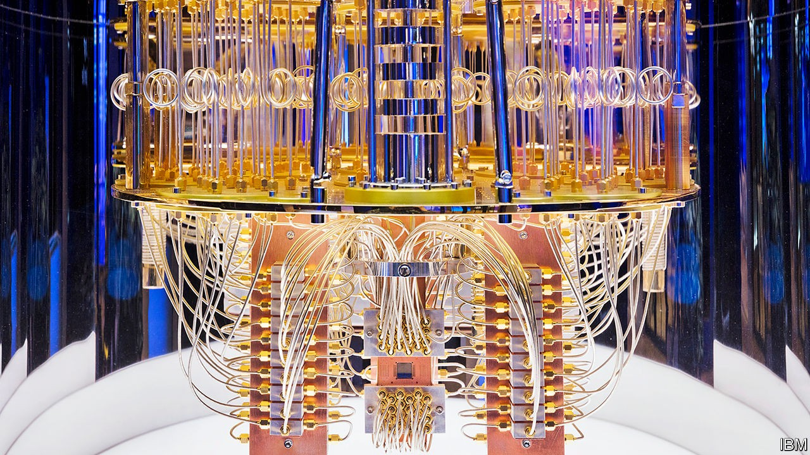

## Quantum computing

# What quantum computers reveal about innovation

> Venture capital is often the last guest to arrive at the party

> Sep 26th 2020

IT IS HARD to choose one moment as marking the birth of a technology. But by one common reckoning, quantum computing will be 40 next year. In 1981 Richard Feynman, an American physicist, spoke at a computing conference, observing that “Nature isn’t classical, dammit, and if you want to make a simulation of nature, you’d better make it quantum mechanical, and by golly it’s a wonderful problem, because it doesn’t look so easy.”

Entering middle age, quantum computing is at last becoming a commercial proposition (see [article](https://www.economist.com//node/21792017)). Until recently the consensus was that practical applications would have to wait for large, stable machines, probably at least a decade away. Not everyone agrees. Venture capital is beginning to flow into companies built around quantum computers, as investors make a bold—possibly foolhardy—bet that even the limited, error-prone, unstable machines that make up the state-of-the-art today may prove commercially useful.

If those bets pay off, it would be good news, and not just for investors. Quantum computers can perform some sorts of mathematics far faster than any classical machine. Building them could open up entirely new vistas. They may, for instance, revolutionise chemistry. Most reactions are too complex for existing computers to simulate exactly, blunting researchers’ precision. Quantum machines could cut through the mathematical tangle, with applications in materials science, drugmaking, batteries and more. Their facility with optimisation problems, which are likewise a struggle for non-quantum machines, could be a boon for logistics, finance and artificial intelligence.

The field’s progress is interesting for another reason. Quantum computing offers a worked example of how complicated technologies develop in industrial societies. The chief lesson is to attend to every part of the process. The frenzy of innovation around classical computing, concentrated in Silicon Valley, has focused attention on the world of startups, venture capital and IPOs. But these are things that happen late in a technology’s development, when swift commercial returns are, if not certain, then at least plausible. As Mariana Mazzucato, an Italian-American economist, has argued, the biggest risks are taken earlier, when it is unclear whether a technology will work at all.

The state can be one such risk-taker. The first step in building a quantum computer was to conduct plenty of abstruse mathematics on university blackboards. Collectively, governments, including those of America, Britain, China and Germany, have thrown billions of dollars at funding quantum research.

Other early work was done in the sorts of big, boring companies in which no self-respecting disrupter would be seen dead. The first useful quantum algorithm was discovered in 1994 at Bell Labs, which began life as the research division of America’s telephone monopoly. Another early pioneer was IBM, which also has a buttoned-up reputation—but whose researchers have, over the years, earned six Nobel prizes. Today Google and Microsoft are playing a big role in developing quantum technologies.

The trick for such super-early-stage investors is to know when to stick with a risky prospect and when to call it quits. Good venture capitalists are ruthless about culling underperforming bets and focusing on those that seem to be paying off. Their proximity to markets makes such judgments easier. But governments—which are, after all, spending public money—should strive for the same outlook. If the state is to back technologies that are too risky for other investors, then a high rate of failure is both inevitable and desirable.

There are other lessons, too. Quantum computing has come as far as it has on the backs of thousands of mathematicians, experimental physicists and engineers. That is a reminder of the limits of “great man” theories of innovation, exemplified by the cult of Steve Jobs, a founder of Apple. The popular image of innovation as a “pipeline”, with a stream of individual technologies proceeding smoothly from ideas to products, is likewise too neat. Progress in quantum computing depends on progress in dozens of other fields, from lasers to cryogenics.

None of that is to deny the importance of the people who run the last few miles, taking nascent technologies and trying to spin out profitable businesses. But those who want to see more of that success should keep in mind that a great deal of less celebrated, less glamorous work must come first. ■

## URL

https://www.economist.com/leaders/2020/09/26/what-quantum-computers-reveal-about-innovation
