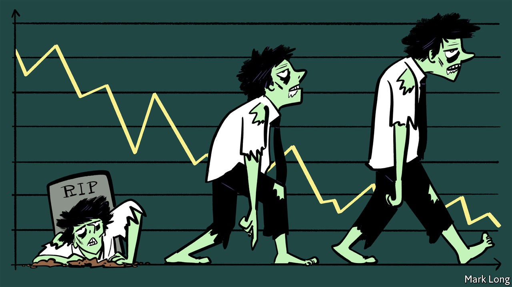

## The corporate undead

# What to do about zombie firms

> Without care, measures taken during the pandemic will keep alive firms that ought to be put out of their misery

> Sep 26th 2020

FOR YEARS economists have argued about whether governments and central banks in the rich world have mistakenly prolonged the lives of “zombie firms”. The corporate landscape, it is said, has turned from one filled with red-blooded creatures of creative destruction to a grey zone of the living dead, incapable of innovation or dynamism. Now the debate has new importance. The pandemic could lead governments to prolong the life of many undeserving firms. Keeping the growth of the undead in check will be vital to the long-term economic recovery.

Marginally profitable firms were central to Japan’s “lost decade” in the 1990s, when banks, unwilling to recognise losses, kept credit flowing to otherwise insolvent borrowers. Zombie-infested industries suffered from inert labour markets and lower productivity growth. Since then, the rich world as a whole has begun to look more zombified (see [article](https://www.economist.com//node/21792063)). In advanced economies the share of listed firms with low market capitalisations given their book value, and whose profits are insufficient to cover their interest payments, grew from around 4% in the mid-1980s to 15% in 2017, according to the Bank for International Settlements. The OECD reckons Italian and Spanish productivity levels would be over 1% higher were it not for the growth of zombie firms, which are alleged to have crowded out would-be rivals.

The evidence for zombification in the 2010s is incomplete: the world economy displayed few signs of capital or labour shortages, which you might expect to see more of if zombies were hoarding resources. Many firms were marginally profitable because aggregate spending was weak. Yet the pandemic is creating a greater risk of extra zombification. Governments have intervened in the economy on an enormous scale in order to keep firms alive. A combination of furlough schemes to reduce wage bills, state-backed loans to provide liquidity and laws or other measures to stop bankruptcies has prevented a wave of company failures. The danger is that, as economies emerge from the pandemic with new wants and needs, some firms that should be allowed to fail are instead kept going.

The march of the undead can be kept in check. Governments should support workers not jobs, and intervene more surgically. Furlough schemes keep workers tied to companies; it would be better to offer generous unemployment benefits. State-backed loans should not be rolled over indefinitely, but instead be subject to gradually increasing interest rates, encouraging borrowers to rely on private finance. If governments truly believe that the disruption to the hospitality industry will be only temporary, then their support would be justified. But because the industry will never recoup the income that it has lost during the pandemic, it will need grants, not loans—a shift that would help concentrate politicians’ minds.

Another priority is to avoid a banking crisis. Lenders with stretched balance-sheets have an incentive to keep funding their existing customers, masking past lending mistakes with yet more loans. In the short term this avoids recognising losses, in the long term they are funnelling capital to firms which squander it. Regulators must be alive to the risk of these zombie assembly lines. Banks should be kept as strong as possible during the pandemic, to reduce their incentive to conceal losses. That is a reason to limit their ability to pay dividends.

Last, ensure that firms can fail quickly and efficiently so that they can either be recapitalised or their assets and staff redeployed. Bankruptcy courts must be able to revive firms with reasonable prospects, or liquidate assets that can find new productive uses in other hands. Making the process faster and clearer will reduce the incentive of creditors to seek scorched-earth liquidations, especially for small businesses. Suspending bankruptcies for long periods, as Australia and Germany have done, is to deny reality. America, with its unsentimental approach to resolving ailing firms, sets a much better example.

All-but-indiscriminate aid to support firms and workers was a necessary feature of this year’s economic rescues, which took place amid widespread lockdowns of the economy. However, aid has become a threat to dynamism. As economies recover, the market should be allowed to play its proper role of determining winners and losers.■

## URL

https://www.economist.com/leaders/2020/09/26/what-to-do-about-zombie-firms
