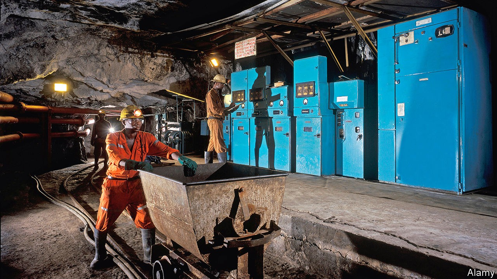

## What’s the rush?

# Ghana is planning to sell most of its future gold royalties

> The deal is causing a furore

> Sep 26th 2020

WHEN PORTUGUESE mariners first dropped anchor in the mouth of the river Pra in what is now Ghana, they heard of goldfields so rich that for the following five centuries the entire region became known as the Gold Coast. The promise of wealth sparked a rush to grab land, build forts, trade slaves and secure bullion, which poured into treasuries in Europe.

A somewhat more genteel rush is now under way to sell the rights to most of the government’s bullion royalties in Africa’s biggest gold producer. The deal, which some see as a model for other resource-rich developing countries, is aimed at providing cash now against income from royalties in the future. The appeal to Ghana’s government is obvious. It is struggling to cope with the economic hit of covid-19 and to sustain public spending under the crushing weight of debt that is expected to equal almost 70% of GDP this year. Yet it is also causing controversy, with critics raising questions over the rushed and opaque process, as well as its terms.

At stake is the roughly 4% in royalties that Ghana’s government earns on every ounce of commercially mined gold. The ounces add up. In 2018 Ghana shipped almost $6bn of the shiny stuff, its single biggest export. Now the government wants to bundle up the rights to 75% of the royalties from 16 big mines (including four under development) in a Jersey-incorporated company called Agyapa. It then plans to sell as much as 49%, with shares being floated on the London and Ghana stock exchanges, for about $500m.

The government says the deal has the advantage of delivering cash without adding to public debt. But critics argue that this is sophistry. “The government is basically selling off its ability to repay its existing normal loan portfolio,” says David Mihalyi of the Natural Resource Governance Institute (NRGI), an international think-tank.

Moreover, Ghana has already received and spent much of the money it hopes to get in future from pumping oil, mining bauxite or selling electricity. Not all has been spent wisely. The treasury’s purse strings typically open in election years (voters go to the polls in December) and money is often squandered on big pay increases for civil servants.

Critics also question the terms of the deal, which is not for a set amount of gold nor a clearly fixed time period. That makes it far more open-ended than is typical in resource-backed deals studied by NRGI, says Mr Mihalyi. Agyapa will continue to get its cut of the revenues if there are any renewals or extensions to mining leases in the 16 areas covered by the agreement. This would give investors any upside from extensions or renewals, but no corresponding obligation to pay the government for them, let alone invest anything itself in exploring for gold or doing the tedious, risky and grubby work of mining it.

Because it is particularly difficult for either the government or investors to value such an open-ended deal, there is a real risk that Ghana will be short-changed. Documents leaked to The Economist suggest the government has put a valuation of $1bn on Agyapa. But calculations by Yakubu Abdul-Salam, a resource economist at Aberdeen University, suggest it is worth at least $2.5bn (and perhaps far more) even given uncertainties over how much gold will be mined and its price.

A spokesperson for the ruling party says the $1bn valuation was just to “spice up” the deal and attract investors and that the real valuation will come from the market when the shares are floated. But, says Bright Simons of Imani, a think-tank in Ghana, the government has been talking with investors for two years, so the $1bn figure probably reflects the value it would expect ahead of the initial public offering (IPO).

One reason for the big difference between the two figures may be investors’ perception of the risk Ghana poses. But no one knows because the government has not been transparent about the assumptions or discount rates used in its valuation (unlike Mr Abdul-Salam, who has published his sums).

Charles Adu Boahen, Ghana’s deputy minister of finance, insists that there will be “total transparency” and the London flotation will help ensure that the company is valued properly by the market. Yet one may reasonably ask why the government registered Agyapa in Jersey, a tax haven that does not have a public register of company owners, rather than, say, London, which does.

The government pooh-poohs these concerns, saying Jersey was chosen for tax efficiency. It says it will exercise control of the company through its majority shareholding and will receive a meaningful annual dividend. But documents obtained by The Economist “raise questions as to how much influence Ghana will have over what Agyapa does with the royalties” that it receives, says Nicola Woodroffe, a lawyer with NRGI.

More questions surround the process of setting up the deal. Although it has been in the works for years, parliament was given just four hours to scrutinise its many complex documents before they were waved through by the ruling party. The opposition walked out in protest. Critics point to the lack of transparency over the recruitment of Agyapa’s boss, who happens to be the son of the senior minister in cabinet and a schoolboy chum of the deputy finance minister. Imani, the Ghanaian think-tank, says it can find no evidence of a public advertisement for the role. Also involved in the deal is an investment bank founded by the finance minister (at which his wife is still a non-executive director). He says the bank was chosen on merit. On September 10th Ghana’s special prosecutor wrote to parliament asking for information and saying it was looking into whether any elements of the deal were corrupt.

The agreement has also caused divisions within government. A leaked memo shows that on July 22nd the attorney-general wrote to the minister of finance saying the deal was “unconscionable”. On August 12th she nonetheless gave the go-ahead to take it to parliament. Since then she has not said publicly whether she changed her mind or whether the deal was changed.

The Ghanaian government is now promising to consult further with NGOs. But the agreements to sign over the royalties have been passed in parliament and the government seems intent on holding the IPO before the end of the year. That leaves little time for change. ■

## URL

https://www.economist.com/middle-east-and-africa/2020/09/26/ghana-is-planning-to-sell-most-of-its-future-gold-royalties
