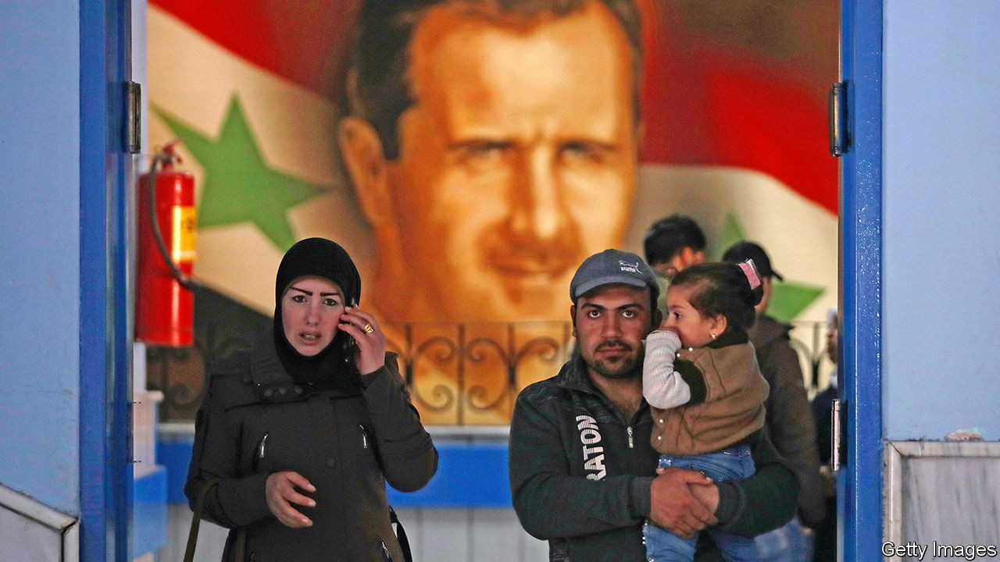
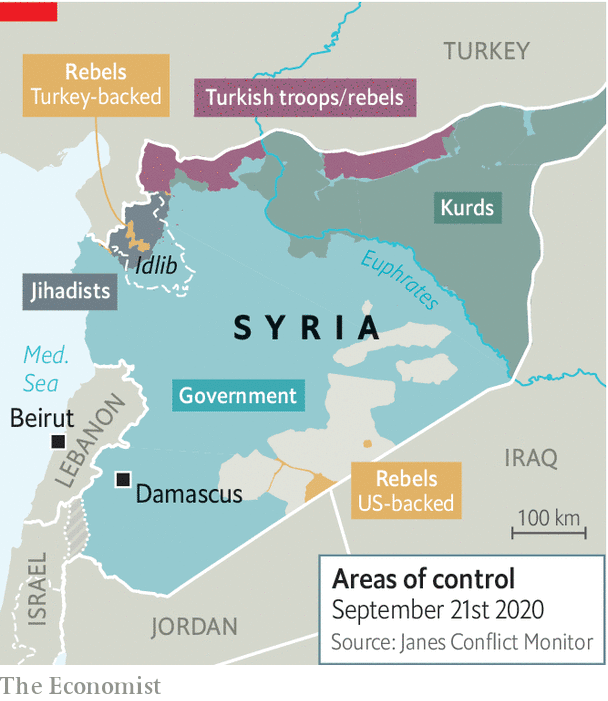

## Despot of deprivation

# Victory for Bashar al-Assad has meant more suffering for his people

> People are growing ever more desperate in the areas under his control

> Sep 26th 2020

THE PRICE of food in Syria has risen so high that women boil weeds to eat. At bakeries in Damascus, the capital, men clamber over each other to get their hands on what little subsidised bread is available. Across the country, queues for petrol snake for miles. Large parts of some cities are rubble. The currency is worth so little that locals use it as cigarette paper.

This was meant to have been a year of recovery for Bashar al-Assad. After nearly a decade of civil war, Syria’s dictator has all but defeated the rebels who tried to unseat him. He hoped one last push would seal his victory and that foreign powers, seeing no alternative, would re-establish diplomatic ties and begin to pay for reconstruction.

So far, it has not worked out like that. Rebels, backed by Turkey, repelled Mr Assad’s spring offensive on their last big stronghold in Idlib province (see map). Despite President Donald Trump’s promise to withdraw, American troops remain in Syria’s oil-rich north-east, helping the Kurds consolidate their rule over the territory. American sanctions have hurt the Syrian economy; a financial crisis in neighbouring Lebanon adds to the pain. Then there is covid-19, which is hitting Syria hard. Humanitarian conditions in regime-held territory are worse now than at the height of the war, says the UN.

The war had already hollowed out the economy. Syria now produces 60,000 barrels of oil a day, a sixth of its pre-war output. Last year’s wheat crop was half as big as the pre-war average. Syrians have long parked their money in Lebanese banks, but last year those banks limited withdrawals, leaving everyone short of hard currency. Partly as a result, the Syrian pound has lost over 70% of its value against the dollar this year alone. Prices of staple goods have soared. Meanwhile, the regime has cut handouts and subsidies. To protect its own banks, Syria’s government has frozen loans and banned dollar transactions as well as limiting withdrawals.

Covid-19 is exacerbating the economic pain. Some 60% of Syrian businesses have temporarily or permanently closed because of the pandemic, says the UN. The regime locked down the country in March, but the restrictions were quickly ignored by desperate citizens. Now the cost, in terms of health, is becoming clearer.

The regime has tried to hide the scale of the outbreak. Its goons order doctors to blame pneumonia, not covid-19, for deaths. Officially fewer than 200 Syrians have died from the disease. But the number is surely much higher. “We do know that community transmission is widespread, as almost 90% of newly confirmed cases cannot be traced to a known source,” says Mark Lowcock, the UN’s emergency-relief co-ordinator. The death toll in Damascus could be 80 times the official tally, according to a study led by scientists at Imperial College London. Nearly 40% of people there may already have caught the virus. Only the well-connected get hospital beds. Doctors go around with oxygen canisters offering the sick relief.

Countries that in the past came to Syria’s aid can’t, or won’t. Iran, which backs Mr Assad, is under sanctions itself and cannot afford to offer much economic help. The dictator’s other big ally, Russia, is also under sanctions. It could do more, say Syrians, but President Vladimir Putin seems to relish the leverage that Syria’s desperation gives him. Earlier this month his foreign minister, Sergei Lavrov, visited Damascus, seeking new energy and construction contracts. “Our saviours have become vultures,” says a Syrian businessman loyal to the regime. America and Europe send money for things like food and medicine, but they refuse to fund reconstruction—at least until a political settlement is reached.

Mr Trump has piled sanctions on Syria, hoping to push Mr Assad towards a settlement that might, eventually, end his time in power. Restrictions imposed in June targeted foreign-currency transactions, including the remittances on which many Syrians depend. They also ended the regime’s hope of moving its banking operations from Beirut to Dubai. European states have applied their own sanctions on Mr Assad’s family and henchmen. Some are also trying to hold the regime accountable for its atrocities. German judges are hearing evidence in the trial of two Syrian officials accused of torture. The Netherlands has threatened to launch a case against the regime for war crimes at the International Court of Justice in The Hague.

Yet the regime is growing more predatory. It has already fleeced those who opposed it. Now it is preying on the businessmen and farmers who supported it. Customs officers and militiamen reportedly impound trucks and confiscate goods, then demand hefty bribes for their return. To collect taxes the state uses generals and warlords, who take a cut. Frontmen for the regime are buying real estate and businesses at a discount from an impoverished middle class. “Assad is seizing ever more of the economy for himself,” says an analyst who often visits Damascus.

Loyalists wonder about the future. “I’m no longer sure he’ll survive,” says a Syrian businessman of Mr Assad. Others dream of far-fetched schemes that might lift Syria out of the vortex. If Mr Assad could bury the hatchet with Turkey’s president, Recep Tayyip Erdogan, Turkish construction firms could come back and rebuild Syria, says a regime insider. Another dreams of wooing America by engaging with Israel, which has conducted hundreds of air strikes on Iranian targets in Syria.

Mr Assad, though, seems uninterested in diplomacy. “His position has not changed from day one,” says a family friend. After two decades in power, his regime has proven remarkably resilient. Loyalists and civil servants have nowhere else to go for a pay cheque. The secret police snuffs out the odd protest, while the army keeps up the pressure on Idlib. Mr Assad’s seven-year term ends next summer, when he is planning another sham election. He and his wife, Asma, are said to be grooming their 18-year-old son, Hafez, to take over one day. For the Assads, remaining in power is victory enough. ■

## URL

https://www.economist.com/middle-east-and-africa/2020/09/26/victory-for-bashar-al-assad-has-meant-more-suffering-for-his-people
