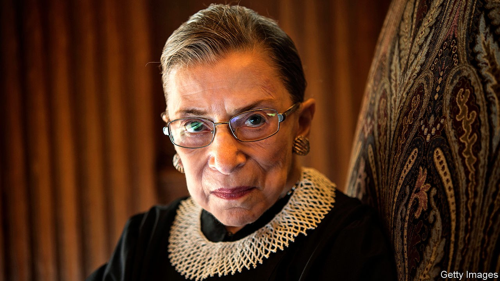

## Diva dissenter

# Ruth Bader Ginsburg died on September 18th

> The liberal conscience of America’s Supreme Court was 87

> Sep 23rd 2020

ON THE EVENING of July 11th 2015, Ruth Bader Ginsburg went to the opera. There was nothing odd in that. Opera, after the law, was her great love, the only place where she could leave the legal world behind. When she worked on her opinions, often into the small hours if her husband Marty was not around to make her go to bed, she would usually have opera, or some other beautiful music, playing in the background. The talent she most coveted was to have a glorious voice, like Renata Tebaldi perhaps. As it was, she sang only in the shower and in her dreams.

This particular opera, however, “Scalia/Ginsburg”, by Derrick Wang, was about her. It featured Antonin Scalia, then the court’s most scathing conservative, and she, its most notorious liberal, duelling musically in the styles of Mozart, Verdi and Puccini. He had to go through various trials; she helped him out, at one point soaring through a glass ceiling in the character of the Queen of the Night from “The Magic Flute”.

She loved it all. She and Scalia, despite the legal zingers he tossed in her direction, had been best buddies since their days together on the DC federal appeals court in the 1980s. And America’s highest court could be just as dramatic, even if more sombrely arrayed. There she sat, this tiny little woman perched among the black-robed men, and there she disagreed. For all but three of her 27 years she had one or two sisterly colleagues, but her opinions still marked her out. She berated the court when, in 2014, it let employers foist their religious beliefs on their workers by not paying for cover for contraception. She was outraged when, in the Citizens United case of 2010, it refused to limit corporate funding of independent political broadcasts, as if America had all the democracy that money could buy. And she especially attacked the striking down, in 2013, of Section 5 of the Voting Rights Act in Shelby County v Holder, on the supposition that racism had waned enough to discard it. That, she wrote, was “like throwing away your umbrella in a rainstorm because you are not getting wet.”

Being contrary, she needed to be extra sharp. She took pride in the speed with which she wrote opinions, and in their clarity. Twice a week she lifted weights, did push-ups and generally honed herself into a lean, Armani-clad contender. In oral argument she liked to leap in first, keen to establish at the start whether the plaintiff had really been damaged, or not. (Her shy, soft, pause-filled delivery off the bench really speeded up then, to Brooklyn fast.) She often announced her dissents orally, from the bench, to show how much she disagreed, and in the trying 5-4 years when she regularly led the dissenters she made sure they spoke with one voice. On those days she wore her “dissenting collar”, a grey, stony, quietly menacing number. It fitted the occasion nicely.

Yet she did not see herself as disruptive, let alone an activist. If she became more of a dissenter with the years, it was because the court, after 2006, swung over to the activist right. At heart she was still what she had always been, a judicial minimalist. She was stunned by the lack of caution in the Roe v Wade ruling of 1973 that legalised abortion; though she certainly approved of the outcome, reform should have come through state legislatures, where it was slowly starting to appear. She was shocked too when the court, while upholding Obamacare, found it illegal under the commerce clause of the constitution; that had been Congress’s domain since the 1930s. In her dissents she sometimes appealed to Congress to correct the law and occasionally, to her delight, it did.

Her legal hero was an incrementalist: Thurgood Marshall, the first black justice on the court, who had laboured to dismantle segregation. Even when she was (as she operatically liked to say) a flaming feminist litigator, bringing cases before the Supreme Court in the 1970s on behalf of the Women’s Rights Project at the ACLU, she saw herself first as a teacher, instructing the all-male court how women felt about laws which “protected” and thus demeaned them. She could have been furious about the prejudice she had faced herself, being Jewish as well as a woman: failing, for example, to get job offers from any New York law firm after leaving Columbia Law School, though she became the first female tenured professor there. But she proceeded carefully, politely, case by case, and bad laws tumbled. When she joined the highest court her success rate fell, but her approach, as only the second woman there, was often the same: to explain to the male justices how it felt to be barred from the Virginia Military Institute or, as a teenage girl, to be strip-searched. Because the court just did not know these things.

The role of women’s champion was too narrow, though. Her arguments in discrimination cases were based squarely on the 14th Amendment’s guarantee of equal protection of the laws. Gross generalisations about “how women were” or “how men were” had to be forgotten. Her dream was a world in which men and women cared for their children equally and had equal opportunities themselves. And the constitution had to embrace everyone: Lilly Ledbetter, struggling to achieve equal pay; Stephen Wiesenfeld, trying as a widower to get the same benefits as a widow would; Maetta Vance, afraid to tell a racist supervisor to buzz off; the young men of 18 in Oklahoma who just wanted to buy a beer, as girls of 18 could. She spoke for all such everyday people.

As the court shifted steadily rightward she became more determined to stay on. She redoubled her exercises, despite her age and the bouts of cancer, colorectal and pancreatic, which annoyingly forced her one day to take part in oral arguments from her bed. She found herself becoming an icon, a face on T-shirts and the subject of biopics: Notorious RBG, mystifying but fun. What did not change was her regard for her colleagues, conservative or not, in the wonderfully civilised family that was the court. For each of them, after all, their basic motivation was the same. At the end of “Scalia/Ginsburg”, the two famous foes-and-friends sang together the aria which was her favourite: “Separate strands unite in friction/To protect our country’s core...And this is why we will see justice done./We are different;/We are one.”■

Correction (September 24th 2020): A previous version of this article stated that Ruth Bader Ginsburg was the first tenured professor at Columbia Law School. She was the first female tenured professor. Apologies.

## URL

https://www.economist.com/obituary/2020/09/23/ruth-bader-ginsburg-died-on-september-18th
