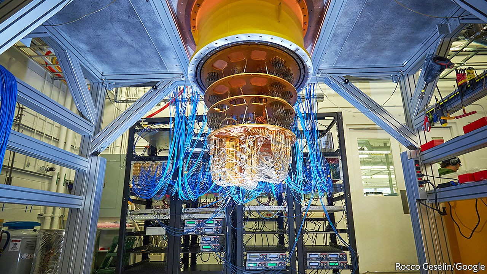
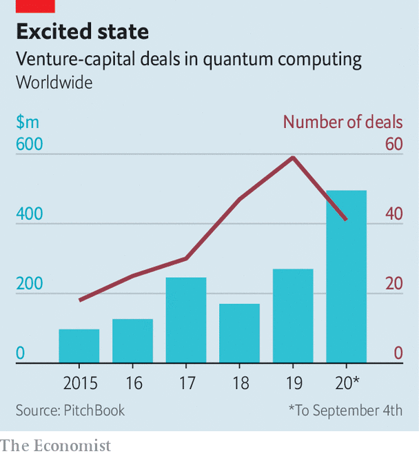

## Uncertainty principals

# Commercialising quantum computers

> Today’s small, limited and finicky machines may yet have business uses

> Sep 26th 2020

BIG, STABLE quantum computers would be useful devices. By exploiting the counterintuitive properties of quantum mechanics they could perform some calculations (though only some) faster than any conceivable non-quantum machine.

For one thing, they would probably be much more rapid than any classical computer at searching a database—an elemental operation with a thousand uses. They would be quicker at more specific tasks, too. Precisely simulating all but the simplest chemical reactions is mathematically intractable for any non-quantum computer, no matter how huge. A quantum computer could do this, aiding the development of drugs, catalysts and batteries. Quantum computers would also speed up the analysis of optimisation problems, which try to find the best way to juggle many variables in order to maximise a particular outcome. That would be a boon to the transport industry (by finding efficient routes) and to finance (by maximising profits given a set of constraints). Boston Consulting Group (BCG), a management consultancy, foresees quantum computers improving the operating income of their users by between $450bn and $850bn a year by 2050.

Unfortunately, big, stable quantum computers do not yet exist. But small, ornery, unstable ones do. John Preskill, a quantum-computing researcher at the California Institute of Technology, dubs such machines NISQs—Noisy, Intermediate-Scale Quantum computers. Some see NISQs as mere stepping stones towards size and stability, and that is certainly the goal of those working on them. A growing number of companies and investors, however, are hopeful that NISQs themselves will be able to do useful work in the meantime. These firms are hunting for “quantum advantage”—a way in which even today’s limited machines might have an impact on their bottom lines, or those of their customers.

For most of the field’s history, quantum-computing research has been backed by governments or big information-technology firms. Increasingly, though, the venture-capital (VC) industry is showing an interest. PitchBook, a research firm based in Seattle, has tracked $495m of VC money that has been invested in quantum computing so far this year—almost double last year’s total (see chart). Dozens of startups are competing with the incumbent tech giants. And established companies, such as Daimler, a carmaker, and Goldman Sachs, a bank, are beginning to experiment with the nascent industry’s products, hoping that, if they can master them, they will bestow an advantage over their competitors.

Much of the money is going towards building hardware. Doug Finke, a computer engineer who runs the Quantum Computing Report, which focuses on the nascent industry, is aware of 87 organisations, big and small, trying to construct quantum computers. Unlike classical computing, which had settled by the 1970s on silicon transistors as the units of computation, there is, as yet, no consensus on the best way to build a quantum computer. IonQ, a firm in Maryland that has raised $84m, uses trapped ytterbium ions, manipulated by lasers, to perform its calculations. Rigetti Computing, a Californian company which announced earlier this month that it would be building a quantum computer for the British government, employs microwaves to control pairs of electrons flowing through superconducting circuits. Microsoft, although very much not a startup, is working on a “topological” quantum computer that relies on the interactions of super-cold electrons.

One particularly well-financed new firm is PsiQuantum, which does its computing with photons that run along waveguides etched onto ordinary silicon chips. It hopes to leapfrog the NISQ era entirely and produce a fully fledged quantum computer within about five years—though that is far sooner than most experts think feasible. PsiQuantum was founded in 2015 by researchers from Imperial College and the University of Bristol, both in Britain. It has raised $215m from backers including BlackRock, a giant investment firm, and the Founders Fund, an American VC company that was an early investor in SpaceX and Facebook. Jeremy O’Brien, one of the firm’s founders, says that, in partnership with GlobalFoundries, a big contract chipmaker, PsiQuantum is already producing wafers full of quantum-computing chips.

Other firms are concentrating on making quantum computers easier to work with. Q-CTRL is an Australian startup that has raised “tens of millions” from investors including Sequoia Capital and In-Q-Tel (which invests on behalf of America’s intelligence agencies). “We build ‘quantum firmware’,” says Michael Biercuk, one of the company’s founders. This is the lowest level of software, responsible for controlling a computer’s hardware directly.

One reason NISQs are so hard to work with is that the delicate quantum states they rely on break down in fractions of a second, so calculations must be completed in those slivers of time. On top of this, imperfect manufacturing means that some parts of a quantum chip suffer noticeably more errors than others—a pattern which varies unpredictably between individual chips. Careful control of a machine’s hardware, says Dr Biercuk, can help minimise these difficulties. To this end Q-CTRL’s engineers have used machine learning to improve hardware-control routines written initially by human beings. Dr Biercuk reckons this can cut error rates by 90% and reduce the variability across an individual chip by a similar amount.

After building a machine and tuning it to work as well as possible, the next step is to get it into the hands of potential customers. The easiest way to do this is to connect interested parties to the internet and invite them to experiment. IBM’s “Q Network”, established in 2017, is a cloud-computing service that lets clients use the firm’s own quantum computers. IBM now has partnerships with dozens of established firms, including Daimler, Samsung and Goldman Sachs, which are intended thus to explore the technology.

Smaller hardware-makers, lacking IBM’s reach, have joined up with other cloud-computing firms. Microsoft (whose own topological machines are still at an early stage of development) offers access via Azure, its cloud-computing service, to machines from IonQ, Honeywell and a company called Quantum Circuits. Amazon hosts machines from Rigetti, IonQ and D-Wave, a Canadian company that builds specialised, fixed-purpose computers called quantum annealers.

Rather than have hardware-makers come up with useful algorithms, the hope is that existing businesses, by being given access to the machines in this way, will invent such algorithms for themselves. With that in mind, says Krysta Svore, who leads Microsoft's quantum-systems team, one task is to make those machines as easy as possible to use. The firm has developed tools intended to help customers wrap their brains around the counterintuitive properties of quantum computers. It has also developed software intended to smooth over differences between machines from different makers, so that programmers do not have to worry about whether they are marshalling ions or electrons. She compares this to the early days of classical computing, when the development of compilers and early programming languages freed human beings from the need to think in the ones and zeros of raw machine code.

The big question is what all this is leading up to. Despite the excitement, the industry’s commercial pioneers have their work cut out for them. There is plenty of promise, but, as yet, no certainty. Finding algorithms that are both commercially useful and simple enough to work within a NISQ machine’s limitations is not easy. A report published last year by America’s National Academy of Sciences reminded readers that no commercial applications are currently known to exist.

The first step, then, is to go looking. The industry has been cheered by Google’s demonstration last year of “quantum supremacy”, in which it used a NISQ machine to perform, with minutes of computing time, a calculation that would have taken thousands of years on classical hardware. Google’s calculation was highly contrived and of little use in the real world. But it proved a point. In August the firm followed up with a paper in Science, describing the simulation of a chemical reaction involving hydrogen and nitrogen atoms. That reaction was simple enough to be within the reach of classical machines.

Optimists like Mr Finke think that, with a bit of luck and progress, the first commercially relevant applications of quantum computers will appear within the next two or three years. In particular, he reckons it is worth keeping an eye on the finance industry, where quantum computers could boost trading algorithms and portfolio management. “To develop a new battery or a new drug you have to test the product,” he points out. This can take years. A slick new financial algorithm could be deployed in days. And given the scale of the markets, even a tiny advantage could be worth a great deal of cash. Amit Kumar, a partner at BCG, agrees—though he points out that, keen to preserve its advantage, a firm which had found a way to benefit from quantum acceleration might try to keep the fact under its hat.

This influx of money has, though, led some researchers to worry that hype may be overtaking reality, and storing up disappointment for the future. Some of the cash, says Dr Biercuk, comes from VC firms taking calculated risks by investing in what has come to be called “deep tech”—cutting-edge, highly technical projects like quantum computing, which advance the state of the art—as opposed to consumer-focused apps or gizmos with a shorter and more certain path to market. But he cautions that there is no shortage of hype-struck “dumb money” sloshing around, too.

Whether those bets pay off will have implications beyond the venture-capital industry’s next bonus round. One reason classical computers developed so quickly was that even early, feeble machines were useful for everything from wartime code-breaking to automating the payrolls of big firms. Those applications generated enough cash to design the next generation of less-feeble machines, which brought in yet more money. The resulting virtuous spiral is still turning, decades later.

Those now moving into quantum computing hope to encourage a similarly virtuous feedback loop. If they succeed, the promise of quantum computing could be realised faster than the decade or more likely to pass before big, stable machines are ready. If they fail, the field’s reputation may take a knock. That knock is unlikely to be fatal. But it will delay the arrival of a usable machine.■

Correction (September 24th 2020): An earlier version of this article described Mr Finke as a physicist, and gave him the title "Dr". He is in fact a computer engineer, and goes by "Mr". Apologies for the mistake. 

## URL

https://www.economist.com/science-and-technology/2020/09/26/commercialising-quantum-computers
