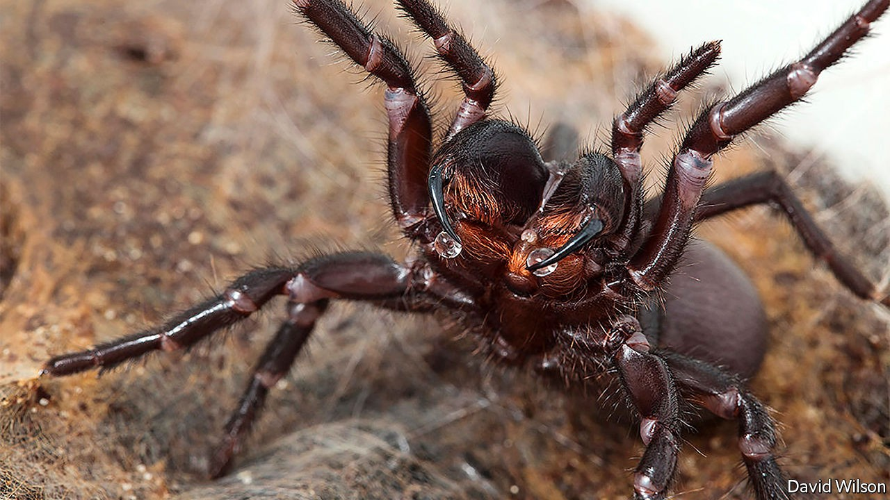

## Evolution

# Why funnel-web spiders are so dangerous to people

> They have not had the chance to evolve not to be

> Sep 26th 2020

FUNNEL-WEB spiders have a fearsome reputation. People bitten by these Australian arachnids suffer extreme pain, breathing problems, confusion, convulsions and dangerously high blood pressure. Left untreated, the venom can kill within hours. For years, researchers assumed this lethal effect was an evolutionary accident. The venom, they presumed, evolved to help the spiders kill their prey—normally insects. Killing mammals was either just collateral damage or a form of protection against possible predators.

Except that the venom does not, in general, kill mammals. Dogs, cats, mice, rabbits and guinea pigs all shake it off. It is only human beings and other primates that succumb. And there is another odd thing about it. Funnel-web-spider venom has thousands of components, but delta-hexatoxins, the specific molecules within it that kill people, are produced in particularly large quantities by sexually mature males during the breeding season—a time when they are barely feeding at all.

Putting these various facts together has led Bryan Fry of the University of Queensland to suggest, in a paper published in the Proceedings of the National Academy of Sciences, that the role of delta-hexatoxins in funnel-web venom is not to kill prey but rather as a sophisticated form of defence—and that, paradoxically, its deadliness to humans is because neither they nor their primate ancestors were, until recently, a threat to the spiders.

Prey animals routinely attacked by venomous predators are under powerful pressure from natural selection. Any mutation which confers resistance to the venom will spread. This puts evolutionary pressure back onto the predator, encouraging the emergence of more potent venoms, which encourages further resistance and provokes further potency. And so on. Toxins directed against prey thus evolve rapidly.

That, though, is not true for defensive venoms. Taking a single type of spider off its menu diminishes a predator’s potential to survive and reproduce only slightly. From this predator’s point of view the requirement to evolve resistance to a venom, particularly one that is not lethal, is therefore low. The spider’s interests, too, may be served by the evolution of non-lethal venom. A live predator that has learnt not to attack may be better than a dead one, which might then be replaced by a conspecific which has not learned that lesson. This is particularly true when the venom is directed towards animals that teach their young, as many mammals do, about what is and is not dangerous in the world. Get stung by a bee and you will surely advise your children to give bees a wide berth, even though bees are not predators.

To pursue this idea, Dr Fry and his colleagues looked at the genetic sequences describing 22 types of delta-hexatoxin, extracted from ten species of funnel-webs. This let them analyse the peptides’ evolutionary histories. Funnel-web spiders are an ancient group, believed to have emerged about 150m years ago, near the end of the Jurassic period. Dr Fry’s analysis suggested that, around that time, delta-hexatoxin peptides were evolving rapidly, but have subsequently barely changed. This is consistent with the idea that they were evolving into something which would discourage, but not kill, vertebrate predators such as mammals—a group that also appeared in the late Jurassic. Which is all well and good, but does not explain why funnel-web delta-hexatoxins are so deadly to people.

The answer to this, Dr Fry suspects, is that until the arrival in Australia 65,000 years ago of human beings, funnel-web spiders had never encountered primates (of which that continent has no wild representatives) and so had had no chance to co-evolve with them. In one sense, then, the fact funnel-web delta-hexatoxins are lethal to humans is indeed an unlucky accident caused by some quirk of primate biochemistry not shared with other groups of mammals. But if such co-evolution had taken place, it would have been in the interests of both sides for this lethality, too, to have been whittled away. ■

## URL

https://www.economist.com/science-and-technology/2020/09/26/why-funnel-web-spiders-are-so-dangerous-to-people
