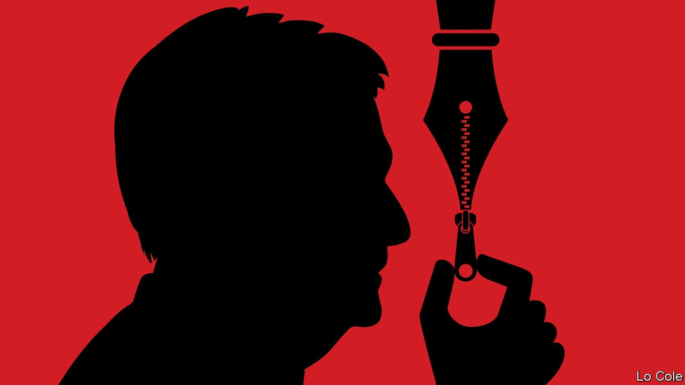

## Bello

# AMLO’s war against the intelligentsia

> Why does Mexico’s president fear a couple of small-circulation journals?

> Sep 24th 2020

ON SEPTEMBER 21st President Andrés Manuel López Obrador (known as AMLO) began his televised early-morning press conference by asking a functionary to read out an interminable list of petrol prices at service stations around the country. Then there were video updates on AMLO’s pet infrastructure projects: an $8bn oil refinery, a new airport in Mexico City and three new railway lines. After an hour or so, he got to the meat of his agenda: attacking two small monthly magazines, Nexos and Letras Libres, and singling out by name their editors, Héctor Aguilar Camín and Enrique Krauze.

They “were the chiefs of the intelligentsia throughout the neoliberal period”, AMLO complained. He insinuated that they acted as hired propagandists for the governments of his predecessors. “They belong to the conservative grouping which would like to maintain the same regime of corruption, injustices and privilege,” he said earlier this month. These attacks, which apply, too, to Reforma, an independent newspaper, have intensified in the past few weeks. They look like an attempt to silence critical voices in the Mexican media by a populist president who has already hobbled previously independent institutions such as the Supreme Court and regulatory agencies. Many media businesses practise self-censorship.

Last month the government fined Nexos 1m pesos ($45,000) and banned all state bodies from dealings with it or its small book publisher. An official claimed that in 2018, when the magazine won an advertising contract from the Social Security Institute, it had failed to pay full labour taxes for its staff. This is false, says Mr Aguilar, who has appealed to a court. This month Paco Ignacio Taibo, a leftist historian appointed by AMLO to be the director of a big state-owned publisher and bookseller, warned Messrs Aguilar and Krauze: “stay in your little corner or change countries. It’s not a threat.” It obviously was, and AMLO has not required Mr Taibo to withdraw it.

This “public lynching” is dangerous, says Mr Krauze, a historian. “The presidential word is very powerful in Mexico. You don’t know how people will interpret it if he is continually pointing to someone as an enemy.” Some critics of past presidents have been murdered (as have journalists who fell foul of crime gangs).

Government support for the media through advertising is an unhealthy Mexican tradition, going back to the 1920s. AMLO is continuing it with partisan gusto. During his first year in office, the two main television companies, which provide adulatory coverage, received a total of 700m pesos in advertising. La Jornada, a small leftist daily, got 252m pesos.

The president’s insinuations that Nexos and Letras Libres lived purely from state largesse during earlier administrations are false. Mr Krauze says that income from the state, which included advertising, subscriptions by public libraries and contracts for historical documentaries, amounted to only 15% of the total revenues of his cultural businesses, Letras Libres and Clío, a film company. In Nexos’s case government advertising was around 25% of the total.

Both Nexos and Letras Libres are niche publications whose combined circulation is fewer than 30,000 copies (though both have popular websites). So why is AMLO scared of them? There are two apparent reasons. One is that he is temperamentally allergic to criticism. The other is that he is pursuing a populist strategy of dividing his country into “the people” and “the reactionaries”. No matter that both Mr Krauze and Mr Aguilar have been champions of democracy for decades, and were fiercely critical of previous governments.

Although opinion polls give AMLO an approval rating of around 55%, the going is getting tougher for him ahead of a vital mid-term election next July. His government has mismanaged the pandemic. Mexico’s economy is set to contract by 10% this year, more than the regional average. A president who claims to champion the poor has done little to prevent their numbers multiplying.

This month 650 of Mexico’s most prominent academics and intellectuals published an open letter stating that “freedom of expression is under siege in Mexico, and with that democracy is threatened.” That mirrors the fears of intellectuals in Brazil regarding their populist president, Jair Bolsonaro. Mr Bolsonaro is of the right, and AMLO claims to be of the left. But it increasingly looks as if the main difference between them is merely that the Mexican speaks more softly and has nicer manners.

## URL

https://www.economist.com/the-americas/2020/09/24/amlos-war-against-the-intelligentsia
