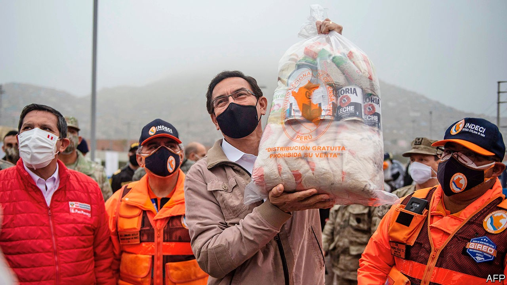

## Limping in Lima

# Martín Vizcarra survives an impeachment vote

> But Peru’s politics will remain chaotic

> Sep 24th 2020LIMA

AT FIRST SIGHT, the impeachment vote on September 18th looked like a big victory for Peru’s president, Martín Vizcarra. Just 32 of 130 congressmen voted to remove him on suspicion that he had obstructed a corruption investigation. But the president owes his survival to the incompetence of his foes rather than to the strength or enthusiasm of his supporters. One congressman, Daniel Urresti, described him as the “living dead” before abstaining.

Peru needs a vigorous president more than usual. The country has the world’s highest number of recorded deaths from covid-19 as a share of its population. The government expects the economy to shrink by 12% this year, which would be the most severe contraction in Latin America. But Peruvians will have to wait months for a fully functioning government and may not get one even then. The country is due to hold a general election in April, and to inaugurate a new president in July. The impeachment saga suggests that the political system may well fail to produce stability.

Until recently, the country has prospered despite its chaotic politics. Annual GDP growth averaged 4.5% in the decade from 2009, among the fastest in the region. The Central Bank has kept inflation low and the finance ministry has kept budget deficits in check. The official poverty rate dropped from 42% in 2007 to 20% last year.

But the pandemic is showing that politics matters. One reason for the high caseload is that many Peruvians have low-paying informal jobs; if they don’t work, they don’t eat. Many also live tightly packed together. Many distrust the politicians who tell them to lock down, and so ignore the rules. Alonso Segura, a former economy minister, doubts the government’s prediction that the economy will grow by 10% next year, recovering much of its losses. “Not only are conditions for pro-growth reforms absent, but the political system has become a source of disruptions and counter-reforms,” says Mr Segura.

Mr Vizcarra’s unexpected elevation to the presidency in March 2018 was a consequence of a crisis that began 30 years ago, with the rise to power of Alberto Fujimori. He was an effective leader, but a despotic and corrupt one. He is serving a prison sentence for human-rights abuses and graft. Two of his successors are under house arrest. Another is soon to go on trial. A fourth, Alan García, committed suicide last year to avoid arrest. Mr Vizcarra took over from Pedro Pablo Kuczynski, one of the housebound ex-presidents, who resigned to avoid impeachment for allegations of corruption, perjury and congressional vote-buying.

Mr Vizcarra promised to clean up corruption, for example by eliminating legislators’ immunity from prosecution. But his tenure has been more notable for grandstanding than for reform. Early on he clashed with Congress, which was dominated by the Popular Force party, led by Mr Fujimori’s daughter, Keiko. It tried to remove Mr Vizcarra. He struck back by proposing to hold a general election a year early, in April 2020, in which he would not stand. When Congress rejected that he shut it down and called a new election for the legislature alone, which was held in January this year.

The pandemic struck not long after the new Congress took office. At first, Mr Vizcarra won praise and popularity by imposing a swift and strict lockdown and providing support to people’s incomes worth 12% of GDP. But the government had trouble delivering cash to people who needed it (in part because it lacks information about them) and hurt the economy by shutting down mines. Mr Vizcarra’s approval ratings remain high. But he clashed with the new Congress, even though pesky Popular Force is a much diminished presence.

Now he is embroiled in scandal. In May news emerged that the culture ministry had since 2018 paid $51,000 to a flamboyant folk singer who calls himself Richard Swing to give motivational talks to government workers. Mr Swing had campaigned for Mr Vizcarra when he was a candidate for vice-president in 2016. Mr Vizcarra’s congressional foes suggested that the president or his top aides had initiated the payments to Mr Swing as a belated reward. On September 10th this year the congressman leading the investigation said that he had a recording of Mr Vizcarra strategising with his aides about how to handle it. Congress then scheduled an impeachment vote. 

Mr Vizcarra admitted that the recording, made secretly by a secretary, was genuine and apologised but said he had committed no crime. Bumbling by Congress’s leaders helped him. The speaker, Manuel Merino, called the armed forces’ top generals about the impeachment—to “reassure” them, he said. The administration claimed he was plotting a coup. On September 12th the prime minister appeared, flanked by the generals, to denounce Mr Merino. Many legislators decided that dumping the president at a time of crisis would do the country more harm than good.

There is little reason to expect the quality of government to improve after next year’s presidential and congressional elections. None of the 24 registered parties has chosen a presidential candidate. (Candidates must join one by the end of September.) The only candidate with double-digit support so far is George Forsyth, a former football goalkeeper who is now the mayor of La Victoria, a gritty district of Lima. His nearest competitor is “none of the above”. He is flirting with National Restoration, an evangelical party that has never governed.

In Peru that is no bar to winning high office. García is the only president since 1990 who won as the candidate of a party that had governed before. Without the backing of strong parties, presidents lack support in Congress and talented deputies to run their administrations. The election in January did little to strengthen the party system. It produced a fragmented Congress, with nine parties, despite a threshold to enter of 5% of the vote. Although Popular Action, a centre-right party, is the largest in Congress, just 6% of Peruvians back it, according to a poll by Ipsos. More than 60% of voters call themselves independents. National Restoration was not among the 11 parties the pollster asked about.

Peru’s next president will have scant resources to cope with an economy still wounded by the pandemic and a rise in poverty. Foreign-exchange reserves have been depleted by the cost of measures to limit the economy’s decline. Public debt will jump from 27% of GDP last year to 35% in 2020, according to the finance ministry. Peru needs economic reforms, such as clearer rules to encourage investment in public works and such vital industries as mining. Mr Vizcarra is unlikely to make much progress in the short time that remains to him. The worry is that his successor may not accomplish much more. ■

## URL

https://www.economist.com/the-americas/2020/09/24/martin-vizcarra-survives-an-impeachment-vote
