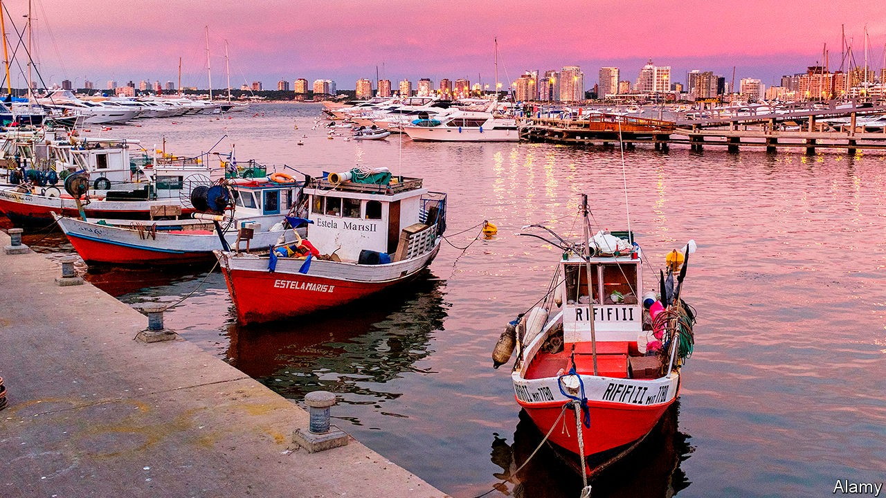

## A mini-war across the River Plate

# Why Argentines are flocking to Uruguay

> A small country lures migrants with tax breaks and a low infection rate

> Sep 26th 2020PUNTA DEL ESTE

FRANCISCO, AN ACCOUNTANT, sips coffee in a café as he explains why he would move to Punta del Este, Uruguay’s most famous beach resort, from his native Argentina. “I can’t sit back and watch my government drain my pension pot empty over the next few years with crazy taxes.” Arturo, a business owner from the province of Buenos Aires, joins the conversation. “I’ve moved already, and my family will follow when the school year ends.” The Peronists, who won back power in Argentina last year, had started “class warfare”.

The exchange on Calle Gorlero, Punta del Este’s main shopping street, suggests that the drive to attract new residents to Uruguay, launched by the country’s conservative president, Luis Lacalle Pou, is beginning to work. On June 11th, three months after taking office, he issued a decree making it easier for foreigners to settle in the country. It reduces the value of property a person must buy to qualify for residency from $1.7m to $380,000. For business owners, the minimum investment has been cut from $5.5m to $1.7m. A five-year tax holiday for both sorts of newcomer has been extended to ten. Foreigners need no longer spend six months every year in Uruguay to qualify for residency. From July 1st the minimum stay is 60 days. The legislature endorsed the changes in August.

As enticing as those tax breaks are, Uruguay’s competent management of covid-19 may have become an even bigger draw. It has the highest testing rate and lowest death rate in Latin America. In Argentina, recorded cases and deaths are soaring. “I worry about taxes, sure,” said a technology mogul on the ferry from Buenos Aires to Montevideo, Uruguay’s capital. “But fear is making me move. I fear for my health, and that of my family.”

The pandemic has caused a “stampede”, says an estate agent in Punta del Este. Inquiries from Argentines have risen sixfold since last year, he says. “This has the makings of a mini-war across the River Plate.”

With 3.5m people on a territory roughly the size of England, Uruguay “needs more people”, says Mr Lacalle Pou. Its fertility rate of less than two children per woman is among the lowest in Latin America. The proportion of people older than 60 is among the highest. Migrants who buy property might give a boost to the economy by encouraging construction. In the long run they will help pay for the welfare state, one of the most generous in the region.

Mr Lacalle Pou says he wants people “from all parts of the world” but his main recruiting ground is Argentina, whose population is 13 times larger than Uruguay’s. His advisers say they hope 100,000 Argentines will relocate. To reconcile immigration with public health, Uruguay requires new arrivals to quarantine. In July Mr Lacalle Pou gave a series of newspaper and television interviews in Argentina touting his country’s charms.

Argentina’s new government is making life harder for the rich. In December 2019 it imposed an annual tax of up to 2.25% on worldwide assets of citizens and residents. Congress is contemplating an additional tax on fortunes of more than $3m. Such nest eggs will be safe across the border. Uruguay is no tax haven, Mr Lacalle Pou insists: it does not let residents hide their income. But it does not tax income earned or wealth held outside the country.

Argentina’s president, Alberto Fernández, is trying to slow the exodus. He responded to Mr Lacalle Pou’s decree with one of his own. It says that Argentines who relocate for tax purposes must live in their new residences for at least six months of the year. They will be allowed to spend only 90 days a year in Argentina.

Despite those restrictions, some 20,000 Argentines have applied to move across the River Plate this year. Enrique Antia, a former mayor of the region of Maldonado, which includes Punta del Este, predicts that the resort’s population will double from 15,000. Uruguay may be small, but in a mini-war that is no disadvantage.■

## URL

https://www.economist.com/the-americas/2020/09/26/why-argentines-are-flocking-to-uruguay
