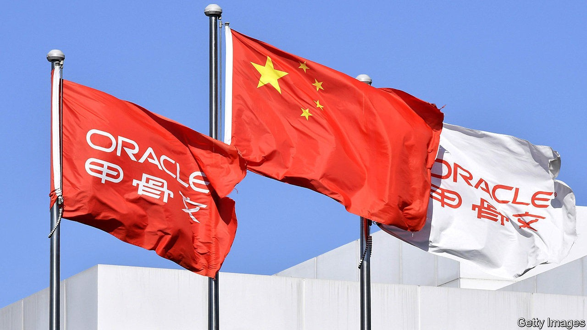
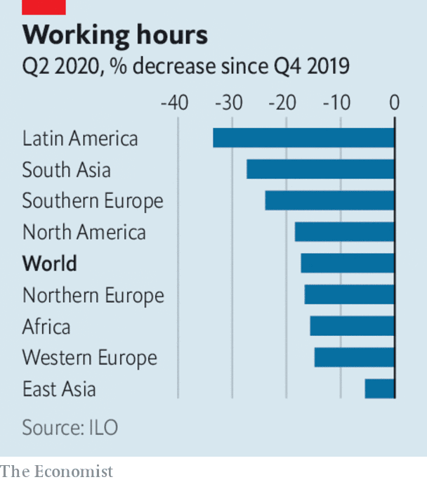

# Business this week

> Sep 26th 2020

There was some confusion about a tentative deal that will allow TikTok, a video-sharing app, to stay in business in the United States. Donald Trump gave his “blessing” to an agreement that would see Oracle and Walmart take a 20% stake in a newly formed TikTok Global, which would then rely on Oracle to provide it with cloud services. But Oracle and ByteDance, TikTok’s Chinese parent company, issued contradictory statements about the ownership of the new business, with ByteDance describing it as a “subsidiary”. China’s state media raged against the deal, describing it as “bullying and extortion”. TikTok asked a court to block an impending order that will in effect shut its operations in America over security concerns. See [article](https://www.economist.com//node/21792081).

A judge in California issued a last-minute temporary injunction against the Trump administration’s ban on WeChat, another Chinese tech firm that has fallen foul of the government. The plaintiffs argued that prohibiting the social-media app in America would curtail free speech and was aimed at Chinese-Americans. The administration can appeal against the decision.

Microsoft, which had been in the running to buy TikTok before Mr Trump threw his weight behind Oracle’s bid, consoled itself by buying ZeniMax, which owns several gaming firms, publishing hits such as “The Elder Scrolls” and “Wolfenstein”. At $7.5bn, it is one of Microsoft’s bigger acquisitions.

Following weeks of courting, CaixaBank made it official and agreed to take over Bankia, creating Spain’s biggest lender with €650bn ($760bn) in assets. “Getting married in difficult times makes it even more important that you choose the right partner,” said CaixaBank’s chief executive.

In Russia, Yandex, a tech firm that operates one of the country’s most popular internet search engines, struck a $5.5bn deal to buy Tinkoff, an online bank that was founded by Oleg Tinkov and is listed in London.

Deutsche Bank is preparing to close a fifth of its branches in Germany, according to reports, leaving it with 400 branches. The German lender thinks the pandemic has shifted many customers permanently towards digital banking.

Investors were unimpressed by Tesla’s much hyped “Battery Day”, even though Elon Musk tried to dampen expectations. The company did announce an ambition to move all levels of car-battery production in house (rather than just battery packs) and increase the range of its batteries. But there were no specifics about a “million-mile” battery, nor a target, in terms of dollars per kilowatt-hour, to bring down the cost of its electric cars to match petrol-powered ones. 

California’s governor signed an order that bans the sale of new petrol and diesel cars by 2035. It is the first American state to adopt such a measure.

Unilever secured the overwhelming support of shareholders in the Netherlands for its proposal to end its Anglo-Dutch dual structure and base the entire group in London. British investors will vote on the measure next month. Unilever wants to unify its structure by late November, but would reconsider its move if the Dutch parliament passes a law before then that would levy huge taxes on any multinational leaving the country.

The income of workers across the world will have fallen by an average 10.7% in the first nine months of this year compared with the same period last year, according to the International Labour Organisation. That amounts to $3.5trn. The percentage of working hours lost because of covid-19 is most acute in Latin America, followed by South Asia. The ILO’s outlook for the last three months of 2020 has “worsened significantly”.

Nike reported an 82% jump in online sales for the three months ending August 31st, year on year. Sales at its stores, most of which were open during the quarter, remained tepid because of social- distancing measures.

The British government scrapped the system of franchising train companies that has underpinned the rail industry since privatisation in the 1990s. A new mix of performance targets and management fees moves operators towards a contracts-based system. With passenger numbers still well below normal because of covid-19, the taxpayer will continue to underwrite the industry’s losses. See [article](https://www.economist.com//node/21792067). 

In the latest corporate response to the race protests that have swept America, Mars changed the name of its Uncle Ben’s brand of rice to Ben’s Original and removed the face of an elderly black man from the packaging “to create more equitable iconography”. The image first appeared in 1946. Mars also struck a partnership with the National Urban League, a civil-rights group, to support aspiring black chefs through a scholarship fund.

## URL

https://www.economist.com/the-world-this-week/2020/09/26/business-this-week
