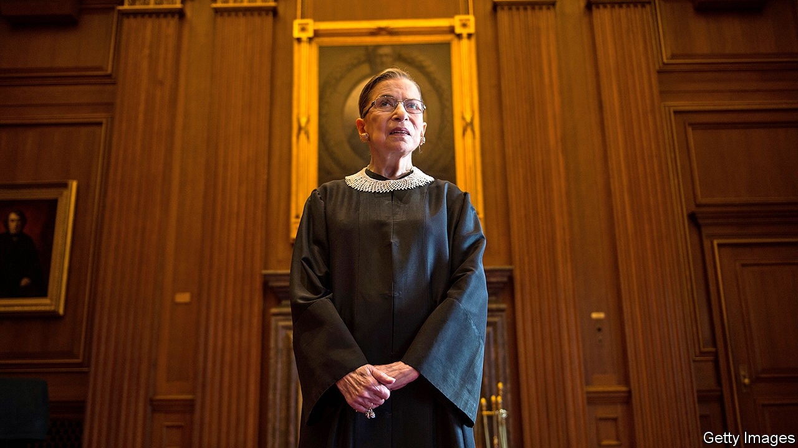

# Politics this week

> Sep 24th 2020

Donald Trump marshalled enough Republican votes in the Senate to consider a replacement for Ruth Bader Ginsburg before the election on November 3rd. Ms Ginsburg’s death gives the party a window to fill her seat on the Supreme Court with a conservative, further tipping its ideological balance to the right. Ms Ginsburg, appointed by Bill Clinton in 1993, was accorded the honour of lying in state in the Capitol building, the first woman to do so. See [article](https://www.economist.com//node/21792045).

A grand jury found no evidence to bring charges against three policemen for the fatal shooting of Breonna Taylor, a black woman, in Kentucky. Around midnight on March 13th police burst into Taylor’s flat without knocking to search for drugs. Her boyfriend, who later said he feared it was her ex-boyfriend breaking in, opened fire. The officers shot back, killing Taylor. No drugs were found. One officer, who fired through blinds, was charged with wantonly endangering the neighbours. After the decision, protests erupted and two officers were shot.

Jeanine Áñez, Bolivia’s interim president, dropped out as a candidate in the presidential election due to be held on October 18th. She said she hoped her withdrawal would boost the prospects of candidates running against Luis Arce, a leftist.

Peru’s president, Martín Vizcarra, survived a congressional vote to impeach him. Opposition politicians sought his ouster because, they claimed, leaked recordings proved that he had tried to cover up ties with a folk singer, known as “Richard Swing”, who had supported him and then received government contracts. See [article](https://www.economist.com//node/21792083).

Alexei Navalny, the main opposition leader in Russia, was discharged from the hospital in Germany where he had been treated since being poisoned with Novichok, a nerve agent, in Russia.

Italians voted in a referendum to cut the size of their parliament by more than a third. See [article](https://www.economist.com//node/21792036).

As cases of covid-19 continued to soar in Spain, the government appealed to residents of Madrid to stay at home. But it stopped short of declaring a state of emergency.

Britain’s prime minister, Boris Johnson, announced new restrictions, as the number of daily covid-19 cases has trebled since the start of September. Last month he was prodding workers to return to offices. Now he says they are to work from home again. Mr Johnson urged people to act responsibly: “your mild cough can be someone else’s death knell”. The government announced a new scheme to safeguard jobs. See [article](https://www.economist.com//node/21792070).

Wildlife officials said that toxic algal blooms in drinking holes caused the previously unexplained deaths of more than 300 elephants in Botswana in recent months. Botswana is home to one-third of Africa’s declining elephant population. 

The leader of a coup in Mali appointed Bah Ndaw, a former defence minister, as transitional president. The EU and America have suspended military aid to the country, which is fighting jihadists.

America announced new sanctions on people and entities linked to Iran’s nuclear programme. America also said it was unilaterally reimposing a UN arms embargo on Iran, a move the UN Security Council has refused to recognise.

Protesters in Thailand marched to the royal palace to demand reforms to the monarchy. Many wore crop tops and temporary tattoos to mock King Vajiralongkorn, who did not respond. He was in Germany, where he spends most of his time. See [article](https://www.economist.com//node/21792058).

Anwar Ibrahim, the leader of Malaysia’s opposition, announced that he had the support of enough MPs to bring the coalition that ran the country until seven months ago back to power. But the king, to whom he must present his claim to power, is in hospital. See [article](https://www.economist.com//node/21792060). 

Police in Hong Kong arrested Joshua Wong, a pro-democracy activist. He was accused of attending an illegal assembly last year and of violating a ban on protesters wearing masks.

China sent military aircraft across the mid-point of the Taiwan Strait, which had served as a makeshift boundary between Chinese and Taiwanese airspace. The incursions may have been a retaliation for the announcement of new American arms sales to Taiwan. A Chinese government spokesman said it did not accept the mid-point as a demarcation line.

China’s leader, Xi Jinping, said his country would be carbon-neutral by 2060, though he didn’t elaborate on how it would achieve that. Speaking to the UN by video-link, he reiterated a pledge that China’s carbon emissions will peak before 2030. See [article](https://www.economist.com//node/21792057).

A Chinese court sentenced Ren Zhiqiang, a former boss of a state-owned property firm, to 18 years in prison for corruption. Mr Ren had been an outspoken critic of Mr Xi. See [article](https://www.economist.com//node/21792052).

The area of the Arctic covered by sea ice shrank to 3.74m sq km in mid-September, the second-lowest figure in 40 years of record-keeping. The decline was most rapid in early September, caused in part by a heatwave in Siberia. Falling temperatures are helping the ice to return, but the 14 lowest extents of the ice have all been recorded over the past 14 years.

The WHO said that the global number of new infections had reached a weekly high of 2m. In the Netherlands the number of new cases hit a weekly record of nearly 13,500, up by 60% from the previous week. See [article](https://www.economist.com//leaders/2020/09/26/why-governments-get-covid-19-wrong).

The number of daily coronavirus infections reached a new high in Israel. Officials say hospitals are approaching their capacity. The government tightened a nationwide lockdown. Iran reported its most cases in a day. Its official cumulative total is now 433,000, though the true figure is much higher.

UEFA, Europe’s football governing body, was criticised for allowing 20,000 fans to attend a match in Budapest between Bayern Munich and Sevilla.

America’s Centres for Disease Control issued advice for Halloween. Trick-or-treating, costume masks and parties are discouraged; carving pumpkins with your family is okay.

## URL

https://www.economist.com/the-world-this-week/2020/09/24/politics-this-week
