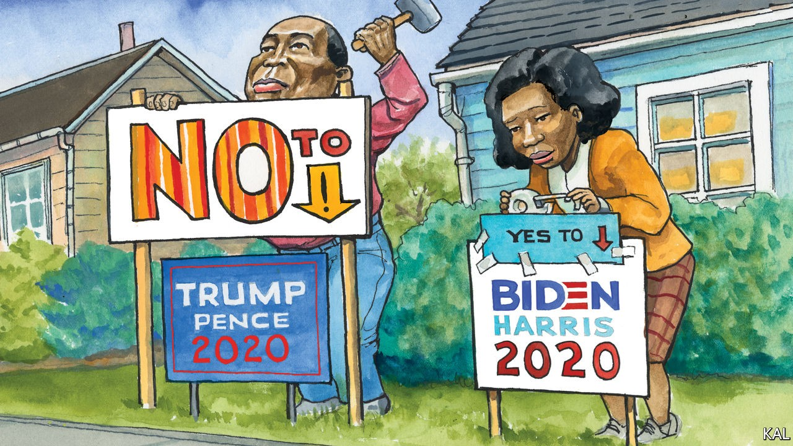

## Lexington

# Hope turned out black voters for Barack Obama

> Will fear bring them out against his successor?

> Sep 26th 2020

IT WAS INTERESTING to recall, while Lexington was observing some canvassing of black North Carolinians last week, that only three months previously America had been convulsed by the biggest racial-justice protests since the 1960s. On the doorsteps of poor black neighbourhoods in Greenville and the countryside east of the city, nobody raised them.

Nor did the couple of dozen voters your columnist met—at the side of masked and PPE-clad Democratic activists—mention another milestone, Joe Biden’s decision to put a black woman on the ticket. Asked for their view of Kamala Harris, most of the targeted voters, who were all black and mostly women, merely nodded politely. One praised her “professionalism”; another the fact that she seemed “strong enough to back up Joe”. Beyond such bland statements, few of the voters even mentioned Mr Biden. But all said they were especially determined to vote for the Democratic candidate this year, because of Donald Trump.

“Gotta get 45 out, that’s the only thing that matters,” said Mary Ellis, at her house in Greenville Heights, one of a row of single-storey dwellings thumping with music. “Everything I hear from him isn’t right,” said her neighbour, Magdalene Knight. “It scares me to think we’ve got a generation of young people watching his immorality,” said Ruby Perkins, a retired teacher, with a large “Thank you Jesus” sign outside her door. “That man lied to the nation about a pandemic. You’ve got to be demented to think he’s the answer.”

This should be music to Democratic ears. A huge majority of African-Americas will vote for Mr Biden, and they will do so for the main reason Democratic strategists have been inviting them to. They want the election to be a referendum on an unpopular president, not a choice between two old white men, and most of them made that determination long ago. “You could put up a flowerpot against Trump and we’d vote for the flowerpot,” said Betsy Wallace in rural Williamston, 30 miles to the north-east. Yet notwithstanding black voters’ overriding support for Mr Biden, they have recently emerged as one of his campaign’s biggest worries.

Polls point to a marginal softness in their support for Mr Biden relative to that enjoyed by Hillary Clinton. Where she won 88% of African-Americans, YouGov polling suggests 83% are committed to voting for Mr Biden. He will probably bridge the gap. Only 8% of black voters say they will vote for Mr Trump; many of the rest are undecided and most likely to plump for Mr Biden. Yet his advisers had been counting on Mr Biden to do better with black voters than Mrs Clinton. To win back the midwestern states she lost, let alone North Carolina, a state where a quarter of voters are black, he may need to do much better. And the polls are not the only things fuelling Democratic anxiety on this score.

Another is the flipside of Mr Trump’s negative appeal. The president’s offensiveness to black voters, combined with Mr Biden’s own limitations as a campaigner, have made it hard for the challenger to make a positive case for himself. “He’s got a good heart, he’s one of us,” was the most the voters in and around Greenville said for Mr Biden. This might suggest his support among African- Americans is wider than it is deep. Which in turn could suggest it will not take much to stop them turning out in the numbers he needs. And covid-19 is a lot. Alongside their loathing for the president, almost all the North Carolinians appeared terrified of the virus, which has hit black America disproportionately hard. Most spoke to the canvassers from behind a screen or a front door held slightly ajar. “I’m sorry, baby,” said Ms Ellis, of Greenville Heights, to explain why she would not step outside. “We’re scared.”

These are valid concerns, which will not be fully allayed until the returns are in. (Representative G.K. Butterfield, whose congressional district includes Greenville, said his biggest fear was of a covid-19 surge a week before the election.) Yet Lexington’s day on the trail suggested the Democrats may be worrying a bit too much.

Voting for the least bad option is not a novelty to black voters. The exuberance of their support for Barack Obama (“The most beautiful thing I’ve ever seen,” recalled Ms Perkins) was an anomaly. They generally take a starkly pragmatic view of politics. For many black voters, elections represent more a source of protection than a promise of future perfection. Their dogged support for the often-disappointing Democrats illustrates that. Republicans tend to ascribe it to leftist identity politics; it is more a defensive measure against a majority-white party that has often sought to repress their voting rights. Mr Trump, who this week randomly accused his opponents of wanting to build “projects” in the leafy suburbs, has hardened that suspicion, and thereby drawn a predictable African-American response. Asked what would get her neighbours to the polls in numbers, Ms Perkins replied: “Fear. Fear of covid. Fear of losing your job and house. Fear of being shot while watching TV in your house.” As an indicator of likely black turnout, enthusiasm for the candidate may be overrated.

Without underestimating the covid-related uncertainties, there are also indicators that the virus could have less of a dampening effect than nervous Democrats fear. Projections from the latest survey data suggest black turnout is on course to be nine points higher than it was in 2016. All the voters canvassed insisted they would not allow the virus to stop them voting. Most said it had made them more determined to vote, and that they had already made plans to protect themselves, by voting early by mail or in person. Polls suggested black voters are 25% more likely to vote early than they were in 2016. That could make it harder to suppress their votes. “I’m voting,” said Ethel Peele, on her doorstep in Williamston. “Even if I have to get me a cab, I’m voting.”

African-American voters are facing even more formidable obstacles than usual this year. Yet they are formidable voters. Most of the evidence suggests Mr Biden can count on them. ■

Dig deeper:Read the [best of our 2020 campaign coverage](https://www.economist.com//us-election-2020) and explore our [election forecasts](https://www.economist.com/https://projects.economist.com/us-2020-forecast/president), then sign up for Checks and Balance, our [weekly newsletter](https://www.economist.com//checksandbalance/) and [podcast](https://www.economist.com/https://play.acast.com/podcasts/2020/01/24/checks-and-balance-our-new-weekly-podcast-on-american-politics) on American politics.

## URL

https://www.economist.com/united-states/2020/09/26/hope-turned-out-black-voters-for-barack-obama
