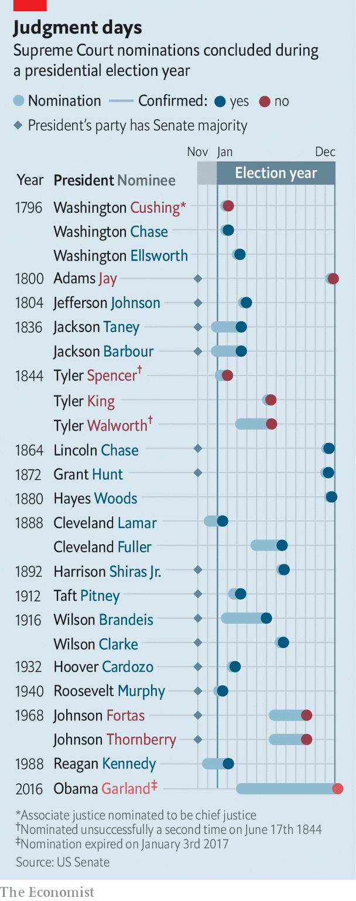

## Courting trouble

# The knife fight over Ruth Bader Ginsburg’s replacement

> Republicans may come to miss the norms they are breaking in the Senate

> Sep 26th 2020

THE PARTIES to a civil war almost never agree on why it began—and the parties to America’s decades-old fight for control of the Supreme Court are no different.

For Republicans, the cause of the conflict is a Democratic Party that has tried to block conservative justices, starting with Robert Bork’s failed nomination in 1987, by underhand means. In attacking Bork’s opposition to civil-rights legislation, Ted Kennedy abandoned a bipartisan tradition of assessing judicial nominees on their qualifications, not their values; in airing allegations of sexual abuse against Clarence Thomas in 1991, Democrats allegedly took that a step further; ditto in the sorry case of Brett Kavanaugh in 2018.

Democrats consider this self-serving nonsense. They note that they supported Ronald Reagan’s alternative to Bork, Anthony Kennedy; and that their efforts to block Justices Thomas and Kavanaugh were unsuccessful. The median justice on the court has grown more conservative in recent decades—suggesting that if the Democrats are trying to sabotage its conservative drift, they are failing. They believe Republicans’ grievances are fuelled by undimmed rage at the court’s consequential liberal lean in the 1960s, and a related ambition to turn back the clock.

These positions have long been entrenched. Yet the conflict has been managed through a combination of improved geriatric medicine and partisan micromanagement of Supreme Court retirements. With only one justice dying in office between 1955 and 2016 (the conservative William Rehnquist, in 2005), the parties have generally replaced outgoing judges with like-minded successors. The death of Ruth Bader Ginsberg on September 18th, following that of Justice Antonin Scalia in 2016, has abruptly ended this phoney war.

Given his party’s fixation with the court, Mitch McConnell’s decision to push through a conservative replacement for the liberal heroine was never in doubt. Even so, the contempt for Senate norms it has necessitated on his and his Republican colleagues’ part is one for the history books. In 2016 Mr McConnell refused to hold hearings for Barack Obama’s nominee to replace Scalia, Merrick Garland, on a made-up pretext that new justices were not confirmed in an election year. This was so demonstrably untrue that even some Republicans seemed discomforted by it.

Lindsey Graham of South Carolina, a sometime bipartisan moderate, felt compelled to insist that Republicans would honour the same precedent in the unlikely event that a justice died in the last year of Mr Trump’s term. Chuck Grassley of Iowa said the same. Mr McConnell’s latest breach of fair play has therefore occasioned a rippling cascade of bad faith. For his part, Mr McConnell claims to have identified a bogus exception to his bogus precedent. When the Senate and presidency are held by the same party, he says his 2016 rule does not apply. (The most recent election-year confirmation, of a conservative judge by a Democratic Senate, points to the nonsense of that.)

Mr Graham, chairman of the Senate Judiciary Committee, meanwhile claims the Democrats invalidated his pledge by being beastly to Justice Kavanaugh. Mr McConnell needs the votes of 50 of the 53 Republican senators to confirm Mr Trump’s nominee to replace Justice Ginsberg, and at the time of writing only Susan Collins of Maine seemed certain to deny him hers. Lisa Murkowski of Alaska vowed to do likewise, then appeared to back down. A gathering of Republican senators over lunch this week appeared to leave only the fine-print of Mr McConnell’s strategy to be worked out.

Most Republican senators are keen to push ahead with the confirmation before the November election—including, as a sign of how reliant the Republican Party has become on base-rallying, those such as Thom Tillis of North Carolina facing stiff re-election fights. A handful of others believe there may be electoral advantage in waiting until after the poll. Yet even if the Republicans lose control of the Senate and White House in that scenario, they still plan to confirm Mr Trump’s third Supreme Court justice. So the court will almost certainly soon have a 6:3 conservative majority. And given that Justice Ginsberg was one of its most liberal members and her expected successor, Amy Coney Barrett, would be one of its most conservative, it will probably be jolted to the right.

Democrats appear stunned. A few days ago they were looking forward to a possible sweep of the White House and Congress, and thereby an opportunity to reverse the damage done by Mr Trump to Mr Obama’s legacy and to the country’s governing institutions. Now they are contemplating the possibility of Obamacare being eviscerated by hostile conservative judges (Ms Barrett is not a fan of Mr Obama’s health-care reform) when it appears before the Supreme Court after the election.

Any future Democratic rule or law could also fall victim to such a court. And even if the justices refrain from activism, the court is in danger of losing the vestige of bipartisan public trust it has hitherto retained. The Senate, which has already lost its vestige, is meanwhile likely to be rendered even more dysfunctional by the bad blood Mr McConnell is generating. “The potential damage to the Senate, the damage to how the parties see each other, to the institution of the court is real,” said Senator Chris Coons, an influential Democrat on Mr Graham’s committee.

While moderate Democrats such as Mr Coons still dread that possible scenario, their Republican counterparts seem to have concluded that the time for norm-respecting niceties has passed. Mr McConnell’s strategy permits no other conclusion. So does the fact that his supporters invariably present his abandonment of Senate tradition as a defence against the even worse abuses they claim the Democrats are plotting. No matter what Mr McConnell does, they suggest the Democrats are about to pack the Supreme Court with liberal judges; if that is right, his theft of the odd Supreme Court seat might seem defensive and proportionate. Like William Howard Taft, another divisive Republican, Republican senators have convinced themselves that the malice of their opponents leaves them no alternative but to “do anything I find myself able to do”.

In reality the alleged Democratic perfidy is not obvious. Left-wing activists and their few elected champions—including Congresswoman Alexandria Ocasio-Cortez—do advocate the structural changes Republicans fear, such as expanding the Senate and Supreme Court bench in a bid to stop conservatives accruing immense power with a minority of votes. But they are relative fringe players in the party. Joe Biden is the Democratic presidential nominee. And he and most of his rivals in the primaries (including Senator Bernie Sanders) ruled out court-packing.

Even after Mr McConnell’s latest judicial heist—and despite media speculation to the contrary—it is hard to imagine 51 Democratic senators backing such a proposal anytime soon. There is especially little appetite for it among the moderate Democrats whose influence increases as the party’s congressional numbers rise. But in the longer term, if Republicans continue down this path, Democratic forbearance will end. Emboldened by their belief that the culture and a majority of Americans are with them, Democrats will also discover their breaking-point. And the Republicans may rue what comes next.■

Dig deeper:Read the [best of our 2020 campaign coverage](https://www.economist.com//us-election-2020) and explore our [election forecasts](https://www.economist.com/https://projects.economist.com/us-2020-forecast/president), then sign up for Checks and Balance, our [weekly newsletter](https://www.economist.com//checksandbalance/) and [podcast](https://www.economist.com/https://play.acast.com/podcasts/2020/01/24/checks-and-balance-our-new-weekly-podcast-on-american-politics) on American politics.

## URL

https://www.economist.com/united-states/2020/09/26/the-knife-fight-over-ruth-bader-ginsburgs-replacement
