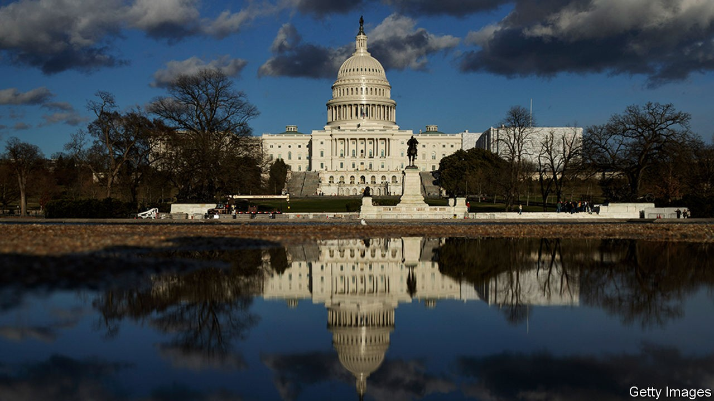
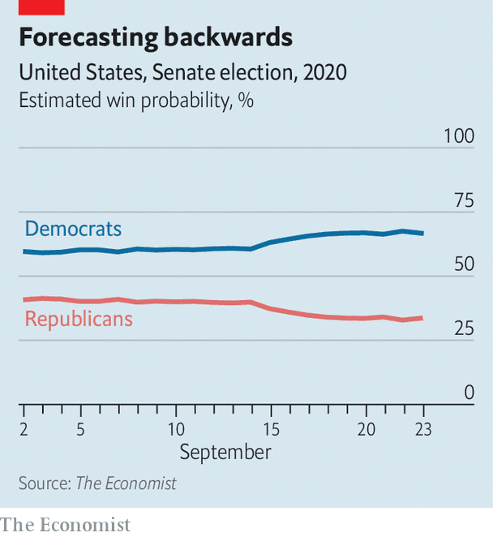

## The donkey’s long tail

# Why the Democrats are our narrow favourites to win the Senate

> The Economist’s new statistical model gives them a 67% chance of flipping the upper house of Congress. That would open up new possibilities

> Sep 23rd 2020

THE MOST important choice American voters face in November is whether to re-elect Donald Trump as president. The second-most important is whether to leave Republicans in control of the Senate, whose assent is required to pass federal laws and to confirm presidential nominees to federal courts and senior jobs.

If Mr Trump wins another term, Republicans will almost certainly hold the Senate as well. But if he does not, a Republican-controlled Senate would serve as a strong check on Joe Biden’s administration. If the record of Mitch McConnell, the Republican majority leader in the Senate, is any guide, a hostile upper chamber could block much of Mr Biden’s legislative agenda and prevent him filling most judicial vacancies—even if he wins the election in a landslide. Conversely, even a bare Senate majority would open up possibilities for him.

In practice, Democrats would be limited by the need to hold their caucus together. If they do win back the Senate, most of their new members will be centrists; their candidate in Kansas was a Republican until 2018. The last midterm elections, when Democrats did well, brought an infusion of moderates representing somewhat conservative places. Nonetheless, the difference in America’s political trajectory between scenarios in which the Democrats hold 49 Senate seats and those where they win 50—tie-breaking votes, if necessary, are cast by the vice-president—would be significant.

If the fight for the Senate gets less attention than it deserves, one reason may be that it is hard to analyse. There are no nationwide Senate polls. Instead there are 35 separate contests, in different states with different candidates (the other 65 seats are not up for election this year). Some races are polled often; others not at all. Even the rules can vary: Louisiana and Georgia use a two-round system with a run-off; Maine recently adopted ranked-choice voting.

To sort through these complexities, we have built a [statistical model](https://www.economist.com/https://projects.economist.com/us-2020-forecast/senate) to estimate the probabilities of each party controlling the Senate (as well as the House of Representatives, which the Democrats already hold). It currently gives the Democrats a 67% chance of flipping the Senate. That probability is lower than the 86% our corresponding model gives Mr Biden of winning the presidency, but higher than conventional wisdom last year held about Senate Democrats’ odds. Our forecast will be updated on our website every day until the election as new data arrive.

Like all quantitative forecasts, our model is only as good as its assumptions. Above all, it relies on the expectation that the statistical relationships that have best predicted legislative election results in the past will persist more or less unchanged. Because none of the races on which the model was trained occurred during a pandemic, this foundation may prove unusually rickety in 2020. For example, the model has no idea that the share of votes cast by post is likely to soar. No one knows which side will benefit from such shifts, but they inject new, unquantifiable uncertainty into the race.

With this caveat, the rich data on Congressional races—nearly 18,000 elections have been held since 1945—permit statisticians to reach fairly sturdy conclusions about voters’ behaviour in legislative contests. Our model uses a wide range of indicators, including national, state and congressional-district polling; the voting histories of each state and district; candidates’ experience in elective office, ideological positioning, incumbency, fundraising and involvement in scandals; the president’s approval rating; the results of special elections held to fill legislative vacancies across the country; and more (see [article](https://www.economist.com//graphic-detail/2020/09/23/our-new-senate-model-has-inched-towards-democrats-in-september) for a step-by-step example of how this works). When applied to past races, its average forecast made on election day would have missed the correct result by two seats in the Senate, and eight in the 435-member House.

The model’s average expectation is that the Democrats will gain eight seats in the House. Two flips are virtually assured, thanks to a court-ordered redistricting in North Carolina. Others are likely to come from a list of a few dozen vulnerable seats, mostly in suburbs or with lots of college-educated white voters, in which Republicans either barely survived in 2018, face stronger challengers than they did that year, or saw a popular incumbent retire.

The Republicans have a much less promising group of targets. The overall environment this year is shaping up to be nearly as good for Democrats as the mid-terms of 2018 were, and many Democratic freshmen who toppled Republican incumbents now enjoy some benefits of incumbency themselves. The model does make Michelle Fischbach, formerly the lieutenant-governor of Minnesota and president of its state Senate, a heavy favourite to beat a Democratic incumbent in the state’s rural seventh district, which voted for Donald Trump by 31 points in 2016. Overall, however, it gives Republicans just a 1-2% chance of wresting back the House.

The Senate, in contrast, rests on a knife- edge. With 47 seats, the Democrats need three more to secure control if Mr Biden wins the presidency, or four if he does not. Because one Democratic incumbent, Doug Jones of blood-red Alabama, is likely to lose—he won his seat in 2017 against an opponent accused of sexually assaulting teenagers—the party probably needs at least four flips, on top of a Biden victory.

Democrats are clear favourites in two seats. In Arizona, Martha McSally, who lost a close Senate race in 2018, wound up in the chamber anyway after she was appointed to fill a vacant seat. She now faces Mark Kelly, a former astronaut married to Gabby Giffords, who served in the House until she was shot in the head by a lunatic in 2011 (and miraculously survived). Mr Kelly has raised a whopping $45m, and leads in the polls by around eight percentage points. Arizona still leans slightly Republican, but autumn polling leads as robust as Mr Kelly’s rarely vanish entirely. Our model gives him a 90% chance of winning.

The Democrats’ other relatively easy flip is in Colorado, which is fast becoming a Democratic state. Their candidate, John Hickenlooper, is a centrist former governor. Colorado has been polled far less than Arizona has, and Mr Hickenlooper’s campaign has been surprisingly shaky. But he appears to lead the incumbent, Cory Gardner, by seven points. The model sees Mr Hickenlooper as an 80-20 favourite.

After these two, the Democrats’ road gets tougher. Their next-best bet appears to be in North Carolina. Mr Biden is clinging to a bare one- or two-point lead there, but the picture in the Senate is different: Cal Cunningham, a former state legislator, soldier and businessman, is polling well ahead of Mr Biden and leads Thom Tillis, a rather unloved Republican incumbent, by six points. Given how closely tied votes for the presidency and Senate have become—in 2016, for the first time since senators became elected by popular vote a century ago, every state with a Senate race voted for the same party for both branches of government—it would be surprising if Mr Tillis finishes that far behind Mr Trump. But this pattern has appeared in enough surveys from enough pollsters that our model, for the moment, makes Mr Cunningham a clear favourite. If the polls do move towards Mr Tillis, the model should boost his odds quickly.

The final state where the model favours a Democratic challenger is Maine. Susan Collins, the incumbent, is the Senate’s most moderate Republican, and in 2014 voters returned her to office by a 37-point margin. However, her vote to confirm Brett Kavanaugh, a conservative judge, to the Supreme Court seems to have alerted Maine’s somewhat Democratic-leaning electorate to the fact that even a centrist Republican is still a Republican. Her challenger, Sara Gideon, is the speaker of the Maine House of Representatives and a formidable fund-raiser. A big reason that our Senate forecast has inched towards the Democrats recently is a flurry of polls giving Ms Gideon a high-single-digit lead. It now thinks her chances of winning the seat are around 70%.

If the Democrats’ path to a majority ended in Maine, they would still be far from certain to regain Senate control. However, the key to their fairly strong position is their “long tail”: an extensive list of races where they are more likely than not to lose, but have a solid chance at an upset. This list starts with Iowa, where Mr Biden and Mr Trump are running neck-and-neck. A recent survey by Ann Selzer, the state’s most prominent pollster, gave the Democrats’ Theresa Greenfield a three-point edge over Joni Ernst, the Republican incumbent.

Democrats are also nearly tied in polls in the two Georgia seats up for election, and, surprisingly, in the far redder states of South Carolina, Kansas and Montana—though their candidate in Montana is Steve Bullock, a popular sitting governor, making his strength a bit more predictable. Democrats also have an outside shot in little-watched races in Alaska and Texas—though probably not in Kentucky, where the model heavily favours Mr McConnell.

Just as in presidential elections, the results of Senate elections are correlated across states. For example, in scenarios where Republicans fend off a Democratic challenge in Montana, they are also more likely to hold on to their seats in Maine and Mississippi. However, each Senate race features a unique set of candidates, running on a distinctive set of local issues. As a result, knowing the result of one Senate election is only moderately useful in predicting the result of another. In 2018 Democratic incumbents in North Dakota, Missouri, Indiana and perennially close Florida were defeated, whereas those in Montana and West Virginia—the most Republican of the group at the presidential level—survived. Two years earlier, on the same night that rural white voters in northern states delivered the presidency to Mr Trump, Democrats managed to flip a Republican-held Senate seat in rural, white New Hampshire.

This partial independence of Senate races from national trends is the main reason why our model gives the Democrats a narrow edge. Even one upset among these eight would make up for a disappointment in Maine or North Carolina; two would all but assure them a majority. And because these states are so varied—Alaska and Montana are western frontier states with an independent streak, Iowa and Kansas are midwestern farming territory, and Georgia and South Carolina are racially polarised states in the South—Republicans would struggle to weather a defection from even one region or demographic group.

Whereas the Senate map in the mid-term elections of 2018 favoured the Republicans, this year’s battles are being fought almost entirely on their terrain. Individually, each of these races should cause the party few headaches. As a group, however, they represent a dire threat. ■

Dig deeper:Read the [best of our 2020 campaign coverage](https://www.economist.com//us-election-2020) and explore our [election forecasts](https://www.economist.com/https://projects.economist.com/us-2020-forecast/president), then sign up for Checks and Balance, our [weekly newsletter](https://www.economist.com//checksandbalance/) and [podcast](https://www.economist.com/https://play.acast.com/podcasts/2020/01/24/checks-and-balance-our-new-weekly-podcast-on-american-politics) on American politics.

## URL

https://www.economist.com/united-states/2020/09/23/why-the-democrats-are-our-narrow-favourites-to-win-the-senate
