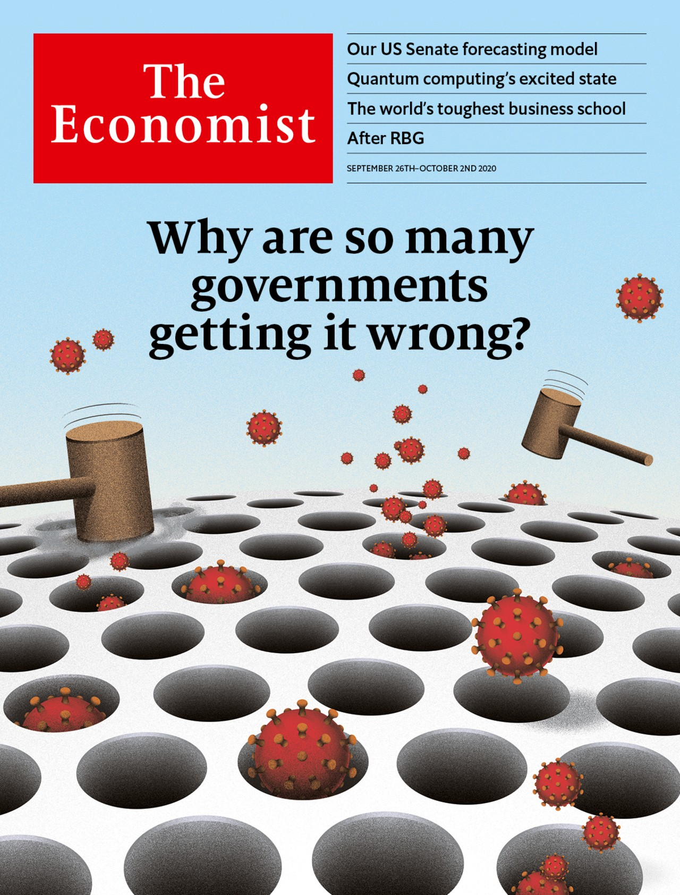

## Why are so many governments getting it wrong?

### The world this week
#### [Politics this week](./The%20world%20this%20week/politics-this-week.md)
#### [Business this week](./The%20world%20this%20week/business-this-week.md)
#### [Kals cartoon](./The%20world%20this%20week/kals-cartoon.md)
### Leaders
#### [Why governments get covid 19 wrong](./Leaders/why-governments-get-covid-19-wrong.md)
#### [Covid 19 has reversed years of gains in the war on poverty](./Leaders/covid-19-has-reversed-years-of-gains-in-the-war-on-poverty.md)
#### [How to make american judges less notorious](./Leaders/how-to-make-american-judges-less-notorious.md)
#### [What to do about zombie firms](./Leaders/what-to-do-about-zombie-firms.md)
#### [What quantum computers reveal about innovation](./Leaders/what-quantum-computers-reveal-about-innovation.md)
### Letters
#### [Letters to the editor](./Letters/letters-to-the-editor.md)
### Briefing
#### [The covid 19 pandemic is worse than official figures show](./Briefing/the-covid-19-pandemic-is-worse-than-official-figures-show.md)
### Asia
#### [Why so many indonesians want to be public servants](./Asia/why-so-many-indonesians-want-to-be-public-servants.md)
#### [Daring thais march to the palace to demand royal reform](./Asia/daring-thais-march-to-the-palace-to-demand-royal-reform.md)
#### [Indias government prunes the regulations stifling farmers](./Asia/indias-government-prunes-the-regulations-stifling-farmers.md)
#### [A veteran malaysian politician tries to topple the government](./Asia/a-veteran-malaysian-politician-tries-to-topple-the-government.md)
#### [Even as countries peck at each other their birdwatchers co operate](./Asia/even-as-countries-peck-at-each-other-their-birdwatchers-co-operate.md)
### China
#### [China aims to cut its net carbon dioxide emissions to zero by 2060](./China/china-aims-to-cut-its-net-carbon-dioxide-emissions-to-zero-by-2060.md)
#### [A prominent critic of chinas leader gets 18 years in jail](./China/a-prominent-critic-of-chinas-leader-gets-18-years-in-jail.md)
#### [Calling for reciprocity is not making china or the west happier](./China/calling-for-reciprocity-is-not-making-china-or-the-west-happier.md)
### United States
#### [Why the democrats are our narrow favourites to win the senate](./United%20States/why-the-democrats-are-our-narrow-favourites-to-win-the-senate.md)
#### [What does amy coney barrett think](./United%20States/what-does-amy-coney-barrett-think.md)
#### [Democrats are doing less badly among rural voters](./United%20States/democrats-are-doing-less-badly-among-rural-voters.md)
#### [China now has the worlds largest fleet alarming its pacific rival](./United%20States/china-now-has-the-worlds-largest-fleet-alarming-its-pacific-rival.md)
#### [The knife fight over ruth bader ginsburgs replacement](./United%20States/the-knife-fight-over-ruth-bader-ginsburgs-replacement.md)
#### [Hope turned out black voters for barack obama](./United%20States/hope-turned-out-black-voters-for-barack-obama.md)
### Middle East & Africa
#### [Victory for bashar al assad has meant more suffering for his people](./Middle%20East%20&%20Africa/victory-for-bashar-al-assad-has-meant-more-suffering-for-his-people.md)
#### [Will the architectural heritage of beirut survive the explosion](./Middle%20East%20&%20Africa/will-the-architectural-heritage-of-beirut-survive-the-explosion.md)
#### [Social media platforms are destroying evidence of war crimes](./Middle%20East%20&%20Africa/social-media-platforms-are-destroying-evidence-of-war-crimes.md)
#### [Ghana is planning to sell most of its future gold royalties](./Middle%20East%20&%20Africa/ghana-is-planning-to-sell-most-of-its-future-gold-royalties.md)
### The Americas
#### [Martin vizcarra survives an impeachment vote](./The%20Americas/martin-vizcarra-survives-an-impeachment-vote.md)
#### [Why argentines are flocking to uruguay](./The%20Americas/why-argentines-are-flocking-to-uruguay.md)
#### [Amlos war against the intelligentsia](./The%20Americas/amlos-war-against-the-intelligentsia.md)
### Europe
#### [France as ever wants to be both european and french](./Europe/france-as-ever-wants-to-be-both-european-and-french.md)
#### [Ukraines anti corruption court bares its teeth](./Europe/ukraines-anti-corruption-court-bares-its-teeth.md)
#### [Italians vote for fewer better politicians](./Europe/italians-vote-for-fewer-better-politicians.md)
#### [Upcoming referendums will show how the swiss may relate to the eu](./Europe/upcoming-referendums-will-show-how-the-swiss-may-relate-to-the-eu.md)
#### [The problem of the eus golden passports](./Europe/the-problem-of-the-eus-golden-passports.md)
### Britain
#### [Keir starmers rather conservative message to britain](./Britain/keir-starmers-rather-conservative-message-to-britain.md)
#### [Britains gender recognition act wont change](./Britain/britains-gender-recognition-act-wont-change.md)
#### [The british government tightens covid 19 restrictions](./Britain/the-british-government-tightens-covid-19-restrictions.md)
#### [Britains experiment in radical rail privatisation is over](./Britain/britains-experiment-in-radical-rail-privatisation-is-over.md)
#### [Defund the bbc home for idling brexiteers](./Britain/defund-the-bbc-home-for-idling-brexiteers.md)
#### [Does immigration import inequality](./Britain/does-immigration-import-inequality.md)
#### [Britains coming commercial property slump](./Britain/britains-coming-commercial-property-slump.md)
#### [Andy burnham strengthens the case for devolution in britain](./Britain/andy-burnham-strengthens-the-case-for-devolution-in-britain.md)
### International
#### [The pandemic is plunging millions back into extreme poverty](./International/the-pandemic-is-plunging-millions-back-into-extreme-poverty.md)
### Business
#### [Can tiktok help oracle stay relevant in the cloud computing age](./Business/can-tiktok-help-oracle-stay-relevant-in-the-cloud-computing-age.md)
#### [Why the tiktok deal is like schrodingers cat](./Business/why-the-tiktok-deal-is-like-schrodingers-cat.md)
#### [How donald kendall as pepsicos boss sparked the cola wars](./Business/how-donald-kendall-as-pepsicos-boss-sparked-the-cola-wars.md)
#### [Bp and other oil majors v utilities](./Business/bp-and-other-oil-majors-v-utilities.md)
#### [The worlds toughest business school](./Business/the-worlds-toughest-business-school.md)
#### [Why rocket internet has come down to earth](./Business/why-rocket-internet-has-come-down-to-earth.md)
#### [Can weibo do better than twitter](./Business/can-weibo-do-better-than-twitter.md)
#### [What warren buffett sees in japan inc](./Business/what-warren-buffett-sees-in-japan-inc.md)
### Finance & economics
#### [Why covid 19 will make killing zombie firms off harder](./Finance%20&%20economics/why-covid-19-will-make-killing-zombie-firms-off-harder.md)
#### [Will japan see a new generation of zombie firms](./Finance%20&%20economics/will-japan-see-a-new-generation-of-zombie-firms.md)
#### [Why is americas economy beating forecasts](./Finance%20&%20economics/why-is-americas-economy-beating-forecasts.md)
#### [Does economic growth boost stock prices](./Finance%20&%20economics/does-economic-growth-boost-stock-prices.md)
#### [Has the vatican cleaned up its finances](./Finance%20&%20economics/has-the-vatican-cleaned-up-its-finances.md)
#### [Can chinas economic miracle continue](./Finance%20&%20economics/can-chinas-economic-miracle-continue.md)
### Science & technology
#### [Commercialising quantum computers](./Science%20&%20technology/commercialising-quantum-computers.md)
#### [Why funnel web spiders are so dangerous to people](./Science%20&%20technology/why-funnel-web-spiders-are-so-dangerous-to-people.md)
#### [A burrowing dinosaur](./Science%20&%20technology/a-burrowing-dinosaur.md)
### Books & arts
#### [Born in los angeles ms 13 came to terrorise el salvador](./Books%20&%20arts/born-in-los-angeles-ms-13-came-to-terrorise-el-salvador.md)
#### [James baker and the art of power](./Books%20&%20arts/james-baker-and-the-art-of-power.md)
#### [Civilisations once met and melded in ravenna](./Books%20&%20arts/civilisations-once-met-and-melded-in-ravenna.md)
#### [The sudden success of sigrid nunez](./Books%20&%20arts/the-sudden-success-of-sigrid-nunez.md)
#### [Hercule poirot turns 100](./Books%20&%20arts/hercule-poirot-turns-100.md)
### Economic & financial indicators
#### [Economic data commodities and markets](./Economic%20&%20financial%20indicators/economic-data-commodities-and-markets.md)
### Graphic detail
#### [Our new senate model has inched towards democrats in september](./Graphic%20detail/our-new-senate-model-has-inched-towards-democrats-in-september.md)
### Obituary
#### [Ruth bader ginsburg died on september 18th](./Obituary/ruth-bader-ginsburg-died-on-september-18th.md)
