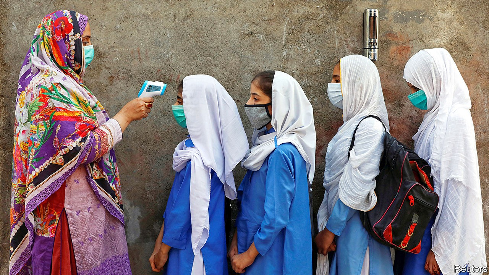
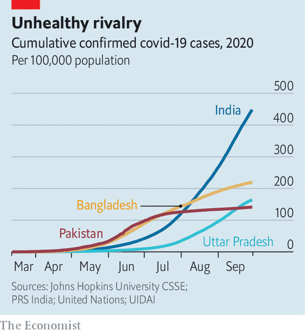

## India v Pakistan v covid-19

# Is Pakistan really handling the pandemic better than India?

> It appears to be, though the official data do not tell the whole story

> Sep 30th 2020ISLAMABAD

IN STATISTICS IF not in cricket, India tends to trump its perennial rival Pakistan. It is four times larger in area, seven times in population and ten times in GDP. Yet in the dismal realm of covid-19, bigger numbers are nothing to boast of. According to both countries’ official tallies, every week of the past month has claimed more Indian lives than the entire nine months of the pandemic have in Pakistan—some 6,500.

Whereas India’s burden is still rising by 70,000 new cases a day, Pakistan’s caseload seems to have peaked three months ago. Its daily total of new cases has remained in the mere hundreds since early August. India’s economy has also fared far worse. The Asian Development Bank predicts that its GDP will shrink by fully 9% in the current fiscal year, compared with a contraction of 0.4% for Pakistan.

“We have not only managed to control the virus, stabilise our economy, but most importantly, we have been able to protect the poorest segment of our society from the worst fallouts of the lockdown,” crowed Imran Khan, Pakistan’s prime minister, in a recent video address to the UN General Assembly. Meanwhile, ordinary Pakistanis are doffing masks and disregarding social-distance rules. “I didn’t fall sick and neither did anyone I know,” declares Irfanullah Khan, a grocer in Islamabad’s Najam market. “Now it’s over.”

Experts loudly chorus that such conclusions are wrong, yet they do concur that Pakistan is enjoying an unexpected reprieve. For weeks in late summer, international health officials were reluctant to accept that the rapid fall in cases as revealed by testing data could really be correct. Yet the proportion of tests coming back positive was also falling, as were the numbers of people being taken to hospital or being kept in intensive care.

All this is puzzling, considering that, although both countries spend painfully little on public health, Pakistan’s health infrastructure is considerably flimsier than India’s. Odder still is that whereas India’s covid policies have been sharp and strict, Pakistan’s have been relatively lax. In the same week in March when Narendra Modi, India’s prime minister, won praise for sealing borders, stopping trains and slapping his 1.3bn fellow citizens under a harsh lockdown that ended up lasting two months, Mr Khan attracted wagging fingers for objecting that many of his own countrymen were too poor to endure such strictures. Rather than shut down the whole country, Pakistan adopted a piecemeal approach that focused on isolating areas where there were outbreaks and on providing cash handouts to the poorest.

Mr Khan’s supporters say this policy’s success was aided by the creation of a national command centre to co-ordinate regional policies and by enlisting the army, including its tentacular security apparatus, for contact-tracing efforts. Others say efficient redeployment of a national polio-eradication campaign provided more vital boots on the ground to combat covid.

There are less heroic reasons for Pakistan’s lower covid toll, too. Some, ironically, stem from its relative backwardness. “Basically, it is undertesting on a massive scale,” contends Ramanan Laxminarayan of Princeton University. He notes that Pakistan tests for covid at less than a quarter of India’s rate, per person, adding that the relatively poor Indian state of Uttar Pradesh, with a population equal to Pakistan’s and a similar failure to test widely, has also registered similar numbers of cases and fatalities (see chart). “Test not, find not,” says Mr Laxminarayan. “It’s the same with authoritarian regimes the world over.”

Demography is another factor. Both Pakistan and India have a far smaller proportion of old people than rich countries do. Just 4% of Pakistanis are over 65, for example, compared with 23% of Italians. Yet the median age in Pakistan, 23, is four years lower than India’s, and its average life expectancy, 67, is two years shorter. This puts a far smaller proportion of Pakistanis in the age bracket most vulnerable to covid.

Although both countries remain largely rural, Indians are much more mobile, both domestically and internationally. Some 160m Indians travel by air annually compared with fewer than 10m Pakistanis; passenger traffic on Indian railways is 130 times greater. Mr Modi’s lockdown, ironically, first bottled tens of millions of migrant workers inside cities that were often reservoirs of covid and then, as pressure mounted to let them return to their villages, distributed the epidemic more widely. Pakistanis, by and large, have instead stayed put at home, which more often means a family home in a village, and less often the kind of crowded workers’ colonies that ring Indian cities. The laxness of Pakistan’s lockdown meant that most small businesses stayed open, whereas nearly all in India were forced to close.

In a further irony, relative prosperity has made not just India’s health but also its economy more vulnerable to covid. The pandemic has slammed not just the huge informal sector, but such big drivers of growth as carmakers and airlines. Pakistan, in contrast, has fewer industries to attract and then dismiss migrant labour, fewer planes and trains to idle, fewer and less complex supply chains to sever. Not surprisingly, the ADB foresees India’s more sensitive economy springing back next year with 8% growth, whereas Pakistan’s is expected to grow just 2%.

Despite the starkly different trajectories covid has taken so far in India and Pakistan, experts warn against drawing firm conclusions. “Our lockdown may have hurt India more than the disease itself, but in other respects we are much like Pakistan,” says Jayaprakash Muliyil, an adviser to India’s National Institute of Epidemiology. None of the numbers coming from either country is likely to present a true picture, he suggests: “We both really cannot see what is happening in villages, where most people live, and we share the same disdain for proper data.”

Serological studies, which detect covid antibodies rather than active infections, have in both countries suggested a vast gap between actual and declared caseloads. A study in Islamabad in June estimated that 14.5% of the 2m people in Pakistan’s capital had already been infected—as many as the official number for the entire country at the time. A nationwide serological survey by India’s government, the results of which were inexplicably delayed until September, suggests that India had in fact already reached its current official covid tally of some 6m cases by early May, well before official numbers surged. The Lancet, a medical journal, charged India with putting misleading “positive spin” on data. Health professionals warn that Pakistan, like its other big neighbour Iran, could soon find itself experiencing a second wave. Zulfiqar Bhutta, a professor at Aga Khan University in Karachi, Pakistan’s biggest city, advises against complacency: “At this point in time nobody should be crowing, and nobody should be declaring game over.” ■

## URL

https://www.economist.com/asia/2020/09/30/is-pakistan-really-handling-the-pandemic-better-than-india
