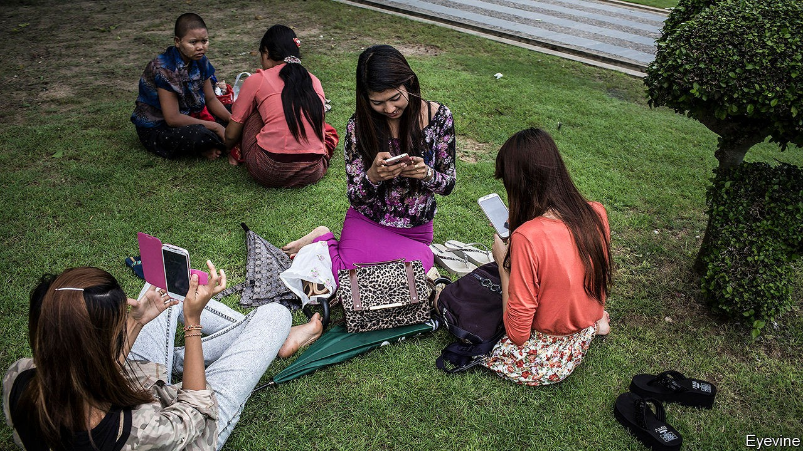

## No time for details

# Myanmar’s government makes life difficult for Western investors

> Its short deadlines and awkward rules do not put off Chinese firms, however

> Oct 3rd 2020YANGON

IN A SPEECH last year, Aung San Suu Kyi, Myanmar’s president in all but name, laid out the many reforms her government had undertaken to attract foreign investors. In return, she went on, “we only ask our investors to ensure that their investments are responsible, by incorporating environmental, social and governance factors”. The subtext, although she did not mention it, was that the biggest source of investment in Myanmar, Chinese firms, have never paid much attention to such things and have stoked popular resentment as a result. When Ms Suu Kyi was still an opposition leader, she called for the scrapping of the biggest Chinese investment in the country, a huge dam to be built on its main river, the Irrawaddy, precisely because of misgivings about its environmental and social impact and the murky role of the Chinese state in the governance of the project. Yet since she gave the speech, Ms Suu Kyi’s government has been making life difficult for the sorts of firms she says she wants to attract, often to the benefit of their Chinese rivals.

The power industry is a good example. A giant tender to build solar farms announced in May originally gave bidders only a month to apply, even though most foreigners could not enter the country at the time because of a coronavirus flight ban. After complaints, the energy ministry extended the deadline by a month. Investors worried that recent changes to the law on land ownership might end up classifying as vacant and ripe for development land that in fact had been used by poor minorities for generations. The short bidding period, coupled with covid-19, gave them no chance to resolve their concerns. As a result, big Western firms shunned the tender. All but one of the 29 contracts went to Chinese firms and local partners.

Something similar happened last year, when the ministry of energy awarded five contracts for the speedy construction of power plants, to alleviate a shortage of electricity. Again, there was a one-month bidding period, and all the contracts went to firms based in China.

Meanwhile, rules that are awkward for investors who take seriously concerns about corporate conduct are proliferating. For over a year Ms Suu Kyi’s government has limited internet access and blocked critical websites in parts of the country afflicted by an insurgency. Telenor, a Norwegian firm that runs one of Myanmar’s mobile providers, at first resisted the restrictions before acquiescing. Meanwhile, opposition politicians in Britain have urged CDC Group, the British government’s development-finance arm, to dissociate itself from the shutdown by selling its stake in Frontiir, a Burmese internet provider. A group of European chambers of commerce warns that the internet restrictions could undermine foreigners’ view of Myanmar “as a responsible investment destination”.

Ms Suu Kyi does not want that. But policy-making is overseen by ageing ministers who grew up under a socialist regime that demonised the private sector. Senior bureaucrats are much the same. Optimists hope for a new leaf after elections in November—but if change comes, it will not be as quick as a government tender. ■

## URL

https://www.economist.com/asia/2020/10/03/myanmars-government-makes-life-difficult-for-western-investors
