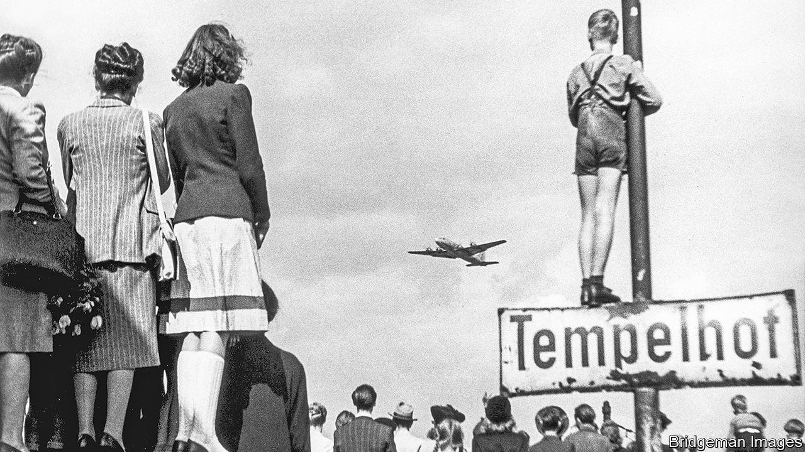

## Original sins

# An indictment of the CIA, through the lives of four spies

> But might they not have helped win the cold war?

> Oct 3rd 2020

The Quiet Americans. By Scott Anderson.Doubleday; 576 pages; $30. To be published in Britain by Picador in February 2021; £20.

THIS INTRIGUING book is an indictment. From its first page it argues that the CIA lost its way, in all senses, in the first decade of the cold war. Its witnesses are four courageous and initially idealistic patriots. Frank Wisner oversaw some of the earliest efforts to “roll back” communism in Europe. Michael Burke was a daredevil figure in the same game. Edward Lansdale was an éminence grise in the Far East. Peter Sichel, a German-born Jewish wine-merchant and Wunderkind—and the only one of the four still alive—held his nose as he co-opted former Nazis into the agency, an initiative cited as one of its original sins.

Scott Anderson, a veteran foreign correspondent and novelist, weaves a beguiling if sometimes puzzling narrative from their criss-crossing careers. He takes in the Philippines, Vietnam and the CIA’s early venality in Central America. He traipses along the Iron Curtain to unveil a string of early disasters in eastern Europe. His verdict is damning, yet also imprecise.

All four agents had brave, brilliant starts in the Office of Strategic Services, the CIA’s forerunner, during the second world war, and were driven largely by principle. The author shows how they were all laid low, in moral and career terms, by the wrong-headedness of their political overlords, which they only occasionally resisted. The villains include J. Edgar Hoover, the FBI boss who, jealous of the CIA, stoked paranoia among allies as well as enemies, and Senator Joseph McCarthy, who ruined hundreds of lives in his quest for reds under the bed; but also, less predictably, the Dulles brothers, John Foster as secretary of state and Allen as head of the CIA. Presidents Harry Truman and Dwight Eisenhower are castigated. Ronald Reagan, Richard Nixon and even Barack Obama take a few knocks.

Of the four spies, Lansdale and Burke ultimately left the CIA in despair, “stricken by the moral compromises they had been asked to make”. Wisner committed suicide. The agents whom he and Burke infiltrated into Romania, Poland, the Baltic states and East Germany all disappeared; most were probably killed. Worse, in Mr Anderson’s view, were the results of two early successes, the coups against democracy in Iran and Guatemala, which tarnished the CIA for ever in the eyes of many in the Middle East and Latin America.

Telling this tale of woe through the four men is a clever device, and Mr Anderson is a fine narrator. Each of the quartet had remarkable early achievements. Lansdale, a former adman in California with a gift for empathy, almost single-handedly steered Ramon Magsaysay into the presidency of the Philippines in 1953 (he died in an air crash). Lansdale then became the most trusted adviser to Vietnam’s president, Ngo Dinh Diem, who was ousted and killed in 1963. Many of the CIA’s failures stemmed from familiar shortcomings. “We all have this tendency to look for information that confirms our beliefs and to ignore what conflicts with them,” explains Mr Sichel. “It’s very hard to give somebody information he doesn’t want to hear, and the more senior they are, the worse it is.”

Early in his own career Mr Anderson witnessed the murderous brutality of a right-wing regime in El Salvador that was backed by the CIA. “The very phrase ‘anti-communist’”, he writes, “took on a squalid quality when I considered the crimes done in its name.” He duly dismisses out of hand the cold war strategy of Truman, Eisenhower and their successors—based on the threat of “massive retaliation”, including nuclear war, if the Soviets overstepped the mark, while the CIA undertook a constant lower-level pushback, including covert operations. He lambasts George Kennan, a fabled diplomat, for encouraging the CIA’s policy of containment, which was “designed to confront the Russians with unalterable counterforce”. This “anti-communist refrain”, he complains, lasted until communism collapsed. Oddly, he ignores the possibility that this outcome was precipitated at least partly by relentless outside pressure from the CIA and others.

More questionable still is his assertion that America’s over-zealous leaders and submissive spooks “undercut the moderate faction within the Kremlin and bolstered the militants”, and thus, especially after Stalin’s death in 1953, “missed a golden opportunity to dramatically alter the course of the cold war”. He even implicates the CIA in the suppression of the Hungarian revolt of 1956: by egging it on but backing away, Mr Anderson charges, the agency encouraged Moscow to crack down. Hungarian rebels may have picked up mixed signals from the Americans. But it is surely fanciful to suggest that Nikita Khrushchev was poised to “let Hungary go”, before the CIA’s machinations changed his mind.

Espionage, intelligence-gathering and covert operations are by definition dodgy trades, whatever the motives of their practitioners. Mr Anderson vigorously argues that his quartet epitomised America’s slide into moral ambiguity and strategic muddle. Intelligence officers like them “provided the fuel for the nuclear arms race” and “drove nations into the orbits of East or West”. Spies on both sides were “the cold war’s first frontline soldiers”.

But then Mr Anderson switches his animus back against the presidents and policymakers. “Virtually every major covert mission undertaken by the CIA from its inception until today”, he says, “has been done under the express, if unwritten, orders of presidents.” The agency is doomed to be “the ultimate fall-guy”. So were the flawed four both culprits and victims? A puzzling conundrum. ■

## URL

https://www.economist.com/books-and-arts/2020/10/03/an-indictment-of-the-cia-through-the-lives-of-four-spies
