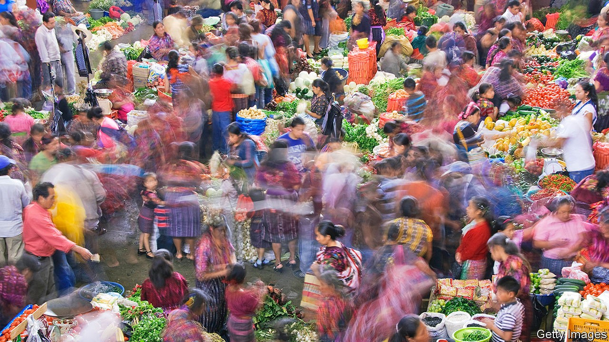

## Latin American letters

# Mexico’s chroniclers tell the other half of history

> A classic literary genre is gradually receiving the attention it deserves

> Oct 3rd 2020TONALÁ

BEFORE REVOLUTION swept Mexico in 1910, the most tumultuous episode in the history of San José de Gracia, a tiny town in the state of Michoacán, was neither a battle nor a reform. It was a rumour that the world would come to an end on December 31st 1900. Decades later Luis González y González, a native son of San José, described the ensuing pandemonium:

“Pueblo en Vilo” (“Town on Edge”), the biography of San José from which this tale comes, is one of Mexico’s greatest books. González, a historian by training, turned the town’s recollections and archival documents into a story. “I have the feeling of being the official chronicler of the people, the compiler and constructor of collective memory,” he said. Cities and villages across Mexico have since appointed writers to be exactly that: hundreds of municipal governments now have an official cronista. Their job is to record noteworthy happenings on their patch, in the way they see fit.

Isn’t that, sceptics might ask, the job of historians and journalists? A good cronista will indeed stray onto their turf, and that of sociologists and poets. That flexibility is the point. Juan Villoro, a writer of chronicles, calls the form “the platypus of prose”: a mix of elements, but undeniably its own creature. The best examples weave a narrative, defer to the truth, appeal to emotions and—above all—evoke an intense sense of place and time.

In Latin America the chronicle predates many of the genres with which it can overlap. The first literature of New Spain was the victory cry of the conquistador. Observers such as Bernal Díaz del Castillo sent accounts of indigenous societies to the king even as conquest disfigured them. Nineteenth-century politicians such as Guillermo Prieto energetically chronicled daily life. Modern Latin American literature charmed the world by building on this tradition, argues J.M. Servin in the preface to his latest chronicle of Mexico City.

In some ways, the cronista’s role is a distinguished one. Mexicans frequently hurry politicians out of office after a single term, but many cronistas retain their positions until the day they die. In 20th-century Mexico City, when (unlike now) the mayor selected a single cronista for the whole capital, the street he lived on would be renamed after him. So influential was Carlos Monsiváis, the city’s chronicler in the 1970s, that when a notable Mexican died, the director of the Institute of Fine Arts would call him to determine whether the deceased merited a public funeral inside the exalted Palacio de Bellas Artes.

Yet the chronicles themselves had a narrow audience. “For most Mexican families, buying a book is an impossible luxury. Rich Mexicans do not read either,” Elena Poniatowska, an author of chronicles as well as essays and novels, has lamented. Often these municipal microhistorians are not only unread but unknown among locals, never mind outsiders. Many are wizened sages. Others are friends appointed by the mayor and “don’t know which year their town was founded”, sniffs Sofía Mireles Gavito, a cronista in Tonalá, on the scorching southern coast of Chiapas.

However big their readership, each faces the daunting task of deciding what to chronicle. In many small towns basic history books with dates and names remain unwritten, giving the cronistas a blank slate. In her most recent volume Ms Mireles Gavito elected to focus on the “spiritual conquest” of coastal Chiapas in the 16th century. María de Jesús Real García, cronista for the Benito Juárez municipality in Mexico City, is writing about Mexican radio ahead of its centenary in 2021. Some choose to penetrate society’s upper crust, as in Artemio de Valle Arizpe’s entertaining account of “La Güera Rodríguez”, a redheaded socialite who brought powerful men to their knees at the turn of the 19th century. By contrast, Héctor Castillo Berthier has shown how the chronicle can ennoble the voiceless. He trudged through Mexico City’s rubbish dumps to speak to underlings of Rafael Gutiérrez Moreno, the powerful and monstrous boss of a trash-men’s union in the 1980s.

“When” is as important a choice for the chronicler as “who”. Monsiváis described his work as “a critique of the present, with one foot in the past”. But many writers plunge headfirst into nostalgia. In 2016 the National Congress of Cronistas released “Cultural Patrimony at Risk”, a tour of threats to the country’s cultural riches—buildings in Durango, indigenous courtship rituals in Chiapas and musical instruments in Nuevo León. On a pleasant afternoon stroll in El Plateado de Joaquín Amaro, a hilly municipality in Zacatecas, Eliezer Márquez Vela, the local cronista, points wistfully to a large stone basin. Women once gathered here to do laundry, he says. But when washing machines arrived, a key network for gossip faded away.

Often, though, the allure of the cronista’s work lies in overlooked details of the present. One such jewel is a monologue from a graffiti artist in Tuxtla Gutiérrez, the capital of Chiapas, which appears in a chronicle by José Luis Castro Aguilar. The artist spent his life being chased by local police, until the government asked him to spray legally. Teresa Zerón-Medina Laris’s chronicle of a clandestine boxing bout in Mexico City “without gloves, bandages, judges, rules, or rounds” is another. “Miss Narco” by Javier Valdez describes the lives of 23 Sinaloan women who were dragged into organised crime. One of them, Yoselín, struggles to break away from narco boyfriends with gold chains and bottomless wallets when her high-school sweetheart returns from America. (Also a courageous journalist, Valdez was murdered in 2017.)

For outsiders, the chronicle’s greatest joy may be an ingredient used sparingly in Mexican literature: humour. The form is often “a refuge for witty ideas that wouldn’t seem serious enough in a drama or novel”, says Mr Villoro. Take the deadpan opening of a recent newspaper column by Armando Fuentes Aguirre, the cronista of Saltillo, headlined “History of a crash”: “Sabinas Hidalgo, Nuevo León, prides itself on being the only place in the world where a horse and a plane have collided.” After rhapsodising for five pages over the local culinary delights whipped up at a street market in the capital, Salvador Novo ends his chronicle in a huff: “And, of course, there are hot dogs. But I will not stain these pages other than to note their inconceivable existence.”

Cronistas find satisfaction in telling the other half of history, the part missed by sweeping national narratives of great men and seismic events. More than that, their craft is at last enjoying global recognition. The Nobel prize for literature, usually reserved for novelists and poets, has recently been won by two exponents of the chronicle, Svetlana Alexievich of Belarus and Turkey’s Orhan Pamuk. In 2013 Ms Poniatowska’s oeuvre earned her the Cervantes prize, the Spanish-speaking world’s highest literary honour. The spotlight may fade. But if anyone knows how to savour a moment, it is cronistas. ■

## URL

https://www.economist.com/books-and-arts/2020/10/03/mexicos-chroniclers-tell-the-other-half-of-history
