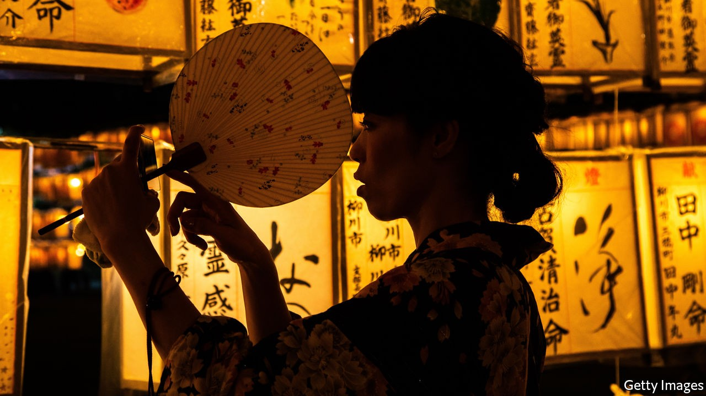

## I don’t belong here

# The author of “Convenience Store Woman” returns

> In “Earthlings”, Sayaka Murata again brings outsiders in Japan to life

> Oct 3rd 2020

Earthlings. By Sayaka Murata. Translated by Ginny Tapley Takemori. Grove Press; 240 pages; $25. Granta; £12.99.

TWO YEARS ago Sayaka Murata won international acclaim after the English-language publication of “Convenience Store Woman”, in which a shopworker struggles to escape society’s pressures. For 18 years before Ms Murata wrote that book, she had herself worked part-time in a convenience store in Tokyo. “Earthlings”, her second novel to be translated into English by Ginny Tapley Takemori, is another offbeat tale about outsiders in Japan. This time, however, her characters are not only low-status; they are completely ostracised.

When the story begins, the narrator, Natsuki, is 11, and bullied by her mother and sister. “This child is so stupid and slow,” her mother tells a neighbour. “What a disgrace.” Natsuki replies: “Yes, it’s true.” A teacher sexually abuses her. She learns to detach herself from reality for protection, conversing with a toy hedgehog called Piyyut, who Natsuki thinks gives her “magical powers” to fend off violence. She is close only to her cousin Yuu, who is also mistreated by his mother and believes he is an extraterrestrial. In the mountains of Akishina, where each year the family gathers for the Obon festival, Natsuki and Yuu search for a spaceship, hoping it will fly them to a planet where they belong.

Natsuki’s experiences come to mirror the life-cycle of the silkworms kept in a special room at her grandparents’ house. As a child, she focuses on surviving (she and Yuu vow to “survive, whatever it takes”). As a young adult, she goes into a kind of cocoon, dodging expectations by marrying an asexual man. Eventually, in the most disturbing scenes of this uncomfortable yet unforgettable book, she attempts to escape the existence of a “brainwashed” earthling altogether, and live as an alien instead.

Throughout the story, her feelings of being an outsider are manifest in the world around her. From her perspective, shadows in forests and in the dark at bedtime are “tinged with the colour of outer space”. As Natsuki becomes more and more marginalised, the Japanese landscape grows increasingly otherworldly.

This is a novel about trauma—the trauma of bullying, childhood sexual abuse and of being blamed for that abuse. Ms Murata admonishes Japan for its conformism, as well as for the pressure put on women and couples to have children, and the way victims of sexual violence can be regarded with suspicion (both problems in other countries, too). In her unique, deadpan style, she shows how the treatment of people on society’s fringes can itself be a form of violence, irreparably damaging their connection to the world. ■

## URL

https://www.economist.com/books-and-arts/2020/10/03/the-author-of-convenience-store-woman-returns
