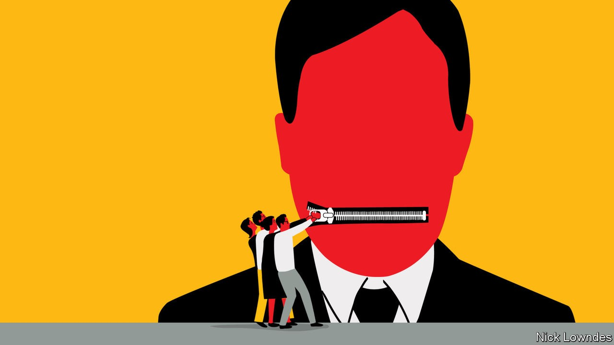

## Johnson

# The battle against racist language is too important to trivialise

> The right and wrong targets in a linguistic struggle

> Oct 3rd 2020

BACK IN 2002 The Economist mused about the rise of Brazil’s left-wing president-elect, Luiz Inácio Lula da Silva. “The meaning of Lula”, ran the cover line, prompting a great deal of mail—much of it from amused South Asian readers who wrote to say that the meaning of “lula” in Urdu is “penis”.

Amused—not outraged. It would have been absurd not to cover a soon-to-be president because his name is naughty in Urdu. Yet another complaint about a verbal coincidence, involving the trace of a graver kind of obscenity, recently had serious consequences at the business school of the University of Southern California (USC). Greg Patton, who teaches communication, was describing how repeating “erm, erm” can undermine a speaker’s effectiveness. He noted that other languages have similar pause-fillers; Chinese people, he mentioned, use the equivalent of “that, that, that”, or in Mandarin, “nei ge, nei ge, nei ge”.

Then came the whirlwind. An anonymous complaint from an unknown number of black students said that their “mental health has been affected”. The dean of the business school removed Mr Patton from the class, excoriating him in a leaked letter: “It is simply unacceptable for faculty to use words in class that can marginalise, hurt and harm the psychological safety of our students.”

Veterans of these brouhahas will recall a case from 1999 in which a Washington official was disciplined for using “niggardly” in a meeting. (The word probably comes from medieval Scandinavia and is unrelated to the racial slur.) Philip Roth turned a true story from 1985 into the crux of his book “The Human Stain” (2000). A professor inquires after two missing students, wondering aloud if they are “spooks”, meaning ghosts. But that term is also an old anti-black insult. The students are black (as, secretly, is he), and the fracas ends his career.

Firestorms like the one at USC are set to become more frequent. America and other countries are wrestling with a history of racism, and language is part of those reckonings. Some renamings and reframings are justifiable, even overdue. Others hit the wrong target, but do little damage. In a few counter-productive cases, aspersions are cast on well-intentioned people.

The problem runs deep. A host of negative words and expressions in English contain the modifier “black”; they are old, and are probably related to a primeval fear of darkness. Nonetheless the constant equation of “black” with danger or evil can weary black human beings: consider black magic, blackguard, black-hearted, black economy and so forth. Some, such as blackmail, are unavoidable fixtures. But not all: the computer types who are replacing “blacklist” (a list of e-mail addresses that cannot reach you) with “blocklist” are making a small but symbolic effort.

The same tech wizards deploying “blocklist” have proposed new terms for “master” and “slave” in computing (whereby one process or device controls another). This seems justifiable, too. The hunt for “masters” has ranged beyond power relationships, however. Harvard has dropped the name “house masters” for faculty members who live in student accommodation and have a pastoral role. Some property salesmen are ditching “master bedroom” in favour of “main bedroom”. These changes may be inessential, but they are harmless.

The harm comes only when sensitivity to offence goes so far that it undermines the assumption of good faith to which people are generally entitled. At a meeting of the Linguistic Society of America in 2018, for instance, Itamar Francez of the University of Chicago spoke on a panel about diversity in the discipline. He decried “formalchismo”: older scholars’ dismissal of new perspectives for being expressed without traditional formality. Many in the audience liked his coinage, but Mr Francez soon found himself retracting it: a listener had complained that it “creates a hostile environment in linguistics for Spanish speakers”. More and more academics say they are afraid to discuss controversial issues; that becomes harder still when even those trying to confront racism are vulnerable to a “call-out” over a triviality.

The losers could be those who need frank discussion most: minority students who should be able to decry the real harms they face, in forms large and small. One student at USC wrote on Instagram that the “nei ge” flap “is going to be used to gaslight us when we try to voice our actual grievances”. An ever-growing list of things you cannot say helps no one. Progress requires more open conversation, not less.

## URL

https://www.economist.com/books-and-arts/2020/10/03/the-battle-against-racist-language-is-too-important-to-trivialise
