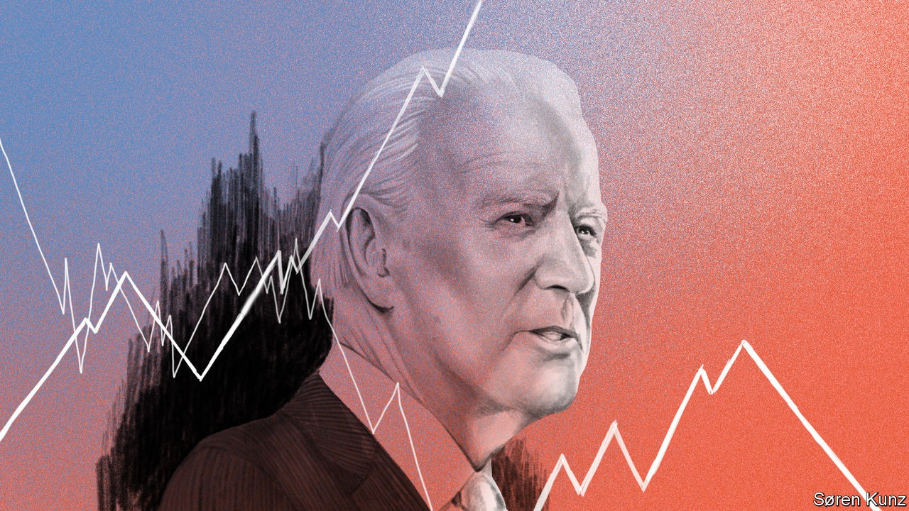
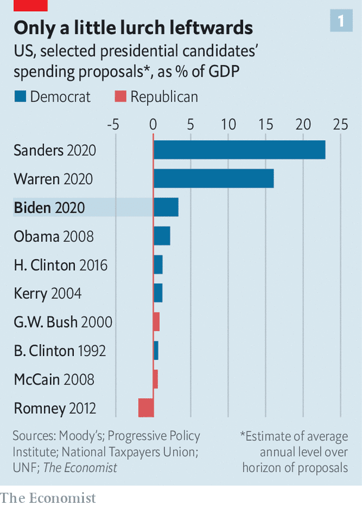
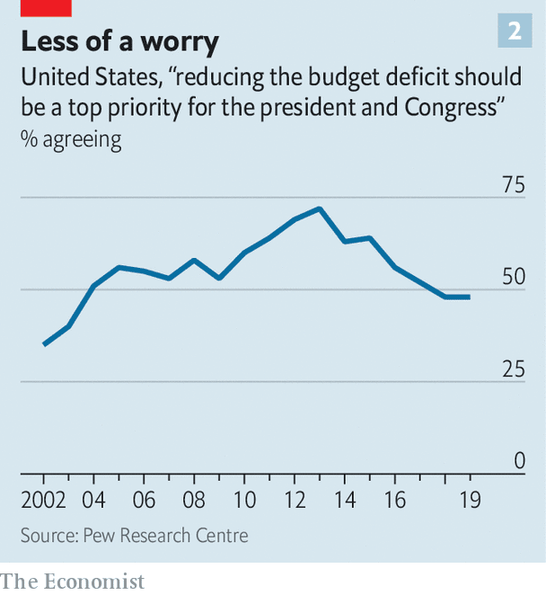
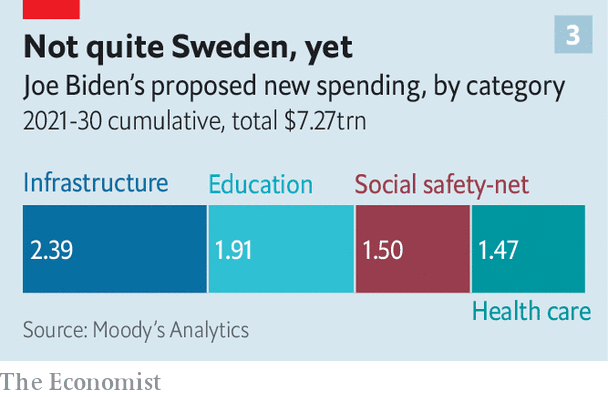
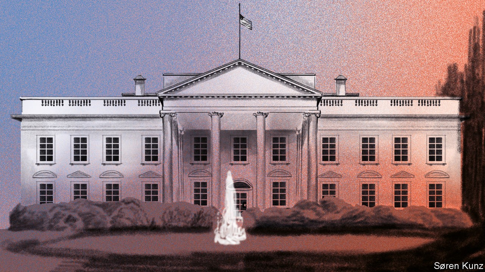

## The pragmatist

# Joe Biden would not remake America’s economy

> He would improve its fortunes, though

> Oct 3rd 2020

SOME LEADERS, when they come into office, have a powerful economic vision for transforming how their country creates wealth and distributes it. Others approach power as pragmatists whose goal is to subtly shape the political and economic forces they inherit. Joe Biden is firmly in the second camp. He is a lifelong centrist whose most enduring economic belief is his admiration for hard-working Americans and who has shifted with the centre of gravity in his party. But Mr Biden’s ability to go with the flow means that, at the moment, both the left and the right are anxious about the prospect of Bidenomics.

Indeed, if Mr Biden wins the election in November and enters the Oval Office in January 2021 he will confront an extraordinary set of circumstances that will put a huge amount of pressure on him. The economy is clawing its way back from the sharpest slump in living memory following covid-19. The legacy of the pandemic will include millions of long-term unemployed, public debts that will soon exceed their all-time high of 106% of GDP, more bankruptcies and accelerated digital disruption in many industries.

At the same time Mr Biden will head up a party that has indeed shifted more to the left and that has a more radical wing that, while not dominant, is influential and thinks America’s economic model is broken and that the answer is a vastly bigger state. Combined with this, the public is bitterly divided and many people are wary of globalisation. Under President Donald Trump, America’s standing in the world has slumped.

Because of this chaotic backdrop and Mr Biden’s own lack of a fixed economic doctrine, the range of outcomes attributed to a Biden presidency is bewildering and not always benign. To some Republicans on Wall Street and in boardrooms he would enable a hostile takeover by the radical left. “The country is running the risk of structural changes under the guise of social justice which would take the US into a place where it won’t know how to function,” claims one. To the left Mr Biden is a timid figure whose moderation means he would be crushed by an obstructive Congress and conservative courts.

Neither view is especially convincing once you consider Mr Biden’s goals. He says he will seek to tilt the balance of American capitalism in favour of workers, not the rich. He will offer competent administration; he is no fan of social experiments or trampling on institutions. His priority would be a stimulus bill to revive growth, though he is likely to pull America somewhat further to the left than either of his Democratic predecessors, Barack Obama or Bill Clinton (see chart 1). He would leave the economy greener, with a more active industrial policy, somewhat higher public spending and borders open to skilled migrants. He would not reverse America’s new protectionism, nor does he have a plan to resolve the country’s long-term fiscal problems.

Mr Biden’s long career does not exactly suggest much enthusiasm for economics. During his 36 years in the Senate his main passions were the justice system and foreign policy. By instinct he is an admirer of the middle-class more than the country’s glittering plutocratic elite or its downtrodden. He grew up in, and later represented, Delaware, a diminutive state which relies on big business to make its crust. Over two-thirds of Fortune 500 firms are legally registered there thanks to its shareholder-friendly laws and tax rules. The Diamond State is home to the headquarters of some icons of 20th-century industry, including DuPont, some of whose workers lived in the suburb Mr Biden spent his teens in. His exposure to such folk may help explain his fondness for manufacturing and a more paternalistic capitalism.

As vice-president in 2009-17 Mr Biden helped implement the stimulus package of 2009 and strike budget deals. But his strength was as a negotiator with Congress, not as a visionary. Allies from his Senate and White House years make up a big share of his advisers and entourage now, with additional advice coming from centre-left economists such as Jared Bernstein, Heather Boushey and Ben Harris. Unlike Mr Obama, he has not appointed a dominant economic figure to his team so far.

As a result, in order to understand where a Biden presidency might take the economy it is necessary to consider the three external forces that he will have to deal with, each of which could in theory push him down a more radical path. The first is the covid-19-induced recession. America has bounced back faster than was originally feared. GDP is now expected to shrink by 4% this year; at one point a decline of 7% had seemed likely. But the recovery could stumble, not least because Congress has so far failed to agree on a further stimulus bill.

What is already clear, however, is that the slump has hit the poor worst, amplifying inequality. Many business figures warn of a surge in defaults among small firms which have found it hard to secure government help: less than 1% of the misfiring $600bn Main Street lending scheme backed by the Federal Reserve and Treasury has been disbursed. State and local governments face a funding crunch. The disruption is not simply a matter of a temporary downturn. Whole industries, including travel and retail, will be transformed.

And the normal laws of economics have been upended. Interest rates are at rock-bottom levels, making borrowing almost free for now. America will run a fiscal deficit of 16% of GDP this year. Asset prices, meanwhile, are sky-high with the stockmarket at its most expensive level since the dotcom bubble of 2000, based on its ratio of price to cyclically adjusted profits.

As he grapples with this topsy-turvy economy, Mr Biden will have to deal with a second force in the form of the left wing of his party. Over a third of voters in the Democratic primaries supported Bernie Sanders or Elizabeth Warren, whose plans involved a giant expansion in annual government spending. Since then Mr Biden has skillfully flattered the more radical left while ignoring their more ambitious proposals, such as nationalised health care and the “Green New Deal”, a package promoted by Alexandria Ocasio-Cortez, a congresswomen, among others, which includes a guaranteed job for all. In July a joint Biden-Sanders task force agreed on watered-down policy recommendations. Some of these Mr Biden then further diluted into his own proposals. Even so, the left will still demand jobs in any administration. And the centre of the party remains to the left of public opinion. Opinion polls suggest the typical American is more worried about climate change and China than they used to be, and more relaxed about government borrowing (see chart 2). But 87% of them still believe in free enterprise.

The final external force Mr Biden would face is Congress. The Economist’s election model gives the Democrats a 98% chance of holding control of the House of Representatives and 69% chance of winning the Senate, with any swing bringing new moderate Democrats in. Assuming the normal rules are in play the Senate will limit what can be done. If Mr Biden’s party ends up with between 50 and 59 seats and sticks to normal Senate protocol over the use of the filibuster, it will only be able to get through tax and spending legislation that either has bipartisan support or can be passed using a process known as reconciliation. This typically limits the number of bills to three a year (one each on spending, tax and debt-limits), does not permit changes to social security and normally requires that the impact on the deficit is neutral within ten years, either because the spending measures expire or are balanced by tax rises. But the Democrats could ditch procedural rules over the filibuster so that they can pass major bills with only 50 votes (plus one from the vice-president who can cast a deciding vote). This might also allow them to pursue other goals including expanding the number of Supreme Court judges.

Faced with these external influences, what would Mr Biden do? He would have three main ways to exercise power: through legislation, job appointments and executive action including regulation. Start with legislation, where Mr Biden has proposals that would raise spending by $7trn over a decade. Congress will almost certainly act as a constraint on this. The Democratic Party’s centre of gravity in the House is still centrist: the largest caucus, with over 100 members, is the moderate New Democrat Coalition. Most new seats won would probably be occupied by moderates, and they also hold key jobs, including the head of the Ways and Means committee, which controls tax legislation.

In the Senate, meanwhile, even if the Democrats won a big enough majority to try to ditch the filibuster, which is unlikely (a rough yardstick is they would need 55 seats), Mr Biden might well resist: his affection for the institution is such that he kept a Senate gym locker when he was vice-president, and any change in the filibuster rules would be a dramatic constitutional escalation in the war between the two parties. Any Democratic swing will see moderates win seats.

All this means Mr Biden will have to compromise and might only get two big priorities passed through Congress. That suggests that any increase in the size of the state would be limited. Ms Warren and Mr Sanders proposed spending increases equivalent to 16-23% of GDP, taking it towards Swedish levels seen in the 1970s. Mr Biden’s formal proposals amount to just a 3% increase and in all probability he might get only half of that passed: so a spending increase of $3trn-4trn over ten years, worth 1-2% of GDP.

The burning priority will be a jumbo “recovery” bill of perhaps $2trn-3trn aimed at revving up the economy and meeting a key strategic priority, more green-tinged infrastructure spending (see chart 3). The latter could command some Republican support because it creates jobs, while also pleasing Mr Biden’s more climate-aware base. Short-term stimulus measures may include cash for state and local governments, a boost to unemployment benefits, a rise in the minimum wage to $15 an hour and further support for small companies.

The green infrastructure element might include upgrades to electricity grids and charging stations for electric cars. In order to cut emissions Mr Biden’s plan aims for power generation to be carbon neutral by the mid-2030s. He is keen to spend tens of billions of dollars a year on research and development into renewable-energy technologies and other areas such as 5G, with the aim of establishing an American edge to rival China’s.

If the jumbo recovery bill goes well, there may be room for a Biden administration to pursue one other big legislative priority. One possibility is immigration reform. Another candidate is boosting middle-class social mobility, where Mr Biden proposes universal pre-school education, tax-credits for child care and free public-university education for families earning less than $125,000 a year. In total spending on an ambitious social-mobility agenda might amount to another $1trn over a decade.

Congress has only limited capacity so Mr Biden will also need to decide what not to do. He does not seem to have a burning appetite to reinvent Obamacare, which was not his first priority when vice-president (although like most politicians he wants to push down drug prices). He will have to hope that the Supreme Court does not force his hand: on November 10th it will begin considering the legality of Obamacare, which could unwind a system millions of people use. Were this to happen Mr Biden might be forced to try to legislate for a replacement. A push to modernise America’s decrepit antitrust apparatus, meanwhile, is on the backburner. Without new legislation, it will be hard to do much about the rising concentration of business or the big tech monopolies, given the courts are reluctant to take action. Kamala Harris, Mr Biden’s running-mate, was friendly towards tech as California’s attorney-general in 2011-17.

Mr Biden’s proposals suggest that roughly half of his spending might be covered by tax rises. Once again the formal plan points to tax hikes of $4trn, but as with spending, in reality a figure half that size or less, of $1.5trn-2trn, is more likely. Big changes to social-security levies are probably off the cards since they are not eligible for the reconciliation process in the Senate. Many Democrats in Congress are wary of raising capital-gains tax too high. So business-tax rises will do much of the work with a partial reversal of the 2017 Trump tax cuts.

Mr Biden would raise the headline rate on corporate income from 21% to up to 28%, levy minimum taxes on foreign earnings and remove tax perks for real-estate and private-equity firms. Individuals earning more than $400,000 would see the top band of income tax rise to up to 39.6%, and those earning more than $1m might have to pay a capital-gains rate that is nearer the one they pay on their income.

A second way Mr Biden could influence the economy, and give licence to his party’s more radical impulses, is through job appointments. Yet it seems unlikely that he will appoint Ms Warren as treasury secretary, or even attorney-general. That would send an alarming signal to the business community when the economy is fragile. It would also trigger a special election to fill her Senate seat in Massachusetts. Instead the front-runners to become treasury secretary are centrists. They include Lael Brainard, a centre-left member of the Federal Reserve Board; Jeff Zients, a co-head of Mr Biden’s transition team; Sylvia Mathews Burwell, a former Obama official and Sarah Bloom Raskin, a former Fed governor and treasury official. If a business figure is needed then Ruth Porat, the finance chief of Alphabet, a tech giant, is also thought to be a contender.

Based on Mr Biden’s own experience as vice-president, in which he acted as a key counsellor to Mr Obama, Ms Harris would have an important voice in his administration. She sits to the left of him on tax and spending, although she is within the mainstream. And having rejected its signature policies and outmanoeuvred its star figures, Mr Biden might try to placate the left of his party by giving it lots of jobs in the regulatory apparatus where they would emit a cacophony of left-sounding signals.

The final tool Mr Biden has to get his way is executive orders, which Mr Trump and Mr Obama both used. Yet here, too, Mr Biden will be restricted by the courts which have become substantially more conservative than they were in the Obama era. Mr Biden would try to use this power to reverse some of Mr Trump’s own executive orders. Top of this list is probably the ban on some migrants and the president’s clampdown on refugees and undocumented workers that has intensified this year. The rules for visas for skilled workers would be eased. Yet despite his support for immigration, his stance on protectionism is more ambiguous, and here the president has sway and discretion. Mr Biden has been a free trader in the past and would certainly be politer to China than Mr Trump has been. He would rally America’s allies to put in place a co-ordinated response to deal with China’s economic model under Xi Jinping in which even notionally private Chinese firms are often acting under the strategic direction of the Communist Party.

But he will only go so far. This reflects a shift in public opinion. According to the Pew Research Centre, fully 73% of Americans now have an unfavourable view of China, a new high. Mr Biden would not quickly withdraw the tariffs that are now in place (the average tariff on goods imported from China is about 19%). While he has been critical of the Trump administration’s botched effort to rein in TikTok, a Chinese social-media app, he would probably stick with the embargo on Huawei and be wary of high-tech trade with China.

Similarly, new trade deals will not be a priority even though Mr Biden supported the Trans-Pacific Partnership and USMCA, the revised US-Mexico-Canada deal passed in 2020. (Ms Harris was opposed to both.) Mr Biden’s industrial strategy is laced with soft protectionism, including promises to bring supply chains back to home, adopt a “buy American” government-procurement policy, tighten rules on the labelling of products, use American steel for transport projects and singing the praises of the Jones Act which requires that only American-flagged ships carry goods between domestic ports.

A Biden presidency therefore promises moderately higher taxes and more spending, especially on green infrastructure, more industrial policy and not much change to trade policy. Who would benefit? In terms of individuals his policies are aimed squarely at the middle classes and lower paid who would benefit from a raft of measures such as cheaper education, perks to get on the housing ladder and a higher minimum wage. Mr Biden’s tax rises are squarely levied on the richest Americans: if fully enacted they would mean the income of the top 1% of earners would drop by 14%, and the income of the top 0.1% by 18%, according to the Penn Wharton Budget Model. In reality these proposals will not be passed in their entirety. Either way, the impact of the tax changes on the 99% would be minimal (see chart 4).

What about business? Which firms would gain and which would suffer? One estimate suggests corporate profits would fall by about 12% because of the tax rises. Investors have already begun to discount this and to bid up the shares of renewable-energy firms and construction and infrastructure companies which might benefit from a Biden presidency. The shares of fossil-fuel energy firms which might suffer under a Biden presidency have dropped. Tech stocks have soared this year even as the odds of a Biden win have risen, suggesting investors don’t worry about antitrust action against Silicon Valley. The stockmarket has risen by 4.5% this year despite the recession; hardly a sign of an imminent lurch towards big-state socialism.

Even so, there would be risks to the economy from a Biden presidency. One is that he loses control of the party and there is a lurch even further to the left, spooking the business world. Were the Democrats to abandon the Senate filibuster, a path might be open to an expansion in the size of the Supreme Court or, some bosses fear, more radical legislation. But Mr Biden would probably resist this.

More likely is that a regulatory apparatus stuffed with left-wing appointees ends up damaging his relationship with business. Many of the Trump administration’s most reckless regulatory decisions, for example its push since 2017 to stop the Environmental Protection Agency from limiting the use of coal, need to be reversed. The danger is that new rules are churned out in unco-ordinated fashion on unions, inequality and the like, accompanied by volleys of confrontational rhetoric. Democrats tend to think that business is just crying wolf. But small firms consistently complain about regulation, and badly designed rules after the financial crisis of 2008-09 helped cause serious problems in the mortgage market.

The second danger is fading dynamism. Some of Mr Biden’s agenda, including infrastructure and more research and development, will boost America’s long-term competitiveness. But a lack of antitrust policy and more red tape could continue to give too much power to large, incumbent companies, which have seen their market share rise in two-thirds of industries over the past two decades, creating oligopolies in industries from mobile telecoms to credit cards. The undercurrent of protectionism in Mr Biden’s plans could insulate the economy from competition abroad, sapping its vitality. Ultimately there exists a tension between Mr Biden’s desire to build new infrastructure quickly and cheaply and his plan to favour domestic workers and supply chains, that is likely to become far more acute over time.

The final risk is America’s long-term fiscal position (see chart 5). Even after the covid-19 stimulus fades, and before any deficit-widening steps that the next president makes, America’s deficit was projected to soar above 5% of GDP in perpetuity, with public debt reaching about 200% of GDP by 2050. Today the Federal Reserve is buying much of the net new debt issuance by the government, as fiscal and monetary policy begin to merge.

For now this strange new fiscal regime seems sustainable. But over time the risk of the politicisation of the Fed will increase. And the economy and financial system will become vulnerable to any eventual rise in inflation. A debate over these risks looks likely to occur when the first term of Jay Powell, the Fed’s chairman, finishes in early 2022. But so far Mr Biden has no major plan for redesigning the macroeconomic architecture or for getting America’s long-term finances on a stable footing.

Mr Biden, a life-long pragmatist, looks likely to govern as one. Stylistically that means getting sensible advice, behaving consistently and working with America’s institutions. While he may lack a formal economic doctrine, his goal will be to get the economy out of its covid-19 slump, improve social mobility and build a better safety net. He will place his biggest bet on giving a long-term boost in infrastructure and climate policy, and then try to moderate the wilder forces swirling around America’s electorate and polity, including the more socialist ideas of the hard left, chauvinistic protectionism and the indifference of the right towards America’s social fabric. The claim that a Biden presidency would destroy American capitalism is silly. If he can restore competent management and make the economy work better for ordinary people Mr Biden’s last job in politics will be done. ■

Dig deeper:Read the [best of our 2020 campaign coverage](https://www.economist.com//us-election-2020) and explore our [election forecasts](https://www.economist.com/https://projects.economist.com/us-2020-forecast/president), then sign up for Checks and Balance, our [weekly newsletter](https://www.economist.com//checksandbalance/) and [podcast](https://www.economist.com/https://play.acast.com/podcasts/2020/01/24/checks-and-balance-our-new-weekly-podcast-on-american-politics) on American politics.

## URL

https://www.economist.com/briefing/2020/10/03/joe-biden-would-not-remake-americas-economy
