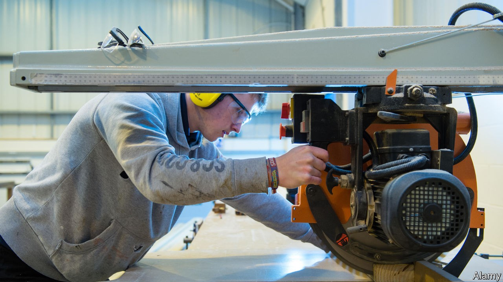
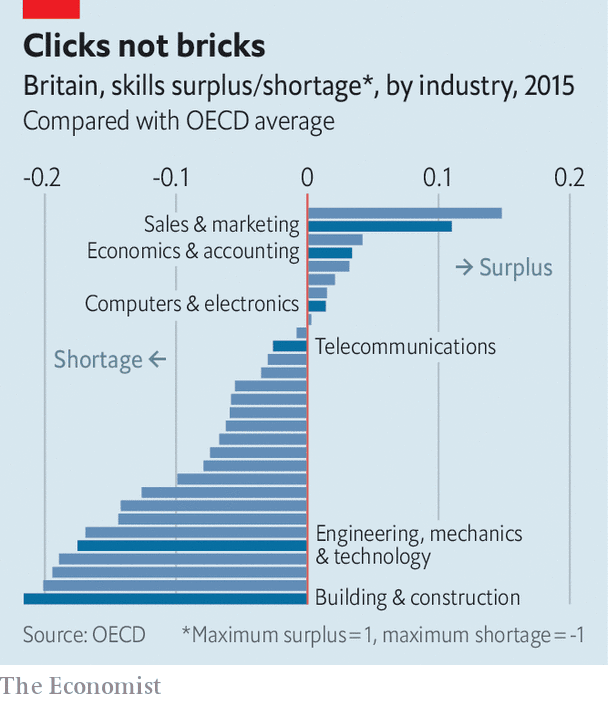

## Skills

# Another promise to improve vocational education in Britain

> From a prime minister with a classics degree

> Oct 3rd 2020

IN 1896 A delegation of businessmen travelled from Manchester to Germany to learn the secrets of its industrial success. The answer, they reckoned, lay in Germany’s superior system of technical education. “It is high time”, they argued, “the effort was made in this country to give our youth the educational advantages enjoyed by their rivals abroad.”

The Mancunians would be unimpressed by the direction of travel in recent years. Universities have expanded hugely; vocational education has not. The Augur review of post-18 education, which reported in 2019, found that there were 50 times as many undergraduates as there were young people studying for higher national diplomas and higher national certificates, the key vocational qualifications. Only 24% of British 16- to 18-year-olds did apprenticeships in 2017, according to the OECD, compared with 59% in Switzerland and 41% in Germany.

Not surprisingly, Britain is shorter of skills than other rich countries. It does badly in 22 of the 31 categories tracked by the OECD (see chart). While Britain is well supplied with sales, marketing, economics and accountancy skills, it is sorely lacking in people who know their onions in construction, engineering, mechanics and technology.

On September 29th Boris Johnson, who studied classics at Oxford University, lectured an audience of further-education college students on the importance of technical, hands-on qualifications. “All of us in this country need you to have those practical skills…more than ever.” He noted that “a significant and growing minority of young people leave university, get non-graduate job and end up wondering whether they did the right thing.” He promised to spend £1.5bn ($1.9bn) on upgrading vocational colleges and to introduce a Lifetime Skills Guarantee that will fund technical courses for adults from April next year.

That sounds encouraging; but the money is dwarfed by the £14bn budget for universities, and British history is littered with similar, failed, initiatives. The Education Act of 1944 created technical schools, but few ever opened and most had closed by the 1960s. Industrial Training Boards were established to oversee vocational training in the late 1960s but had petered out by the 1980s when they were replaced by around 150 Industry Training Organisations to drive technical skills. They, in turn, were mostly folded into the 26 Sector Skills Councils in 2002. Employers used a scheme set up in 2009 to promote apprenticeships to get the government to subsidise their wage bills.

Ewart Keep, an educationalist at Oxford University, reckons that a focus on adult education and providing alternative routes for young people makes a great deal of sense. But he notes that while the promised money will be welcome in the sector, “it is only partially repairing the damage of a decade of real-terms cuts in adult-education funding.” And bringing about the fundamental change in attitudes needed to embed change in the system is difficult, since the reverence for universities is “deep-rooted and class-based”. It is easy for Mr Johnson to make speeches celebrating technical education, but harder to imagine him pushing his own children towards a diploma in construction skills.■

## URL

https://www.economist.com/britain/2020/10/03/another-promise-to-improve-vocational-education-in-britain
