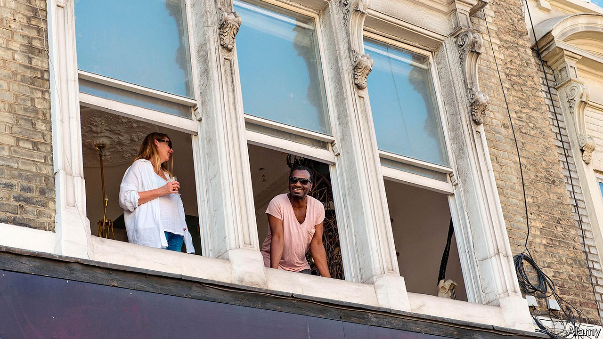
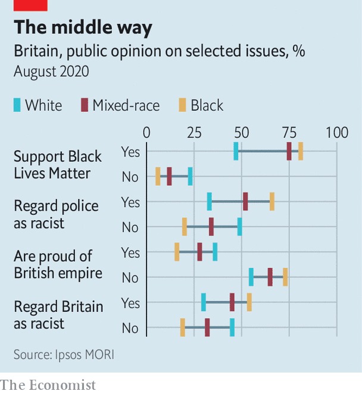

## Ethnic minorities

# Britain’s mixed-race population blurs the lines of identity politics

> It’s not black and white

> Oct 3rd 2020

GEORGE BERNARD SHAW, a playwright and activist, thought that the best way to bring about social equality was “to keep the entire community intermarriageable”. He was primarily concerned with relationships across the class divide but, when he visited South Africa in 1935, he caused a stir by suggesting the same idea for race. The Daily Telegraph, for one, was taken aback. “Marriages of white and black: Startling plan by Mr Shaw”, its headline read.

What was once startling is now commonplace. The number of Britons who say they have a mixed-ethnic background almost doubled between the census of 2001 and 2011, to about 1.2m, or slightly more than 2% of the overall population. That figure is probably an undercount, since not all children of mixed marriages will have ticked one of the mixed categories, and the number is likely to have grown since the census. An analysis by Alita Nandi of Essex University and Lucinda Platt of the London School of Economics suggests that the true figure could be three times as high. If that is right, mixed-race people constitute a larger proportion of the population than any ethnic group.

And that share is still growing. Fewer than 1% of Britons aged 50 or over in 2011 had a mixed-ethnic background, according to an analysis of official statistics by Rob Ford of Manchester University. Among the youngest cohort—under fives—6% had one. The proportion of cohabiting couples that are interracial shot up from 2.6% in 2001 to 4.5% by 2011. Both patterns suggest that the next census, due next year, is almost certain to report an even larger number of mixed-race Britons.

This demographic shift coincides with the resurgence of race as a central political theme. In Britain, as in America and continental Europe, this year will be remembered not only for covid-19 but also for a reassessment of the state of race relations. As statues were felled and historic anthems reappraised, the idea of “white privilege” leapt from the campus to the streets. Yet much of the focus on symbolic and systemic racism overlooks the growing significance of mixed-race Britons, who often defy labels. The attitudes of this group will be crucial in determining the future direction of identity politics.

This is truer of Britain than of other rich countries. London appears to have a far more ethnically mixed population than Paris, Berlin or Rome, though since France, Germany and Italy do not collect data on race, it is impossible to be sure. Certainly, mixed-race people make up a greater share of all non-whites in Britain (16%) than in America (11%). And the pattern of marriage is different, too. Most Americans of mixed parentage settle down with a partner from a minority group, but 50% of Britons with black African and white parents—and 75% whose parents were white and black Caribbean—marry a white partner.

A poll for The Economist by Ipsos MORI suggests that mixed-race Britons are, in general, less wary of Britain’s institutions and history than black Britons (see chart). They are marginally less likely to support Black Lives Matter (BLM), less likely to agree with the proposition that “Britain is a racist country” and much less likely to think most British cops are intentionally racist. Though a plurality of all ethnic groups surveyed thought the British Empire should be a source of neither shame nor pride, considerably more mixed-race than black Britons were proud of it. Sunder Katwala of British Future, a think-tank, believes that BLM will pursue different policies in Britain than in America in part because of the disparity in the rates of inter-ethnic relationships. “This policing of the boundaries requires a high level of social distance between the groups,” he says.

That is much rarer in Britain than it once was. Consider Marvin Rees, the mixed-race mayor of Bristol. He is proud of his Jamaican ancestry and, growing up in the 1980s, he often faced racial abuse. Yet he would return home each evening to his white mother, who left school at 14 to work as a hairdresser. “There is such a thing as white privilege but my white family did not grow up with privilege,” he says. He remembers a school friend asking him during one of the city’s race riots, when they were both about 13, “‘in a war between black and white whose side are you going to be on?’...The idea of going to war with white people didn’t sit well with me. At the same time, I recognised the physical threat to my safety was coming from white people.”

Mr Rees, whose wife is white, credits his background for his nuanced approach to racial issues. His city made headlines around the world in June when protesters toppled a statue of a city father who was a notorious slave trader. But Mr Rees was wary of such direct action, arguing that symbols were far less important than measures to tackle entrenched inequality. “I will talk about race and racism in all its fullness,” he says. “But I’m not going to go home and give mum a hard time for being white or ask her to feel guilty.”

Maya, a 30-year-old university teacher in London, also says her ancestry—mixed white and south Asian—makes her aware that “identity is in part changing and contextual”. That she can count ancestors on either side of Britain’s colonial history emphasises the complexity of racial politics and makes her ambivalent about “rigid identity positions”. Another Londoner reckons his mixed-race parentage gives him “a sense of perspective on how arbitrary identity politics is”.

It is not inevitable that, as ethnicities mix, identities get watered down. Mr Rees points out that, as people feel their connection to a particular identity weakening, they may well seek to reassert it. “People crave simplicity and certainty.” If that were to happen, the growth in intermarriage could eventually make racial politics more, not less, divided.

But our polling suggests the opposite is happening. Trevor Phillips, a former chairman of the Equality and Human Rights Commission, argues that rather than being forced to choose one ethnic identity or another Britain’s mixed-race citizens are increasingly claiming “both sides of their heritage”. His children have Indian, French and Caribbean ancestry, with cousins from each branch of the family. “Wherever they are at Christmas,” he says, “they know what to do.” And, as Mr Katwala has written, “that is only a threat to those whose views of race depend on telling everybody else how to think about who they are.” ■

## URL

https://www.economist.com/britain/2020/10/03/britains-mixed-race-population-blurs-the-lines-of-identity-politics
