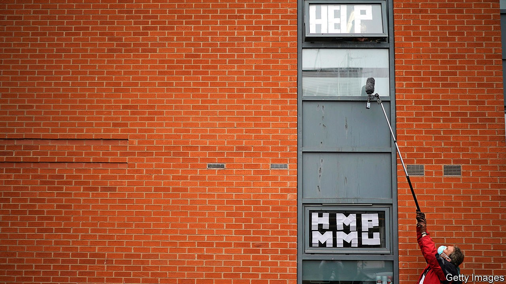

## Freshers’ covid

# British universities may be particularly susceptible to covid-19

> A rash of outbreaks greets returning students

> Oct 3rd 2020LEEDS

THE ANNUAL journey of more than 2m students to British universities is, as David Willetts, a former higher-education minister, has put it, a mass migration: “All it needs is Sir David Attenborough to provide an excited commentary as the convoys of heavily laden estate cars roll by.” This year, the migration has happened as case counts rise during a pandemic—with predictable consequences.

The impact is clear at the University of Leeds. Even in the autumnal sun, few students mingle beneath the hulking brutalism of its campus. With lectures cancelled and most socialising banned, life is to be found elsewhere. Helena Foulger, for one, is in her student flat. The first-year criminologist arrived in Leeds on September 16th. Eight days later she took a covid test, which came back positive. Two of her five flatmates have developed symptoms; all are isolating. “I think there’s one out of nine flats in our block now that hasn’t got corona,” she says.

The peculiarities of British higher education may make it especially vulnerable to the pandemic. More than a third of the country’s universities have already recorded cases. Despite plenty of warning, outbreaks appear to have taken national governments and many universities by surprise. At the start of September, the official Scientific Advisory Group for Emergencies (SAGE) dedicated a meeting to the return of universities. A paper prepared for the get-together warned that “it is highly likely that there will be significant outbreaks associated with [higher education], and asymptomatic transmission may make these harder to detect.”

The experience of other countries provided additional warning. According to the New York Times, more than 130,000 cases have been recorded at American colleges, which tend to go back earlier. And whereas in America and Europe plenty of students go to their local institution, living at home while studying, in Britain the medieval model of a young scholar travelling to study still dominates. Four in five students leave home to go to university, where they live in cramped digs well-suited to transmission of the virus.

Some universities, including Glasgow and Manchester Metropolitan, have responded to outbreaks by locking students in their halls en masse. Ms Foulger says Leeds has been helpful, but elsewhere imprisoned students have set up Instagram accounts detailing the dismal food they have received. Nicola Sturgeon, Scotland’s first minister, was criticised for instructing students to avoid pubs and restaurants (restrictions which were not imposed on other social groups).

Higher-education funding follows student recruitment; over the summer the government outlined a tough bail-out regime for universities in England that get into trouble. Responding to these incentives, vice-chancellors have sought to offer at least some face-to-face teaching—but growing numbers are now accepting defeat. Students who are being taught entirely online are wondering why they have returned. “9k 4 what?” reads a homemade sign, referring to the annual £9,250 ($11,900) tuition fee, in Manchester.

The government lacks the capacity to put in place screening tests for asymptomatic cases. Some universities, including Cardiff, Cambridge and UCL, have stepped into the breach. At Cardiff, arrivals are asked to take spit tests. The university then has the capacity to carry out 1,000 or so a day. “It’s similar to the moonshot for the country,” says Colin Riordan, its vice-chancellor. “We’ve done it for the university.” If the programmes are successful, more will follow. But their cost is a barrier. Cardiff spent £800,000 setting up its laboratory.

SAGE is concerned by what happens when students return home, when there is the potential for them to seed the virus among more vulnerable populations. Denying reports that students would have to remain at university over Christmas, Gavin Williamson, the education secretary, said in-person teaching may stop a few weeks before the end of term to ensure this is not necessary. Which would mean that students would cap off a term mostly spent in their dorms with even more time spent in their dorms. ■

Editor’s note: Some of our covid-19 coverage is free for readers of The Economist Today, our daily [newsletter](https://www.economist.com/https://my.economist.com/user#newsletter). For more stories and our pandemic tracker, see our [hub](https://www.economist.com//news/2020/03/11/the-economists-coverage-of-the-coronavirus)

## URL

https://www.economist.com/britain/2020/10/03/british-universities-may-be-particularly-susceptible-to-covid-19
