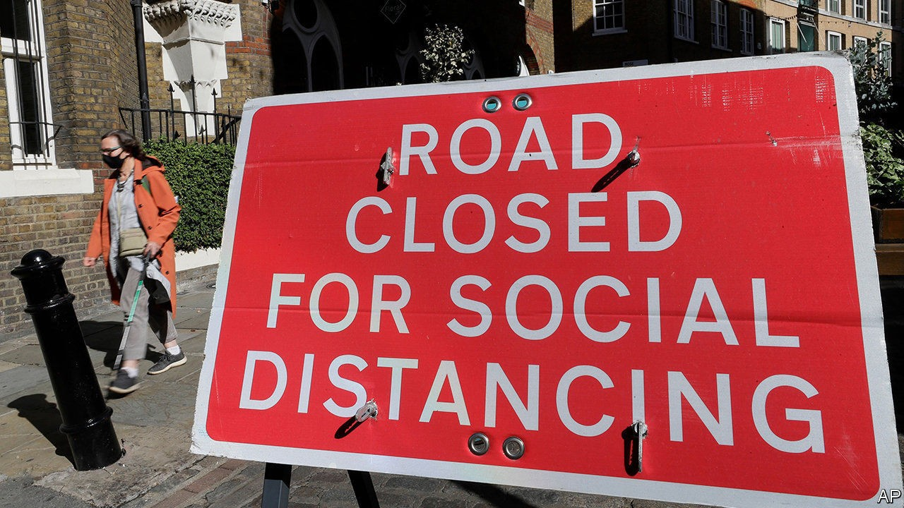
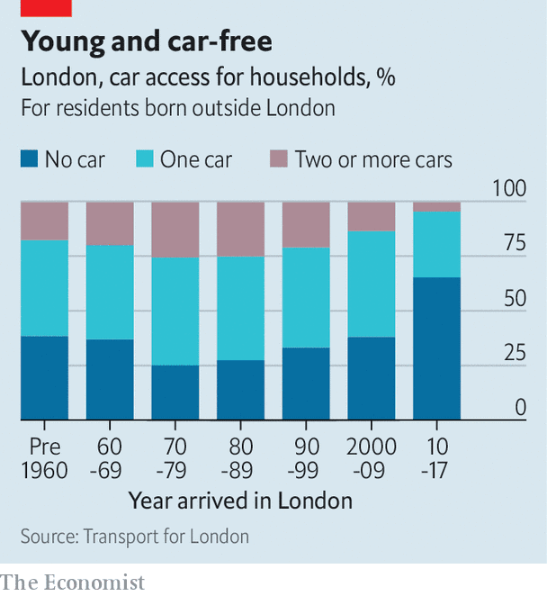

## Cars in the capital

# The battle over London’s road closures

> Old London pitted against new

> Oct 3rd 2020

ON SEPTEMBER 26TH a few dozen people gathered in Bethnal Green in the East End of London to protest against road closures. Whistles blew and passing drivers honked as speakers railed against Tower Hamlets council. Restrictions on driving (some planned, others already in place) were awful, they said. Banning cars from some roads merely increased traffic on others; local businesses were dying for want of customers; the disabled could not get about. It was all very harmonious, until a suspicious group of men was spotted nearby. “Cyclists!” hissed a protester. “They might be looking for trouble.”

When covid-19 hit Britain in the spring, several London councils moved to head off an expected surge in driving as people tried to avoid public transport. New planning rules allow them to close roads to cars without holding lengthy consultations—they can act first and then, over the next 18 months, ask people what they think of the changes. Councils have duly blocked some roads with bollards and large wooden planters, and erected cameras on others to photograph and fine errant drivers.

This should not have been unexpected. Driving in London has become ever more challenging, and in the 2018 local elections Labour Party councillors in some boroughs pledged to deter it even further. But the sudden changes have been too much for some. Protests have been held, traffic signs have been spray-painted over, bollards and planters have been vandalised and oil has been tipped onto bike lanes.

Ostensibly, supporters and opponents of the new low-traffic neighbourhoods, sometimes called “mini-Hollands”, disagree about facts. Does banning cars from local streets discourage driving or merely displace it to other roads? Does it slow down ambulances and fire engines or speed them up? But the dispute over road closures is really about something bigger.

“It’s social cleansing,” argues Mohammad Rakib, who organised the protest in Bethnal Green. He believes the car bans are designed to create a village atmosphere that will entice more young, bicycle-riding professionals to a mostly poor district. He thinks it is revealing that advocates of low-traffic neighbourhoods laud cities such as Amsterdam and San Francisco: “Those places have already been gentrified.”

The argument, which other protesters also make, that car bans disproportionately affect working-class Londoners is wrong. The wealthy drive cars (and ride bicycles) more than the poorest, who tend to walk or take buses. What is true, however, is that veteran Londoners drive. People who moved to the capital several decades ago are much more likely to own a car than new arrivals (see chart). The opponents of low-traffic neighbourhoods are fighting to save the old, chaotic, dirty London. One group, in Hackney, has embraced the slur that its supporters are “rat-runners”.

The struggle between old and new, between those defending their way of life and those who want a greener city, is London’s version of the cultural divide that gave Britain Brexit and propelled Boris Johnson to power. Jody Graber, a leader of the protests against road closures in Islington, certainly hopes the parallel holds. He plans to stand as a councillor in that heavily Labour borough. “Boris smashed the red wall up north,” he says. “I’m going to smash it in north London.”■

## URL

https://www.economist.com/britain/2020/10/03/the-battle-over-londons-road-closures
