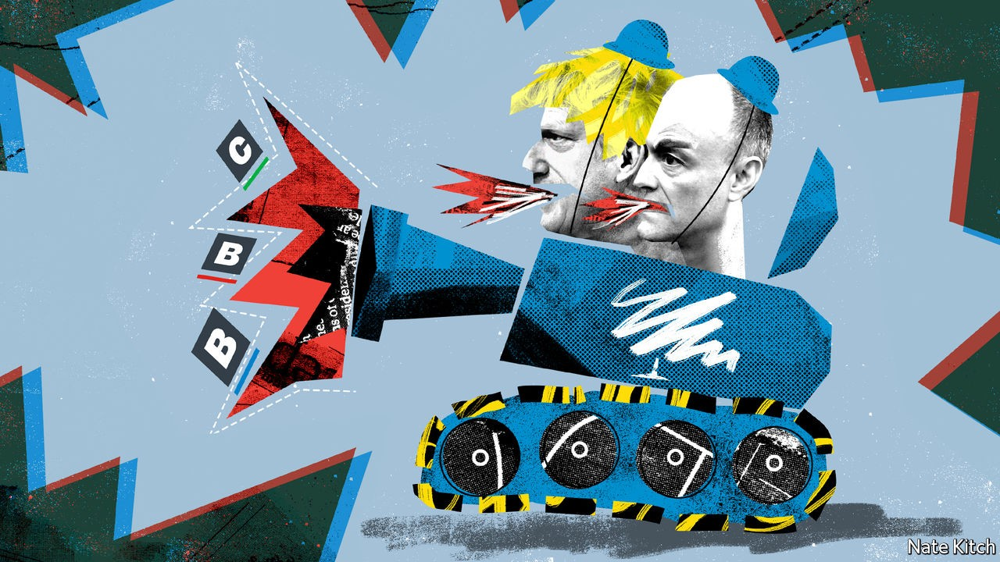

## Bagehot

# The Tories launch a culture war

> It may not do them or the country much good

> Oct 3rd 2020

IN THE LONG-FORGOTTEN days of Cool Britannia, Downing Street was packed with left-leaning intellectuals scoffing prime ministerial canapés as Tony Blair sought to dominate not just the country’s politics but also its culture. David Cameron, like most Tories, was more interested in economics: he focused on squeezing public expenditure while hugging hoodies and huskies to blur the cultural distinction between Conservative and Labour parties.

Now the parties’ positions are reversed. Sir Keir Starmer, the Labour leader, is copying the Tories’ cultural attitudes, not fighting them. His recent address to his party conference was a paean to flag and family. The Conservatives, meanwhile, acknowledge that ceding culture to the left was a mistake: in the arts, broadcasting and higher education, Toryism is not just dead but damned.

Downing Street has let it be known that it is thinking of appointing two right-of-centre journalists, Lord (Charles) Moore and Sir Paul Dacre, to the most powerful cultural thrones in the land: chairman of the BBC and head of the media regulator, Ofcom. Oliver Dowden, the culture secretary, has told museums and galleries that they could lose grants if they take down controversial statues and artefacts. The Department for Education is banning teaching materials provided by “anti-capitalist groups”. This is part of a broader push from the right. Andrew Neil, a fearsome political interviewer, is helping found a new television channel, GB News, featuring American-style TV anchors “with a bit of edge”. Laurence Fox, a rare anti-woke actor, is founding a new political party, Reclaim, which he hopes will do for culture what UKIP did for Brexit.

Leadership is one reason for the new approach. The people who now run the Tory party are more interested in culture than economics: Boris Johnson, a former Daily Telegraph journalist (and underling of Lord Moore) who specialised in tweaking liberal tails, Michael Gove, a journalist influenced by America’s neo-conservative movement, and Dominic Cummings, a combative aide consumed by hatred of the metropolitan elite. Another is the shift in economic strategy, which started with the mantra of “levelling up” poorer areas of the country and has been completed by coronavirus. The Tories, like Labour, are now a party of the big state, so economics no longer divides the parties so clearly.

Fighting on the cultural battlefield has not, in the past, served the Tories well. Margaret Thatcher preached “Victorian values” only to be embarrassed when one of her favourite ministers, Cecil Parkinson, fathered a child by his mistress. John Major called for a return to basics only to see a succession of his colleagues, and eventually himself, damaged by sex scandals. “Family values” were a problem for the Tories not only because adulterers lived in fear that they would be exposed but also because closeted gays, of whom the party had many, bridled at their enforced hypocrisy.

As the father of at least six children by three different women, Mr Johnson does not look like the ideal leader to rally conservative troops in a culture war. But the issues are different today. Marriage is a minority pursuit. Gays are no longer closeted. Identity politics has united the party against a cultural left that treats the term “white” as an accusation rather than a description and regards Britain’s past as one of unrelieved villainy. The Conservatives are much better prepared this time around, too. The parliamentary party is diverse enough to rebut the charge that it is just a bunch of reactionary white men: the likes of Kemi Badenoch and Kwasi Kwarteng would no doubt welcome the chance to go toe-to-toe with Black Lives Matter (BLM) spokesmen. Many backbenchers are fired up. “Johnson should instruct a team of ministers to wage war on woke,” says Neil O’Brien, a cerebral MP for Harborough. And right-of-centre think-tanks are ready to roll out materials on everything from the statue wars to BBC bias.

This points to the biggest reason for the Tories’ confidence: the left’s over-reach. It is partly a matter of taking reasonable ideas too far. Acknowledging Britain’s role in the slave trade should not stretch to removing the name of David Hume, a colossus of the Enlightenment, from a building in Edinburgh University—a demand to which the university, to its shame, acceded. It is also a matter of style. The harassment of J.K. Rowling by trans-rights activists is an abomination. De-platforming has no role in universities.

Yet launching a culture war may do the Tories less good than they think. The sure-footed Sir Keir has sidestepped traps they have laid for him, such as over the singing of patriotic songs, and some Tories worry that it will unleash the “crazies” on their side. America’s experience suggests Britain may not benefit either.

A louder Conservative voice in cultural debates is all to the good. Cultural institutions decay if they are nothing more than echo chambers. Pressure groups such as BLM drift into self-indulgent extremism unless subjected to rigorous debate. Taxpayers grow rebellious if they are forced to support institutions that know more about New York than old York. But America’s experience offers a warning. The booing and bellowing of its culture warriors has coarsened discourse and divided the polity so that Republicans and Democrats can no longer work together on practical matters such as combating covid-19 or fixing the infrastructure.

Britain has defences against such developments. Parliamentary government is less prone to paralysis. Broadcasting laws make it more difficult to create highly partisan TV stations. But the Tories’ urge to fight on this new front will test these defences.

Culture is a legitimate area for political argument, but if it is to be constructive the government needs to bear two principles in mind. It should try to broaden the debate, not to disrupt it. The decision to ban literature created by anti-capitalist groups from being taught in schools is, thus, wrong. And the aim of reforming great cultural institutions should be to strengthen them, not to punish them for past misdeeds, imagined or real.■

## URL

https://www.economist.com/britain/2020/10/03/the-tories-launch-a-culture-war
