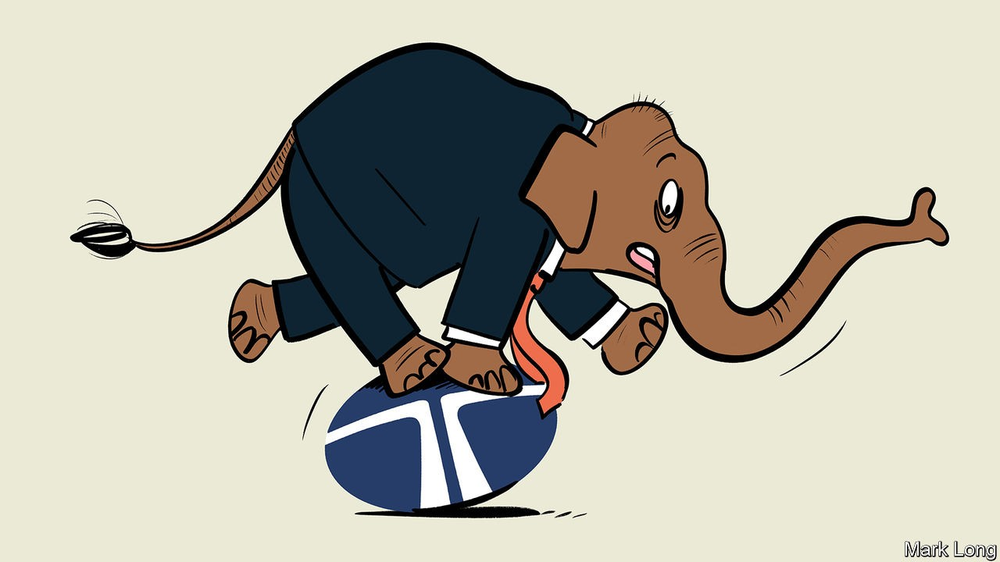
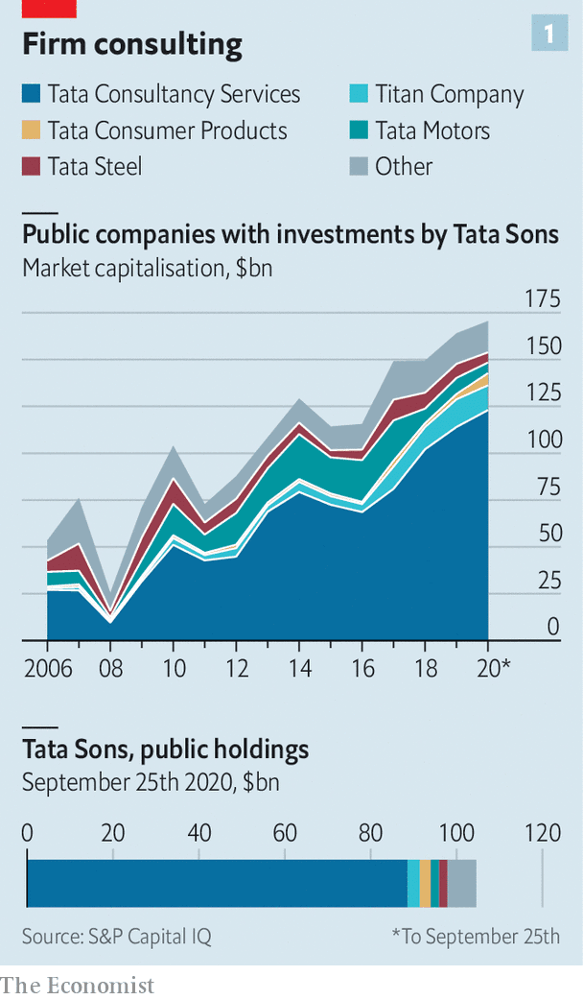
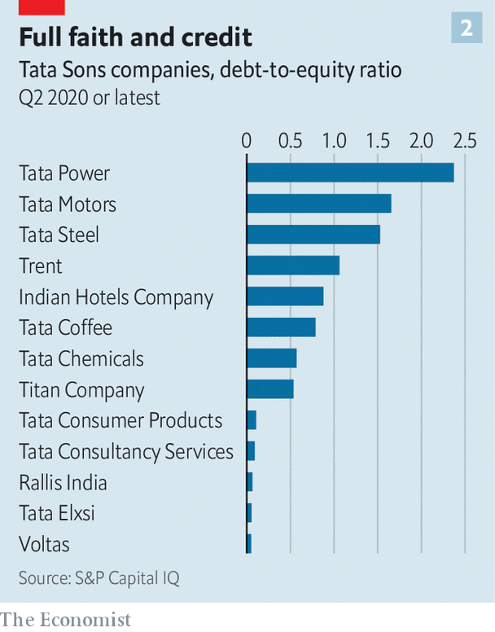

## Endangered species

# Can Tata Sons regain its footing?

> The Indian conglomerate’s structure is straining under internal and external pressure

> Oct 3rd 2020

IN THE PANICKY initial days of India’s covid-19 lockdown, the country could count on one venerable institution. Tata, a 152-year-old conglomerate, bought millions of dollars’ worth of medical supplies for clinics and hospitals. Its shut businesses did not lay off a single worker. A new subsidiary was conjured up to develop a one-hour coronavirus test using gene-editing technology, which was approved last month. Each of these was a feat in its own right. Collectively, they look remarkable.

That is what Indians have come to expect from Tata since its founding in 1868. The group’s holding company, Tata Sons, and the seven charities which today own 66% of its shares, have been a pillar of India’s philanthropy, donating $156m last financial year, as well as its industry. The group thrived by helping India through its challenges, accruing businesses as it went.

Legend has it that Jamsetji Tata, the group’s progenitor, who died in 1904, built the magnificent Taj Mahal hotel after being denied a room at one of Bombay’s existing establishments because he was an Indian, not a European. Today Indian Hotels, which owns the Taj Mahal, is South Asia’s biggest chain. Less apocryphally, Tata Power and Tata Steel were founded to cope with India’s chronic electricity shortages and the paucity of heavy industry. It is a similar story for Tata Chemicals (from soda ash to hybrid seeds), Tata Motors (cars and lorries) and Tata Consumer Products (tea to turmeric). Tata Consultancy Services (TCS), India’s leading information-technology firm, was born in 1968 to manage payroll and inventory for Tata’s burgeoning portfolio of businesses.

The Tata name thus pervades all aspects of Indian life. An outside appraisal cited by Tata Sons values the brand, for the use of which the parent charges affiliates a royalty, at $20bn. That makes it Tata Sons’ second-most-valuable asset behind only its $89bn stake in TCS. But the lattice of business, do-goodery and trust, all wrapped up in a beloved brand, now faces problems of its own, from inside its corporate structure and from stiffer competition beyond it.

Start with the structure. Because for much of its history capital was in short supply in India, Tata Sons holds only partial stakes in big affiliates. In the 1980s the parent company reportedly let executives create an affiliate, Titan, to take on the state wristwatch monopoly on the condition that they could find funding themselves (which they did). During another scramble for money in the volatile 1920s the roots were planted for what has turned into the group’s biggest headache of late.

The details are fuzzy. But a loan secured at the time has evolved into an equity stake held by the Shapoorji Pallonji Group—a name that, like Tata’s, resonates in India Inc. SP Group, as it is known for short, built many of Mumbai’s landmark buildings, including the central railway station and the old reserve (central) bank. Its controlling Mistry family is, like the Tatas, drawn from old Bombay’s Parsi elite. Close ties between the clans (including by marriage) meant that when a Tata wanted to offload a stake, the Mistrys were seen as friendly buyers. Today SP Group holds 18.4% of Tata Sons.

In 2012 Ratan Tata, the current patriarch, stepped down as chairman of Tata Sons. He installed Cyrus Mistry, who then headed SP Group, as his successor. Mr Tata owed the Mistrys a debt of gratitude from early in his tenure, when Mistry money helped ward off hostile bidders for Tata businesses as India opened up its economy in the 1990s, after the interventionist decades of the Licence Raj. But he left behind a mixed legacy, having used readier access to capital in the roaring 2000s, when India’s economy looked on course for China-like growth, to bankroll a shopping spree. In 2007 he bought Britain’s Corus Steel for $12bn. A year later he paid $2.3bn for Jaguar Land Rover (JLR), an iconic British carmaker. He splurged millions on telecoms networks, power generation and chic hotels, including the Pierre in New York.

Many deals proved to be duds. Tata Steel is losing money. JLR has struggled to carve out a niche in the premium car market. A vast coal-fired power project in the state of Gujarat, begun in 2006 with government encouragement, has generated mostly losses. All this has fuelled a bonfire of value destruction. Since 2007 the market capitalisation of Tata Steel (into which Corus was folded) has gone from $14.5bn to $5.4bn; Tata Motors has declined from $7.3bn to $5.7bn; Tata Power from $7.4bn to $2.3bn; and Indian Hotels from $2.4 to $1.5bn. Today nearly 90% of Tata Sons’ worth is tied up in its lucrative stake in TCS, India’s second-most-valuable company (see chart 1).

In 2016 Mr Mistry was ousted as chairman, apparently at the urging of Mr Tata, who did not think he was doing a good job. The Mumbai rumour mill has it that the two fell out because Mr Tata declined to loosen his grip through the controlling trusts. (Mr Tata’s views on this matter are not known.) Whoever is right, Tata Sons handed the top job to Natarajan Chandrasekaran, TCS’s able boss, to right the ship. Mr Chandrasekaran continued Mr Mistry’s clean-up, writing off investments in a telecoms operation, cutting steel capacity, recapitalising subsidiaries and selling some loss-making assets, including a chain of car dealerships.

That is not the end of it for Mr Chandrasekaran. Out of Tata Sons’ 15 big publicly listed affiliates, only five have returns on capital of over 10%. The debts of four subsidiaries, including Tata Motors and Tata Steel, exceed their equity—by more than twice in the case of Tata Power (see chart 2). Although Tata Sons holds minority stakes in many divisions, markets and bankers appear to assume that it stands entirely behind all its operating companies, in effect taking on full risk for partial reward.

Even if Mr Chandrasekaran’s restructuring plan succeeds, another problem looms in the form of increased competition. Tata’s corporate structure makes it hard for its various arms to collaborate—by linking its hotels, airlines (Tata Sons holds stakes in two) and a coffee-shop joint-venture with Starbucks, say. That could increase efficiency and help fend off global rivals that offer appealing products. The alternative to the Taj Mahal is no longer some fusty Mumbai lodge but the Four Seasons. Tata Motors must take on not just the rickety Hindustan Ambassador but BMW.

In more ordinary times, Tata could tap a reservoir of goodwill, plus returns from TCS, to tackle these challenges patiently. But India’s growing financial strains, exacerbated by covid-19, have opened up fissures. SP Group, whose real-estate investments have been particularly hard-hit, is struggling to roll over debts. A default on its obligations to a small listed subsidiary, Sterling and Wilson Solar, raised concerns about SP Group’s overall debt, estimated at $4.1bn. In response to the cash crunch it reached an agreement with Brookfield, a Canadian private-equity firm, for capital. Collateral included the Mistrys’ shares in Tata Sons. Tata Sons sued to block the transaction, arguing it was not permitted under the shareholding agreements. India’s Supreme Court has suspended the deal until a hearing on October 28th.

Tata’s options are unappealing. SP Group has offered to take direct stakes in subsidiaries in proportion to its overall holdings. But that would dilute Tata Sons’ stakes just as Mr Chandrasekaran is trying to consolidate control by increasing holdings. For the same reason he is reluctant to buy the SP stake outright with money from a sale of assets—the price of which would anyway be depressed by the downturn. Tata Sons’ 30-odd direct holdings, including a financial-services arm, a home-builder and a biotech firm, are worth perhaps $6bn all told. But most are tricky to value at the best of times—which these are not. And Mr Chandrasekaran is understandably loth to reduce its ownership of TCS, and the accompanying juicy dividend.

A third option is to raise fresh capital. For all its problems, Tata’s portfolio of assets may look attractive to a private-equity giant or a sovereign-wealth fund. But outside investors may demand things unbecoming of Tata Sons, like redundancies or divestments. It may be the price for preserving an Indian icon. ■

## URL

https://www.economist.com/business/2020/10/03/can-tata-sons-regain-its-footing
