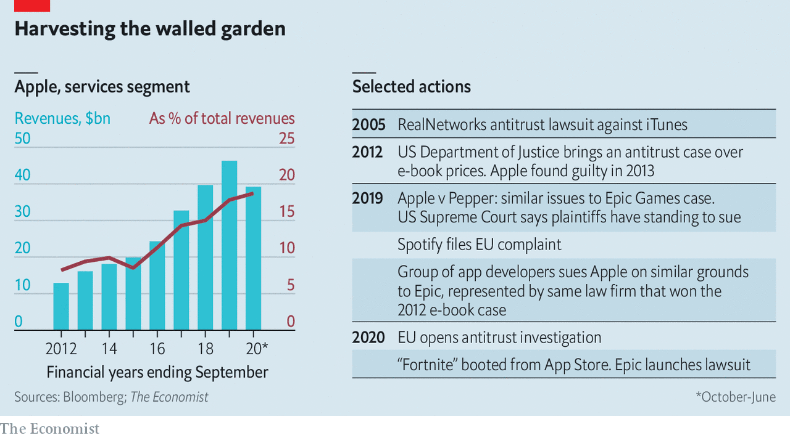

## Storing up trouble

# The Epic-Apple courtroom battle commences

> A judge in California hears the opening arguments in what promises to be a drawn-out—and consequential—dispute

> Oct 3rd 2020

FITTINGLY, THE legal deathmatch is happening online. On September 28th a court in California heard arguments, via video call, in a case that pits Apple against Epic Games, the maker of “Fortnite”, a hit video game. At issue is whether the tight control Apple exerts over the software that can run on its smartphones amounts to a monopolistic abuse of power. The verdict, when it comes, may determine what other digital marketplaces can and cannot do.

Apple’s software practices have seen challenges before (see table). But Epic’s is the most brazen. In August Epic offered “Fortnite” players 20% off in-game purchases on iPhones if they paid Epic directly, not via Apple’s App Store, which takes a 30% cut on most transactions made in apps. This violated App Store terms; “Fortnite” was booted from the platform. Expecting this, Epic responded with the lawsuit (and a cheeky PR campaign).

The hearing concerned the narrow question of whether Epic could force Apple to return “Fortnite” to the App Store while the case proceeds. But it offered a preview of both sides’ arguments. Epic contends that Apple’s “walled garden”—in which iPhone software can be downloaded only via the App Store—stifles competition. In 2018 Epic launched a PC games store, charging a 12% commission. Steam, the dominant store, then dropped its cut from 30% to 20% for top-selling games. Tim Sweeney, Epic’s feisty boss, argues that Apple prevents something similar on iPhones.

Apple retorts that those who dislike its rules have plenty of alternatives. “Fortnite” is available on desktop PCs, games consoles and smartphones that run on Android, a rival operating system made by Google. In a statement, Apple accused Epic of forcing its hand and “putting customers in the middle of their fight”. It has countersued Epic for breaching its App Store contract.

Mark Patterson of Fordham University sees parallels with Microsoft’s run-in with trustbusters in 2001. The software giant’s bundling of a web browser with its Windows operating system was eventually found to be anticompetitive. Apple exerts more power over iPhones than Microsoft did over Windows PCs, Mr Patterson says. But its market share in smartphones is smaller than Microsoft’s was in desktops.

The Epic case may hinge on how the court defines the relevant market. In Apple’s eyes the App Store is part of a broader universe of digital platforms in which it can reasonably claim not to be a monopolist. Epic takes a narrower view, arguing that iPhones are a market unto themselves.

Most lawyers think Apple had the better of the initial exchanges. The judge seemed unconvinced by Apple’s attempts to stop Epic from updating the iPhone version of the software behind “Fortnite”, which is licensed to other gamesmakers. But she reserved her strongest words for Epic, which she admonished for inviting trouble.

The case looks likely to go to a jury trial next year. With no clear precedent, big ramifications for the tech industry and the odds that the losing party will appeal, the dispute may end up in the Supreme Court.

In the meantime, Apple is facing other pressures. Epic is being cheered on by fellow members of the “Coalition for App Fairness”, like Spotify, a music-streamer, and Match Group, owner of Tinder and other dating apps. In June, at Spotify’s urging, the EU opened an antitrust probe into the App Store, and David Cicilline, who chairs a committee in America’s Congress that examines antitrust issues, described Apple’s fees as “highway robbery” and lamented the lack of “real competition” on iPhones.

While it battles Epic in the courts, Apple may tweak its rules to placate some developers. It has done so on occasion in the past, for instance exempting Amazon from the 30% commission on in-app purchases for the e-commerce giant’s Prime Video streaming app. On September 25th, following criticism from Facebook, Apple announced a temporary waiver on the 30% fee on in-app purchases for companies that had been forced by the covid-19 pandemic to switch to online-only events.

Such concessions may be as far as Apple will go, at least willingly. When Steve Jobs launched the App Store in 2008, he didn’t think it would ever make much money. He was wrong. Although the company does not break out the platform’s financial results, it probably makes up the bulk of its services business, which accounts for nearly 20% of revenues—and rising (see chart), as iPhone sales slow. Seeing what a promising profit engine it has turned into, Apple’s late boss would doubtless have fought tooth and nail to hang on to it. ■

## URL

https://www.economist.com/business/2020/10/03/the-epic-apple-courtroom-battle-commences
