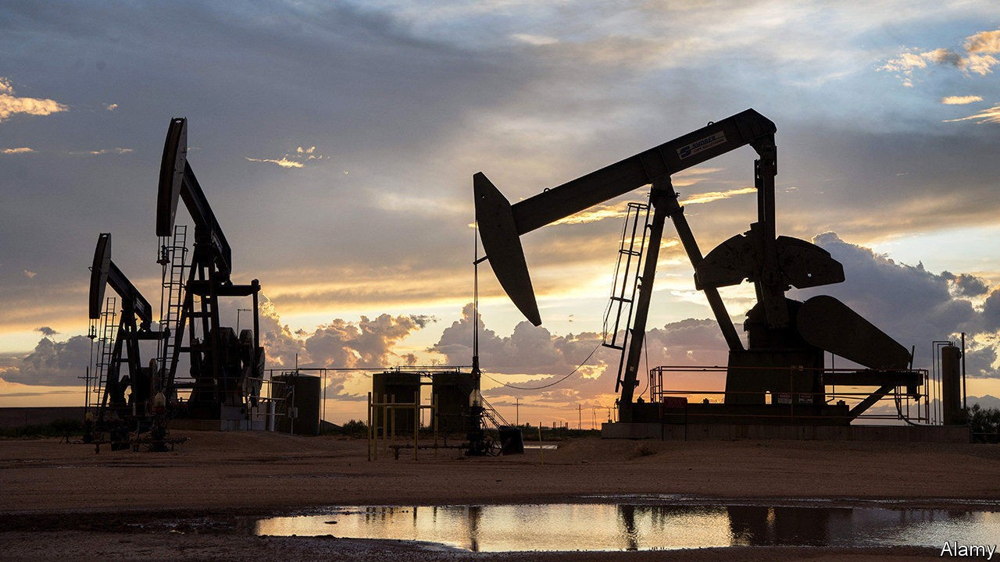
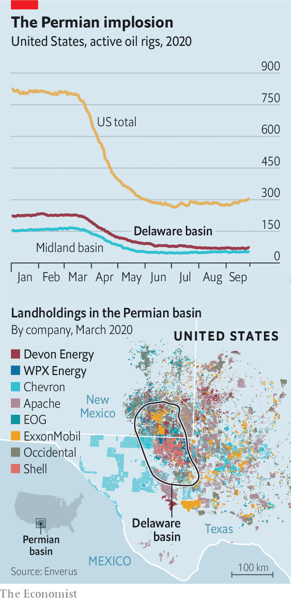

## Shelling out on shale’s sale

# Why Devon Energy wants to buy WBX Energy

> The merger between two frackers is a rare example of consolidation in a fragmented industry

> Oct 3rd 2020NEW YORK

TO CALL 2020 tough for shalemen is to call a monsoon a mist. Covid-19 has halved the value of fracking firms this year. Rig counts are down (see chart). A perfect time for consolidation, then. Yet besides Chevron’s $5bn bid for Noble Energy in July, deals have been sparse. Buyers fret that investors will punish them for overpaying. Targets fear selling amid sinking oil prices. Many bosses’ yearly pay exceeds rewards from a sale, notes Devin McDermott of Morgan Stanley, a bank. So all eyes are on Devon Energy’s $2.6bn offer to buy WPX Energy, a smaller rival, announced this week. 

The merged entity will have 400,000 acres in the Delaware basin and, it is hoped, $575m in annual savings. Andrew Dittmar of Enverus, an analytics firm, says Devon will rely less on wells on federal land, where Joe Biden wants to curb drilling if he becomes president. Devon’s share price jumped by 11% on the news. Fellow frackers will take note. 

## URL

https://www.economist.com/business/2020/10/03/why-devon-energy-wants-to-buy-wbx-energy
