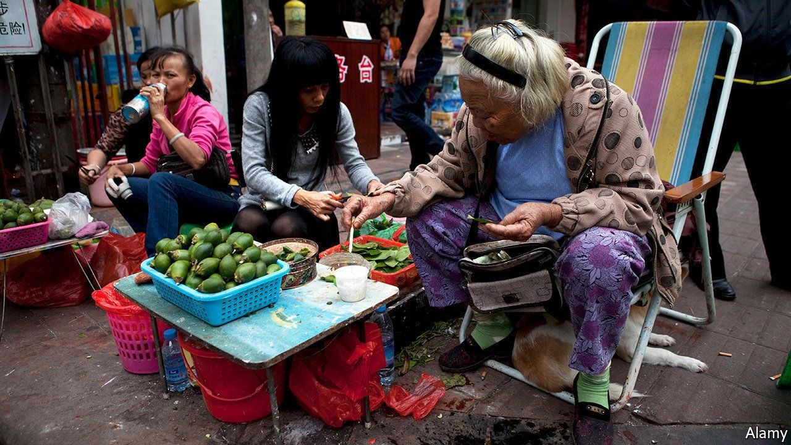

## The peddle betel battle

# A risky stimulant thrives in China’s capital of chewing

> Despite the danger to health, the betel-nut industry is booming

> Oct 3rd 2020XIANGTAN

BETEL NUTS assail the nostrils before they thrill the tongue. At a shop in Xiangtan, a city in the central province of Hunan, they are sold in a dried form—dark and wrinkled in blue-and-white porcelain bowls, with flavourings of spice, mint, orange and cinnamon oil. They sell for a few yuan apiece (under $1). A local song celebrates their ability to induce a bit of a buzz: “The more you chew the betel nut, the livelier you’ll feel...Spit one out and pop another in.” People in Xiangtan exchange them in greeting. From teenagers to elderly mah-jong players, the city’s residents chomp furiously to get their fix of the nut’s main stimulant, arecoline.

In 2017 China’s regulators named arecoline as a carcinogen (long after the World Health Organisation had done so). Also that year doctors in Hunan published findings that oral submucous fibrosis, a disease from chewing betel nuts that often leads to cancer, was “widespread” in the province, with rates much higher than elsewhere in China. They predicted oral-cancer cases would become a “humanitarian catastrophe” in Hunan, rising from almost 25,000 in 2016 to 300,000 in 2030. Something to chew on, you would think.

Yet demand for the nut is swelling. Sales at the largest firms are growing at a yearly rate of 10%, according to the Hunan Betel-Nut Association in Xiangtan, where the industry took off in the 1980s (it was already well-established across the Asia-Pacific). The business employs over 2m of Hunan’s 41m working-age adults. Most of them are involved in processing the betel nuts, which are the berries of areca palm trees. These are mainly grown on Hainan, a tropical-island province 1,000km away (where a peddler selling fresh nuts is pictured).

In February, as cases of covid-19 soared in China, the National Health Commission even included betel nuts in a prescription based on traditional Chinese medicine for removing “dampness in the lung”. Firms in Hunan province handed out mask-and-betel-nut care packages to taxi drivers and street cleaners. The head of a betel-nut association on Hainan island told state media a story often recounted in Xiangtan: a monk there survived a plague in the 17th century by continuous chewing of the nut.

The sector is adept at deflecting concerns. In March 2019 the association in Xiangtan said it was banning advertisements by local betel-nut firms. That seemed encouraging—until it emerged that, even under questioning by state media about the purpose of the move, the group would not admit to health concerns. Compliance with the order was patchy. Since August a comedy show, “Deyun Laugh Club”, has been watched 500m times. Among its sponsors is Wu Zi Zui (“Five Drunk Men”), one of Hunan’s biggest betel-nut producers. Opening ads for its goji-flavoured betel nut promise that chewing it will make watching the show “even more fun”.

## URL

https://www.economist.com/china/2020/10/03/a-risky-stimulant-thrives-in-chinas-capital-of-chewing
