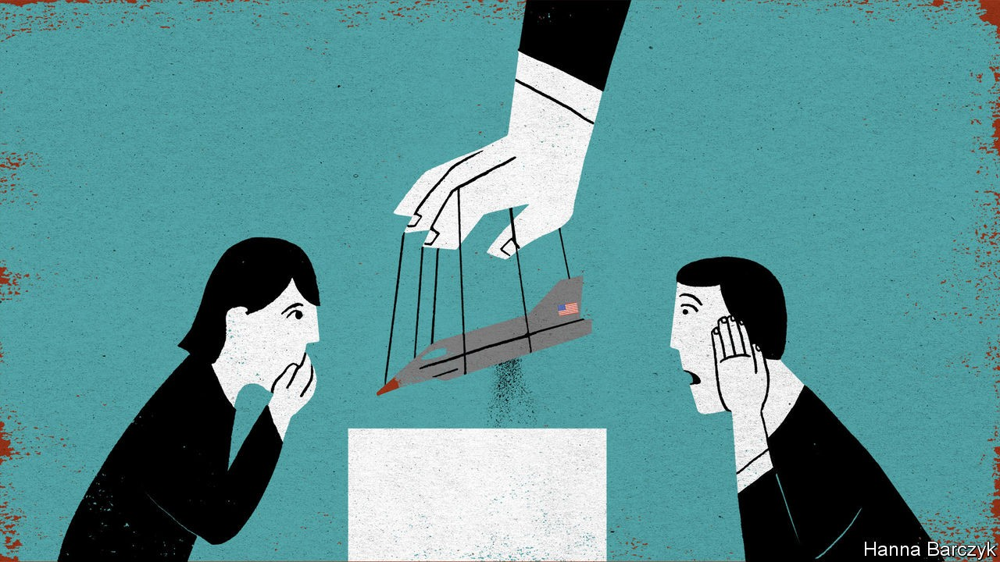

## Chaguan

# China is celebrating 70 years since it entered the Korean war

> Its rulers portray the conflict as a Chinese victory against the West

> Oct 3rd 2020

AN OPTIMIST MIGHT call it progress that China’s national memorial to the Korean war, newly reopened after years of renovations, has reduced the space devoted to a Mao-era hoax—the charge that America used the plague and cholera as bio-weapons during that conflict, thereby committing a war crime.

It is dismaying that the allegations remain on display at all in the memorial, a hilltop complex overlooking the Chinese border city of Dandong and, across the Yalu river, the North Korean town of Sinuiju. The memorial reopened in late September, ahead of the 70th anniversary of China’s entry into the conflict that laid waste to the Korean peninsula from 1950 to 1953, and that Chinese leaders call “The War to Resist America and Aid Korea”. Still, hopeful sorts might note that the hoax was once a much bigger deal. The allegations of germ warfare were worldwide news in the first months of 1952. Chinese and North Korean leaders saw a chance to challenge the legitimacy of the American superpower. In Europe, Soviet-bloc governments and Western sympathisers staged protest marches involving millions of people, accusing American warplanes of dropping bombs packed with bacteria-laced insects on Korea and northern China.

The new memorial in Dandong charges America with crimes against international law in a single display panel, offering few details. A glass case offers supposed evidence: an old bomb casing, and dusty test-tubes containing “bacteria-carrying insects scattered by the US forces”. In reality the tale was long ago debunked, notably by documents that emerged from Soviet archives decades after the war. The papers included a resolution by the Soviet government in 1953 that called reports of American germ warfare in Korea “fictitious”. A study by Milton Leitenberg for the Woodrow Wilson Centre in Washington cites memoirs by Wu Zhili, a former head of China’s military medical service in Korea. Wu called talk of germ warfare a “false alarm” that did not make sense: some alleged drop-zones were just metres from American lines, and the winter weather was far too cold for bacteriological warfare.

Cheerful souls might conclude that modern China’s rulers are embarrassed by this old propaganda but cannot easily disown it, so are taking a middle path. Chaguan draws a different lesson from a recent visit to the memorial. The new museum may tone down its anti-Americanism, eschewing the previous memorial’s statements about American imperialism being exposed as a “paper tiger”. But in its place is something that may prove just as disruptive: a deep disdain for the West, which is portrayed as unable to match the efficiency and order of Communist Party rule. Indeed, America’s germ-warfare campaign is called a military failure, thanks to clever Chinese and North Korean anti-epidemic work.

The museum has reflected political trends since it first opened in 1958. Back then, its displays followed North Korea’s line that the war began with a surprise attack by South Korea—a reversal of the historical truth. Today, in 2020, the museum in Dandong says coyly that “On June 25th 1950 the Korean civil war broke out,” without assigning blame. The memorial closed in 1966 when the commander of Chinese forces in Korea, Peng Dehuai, purged for questioning Mao and later rehabilitated, came under renewed attack. It did not reopen until 1993, a year after China normalised relations with South Korea—a rapprochement that enraged the North and made it urgent for China to assert its version of history. The hall closed again in 2014, ostensibly for repairs, amid Chinese anger at missile tests and nuclear-weapons research by North Korea.

The latest memorial has an intensely domestic focus. Its dioramas, enlivened with the bright lights of projected explosions and the boom of recorded gunfire, feature American soldiers in two roles: fleeing and dying. North Koreans are glimpsed mostly as helpless civilians, thanking Chinese troops for rescuing them.

Chinese students are taught that their country entered the war in self-defence against American invasion threats, sending “Chinese people’s volunteers” in canvas shoes and thin cotton uniforms against swaggering Americans armed with tanks and warplanes. Textbooks describe these Chinese troops hurling rocks when ammunition ran out, teaching the world to respect the young People’s Republic of China. In reality, the war was a bloodbath that ended where it started, with Korea divided along the 38th parallel, at a cost of perhaps 400,000 Chinese lives (the memorial admits to less than half that number). In this 70th anniversary year, those events have been distilled into a simple moral about not fearing America’s strength. State media stress how weak and poor China was in 1950. They praise Communist pioneers for daring to attack America, and for realising that, faced with such a bully, they had to seek “peace through fighting”.

Chaguan did not hear nostalgia for war among the museum’s visitors. He did find admiration for the willingness of previous generations to accept hardship. A local man, Xiu Dexiang, had brought a five-year-old son dressed in a miniature army uniform. “I want to let him know that this life we have did not come easily, and he needs to cherish it,” he explained.

Li Quanxin, a 90-year-old Red Army veteran, drew lessons from the memorial about Chinese self-discipline. “Take this pandemic. Two hundred thousand people died in America! What’s their leader doing? Look at how calm China is now,” he growled. “China’s decision-making is really something. From the Korean war to covid, the path we choose is sure, and the world is in awe.”

Later in October China will award medals to surviving veterans of Korea. Big-budget films about the conflict are heading to cinemas and television screens. Talk of resisting America can hardly be avoided: it is in China’s name for the war. Elaborate challenges to America’s legitimacy will not be needed. To China’s rulers, their system’s superiority and the West’s decline are self-evident.■

## URL

https://www.economist.com/china/2020/10/03/china-is-celebrating-70-years-since-it-entered-the-korean-war
