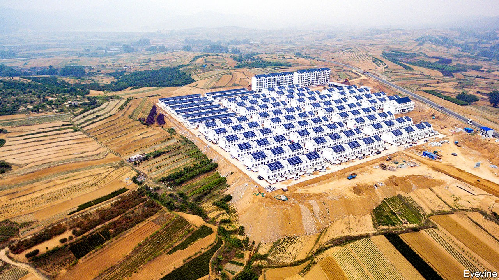

## On Harmony Road

# To put idle land to use, Chinese officials want to erase many villages

> Their methods could cause millions to suffer

> Oct 3rd 2020BINZHOU

THERE IS A surprising amount of earth-moving equipment on the otherwise sleepy rural back roads of Binzhou prefecture in the eastern province of Shandong. Some of it is being used to build an irrigation channel to draw in water from the nearby Yellow river. But much of it is being used for destruction. At a turning off a county highway, a sign points to Zhaibo village. It no longer exists. The machines have already done their job of levelling Zhaibo and carrying away the debris.

Before the end of May, the village was home to about 70 households who made their living growing maize and cotton and tending fruit trees. Now most of the former residents are in newly built flats on the outskirts of Weiji, a town about seven kilometres away. “We’re improving the soil and a lot of them will be able to come back and work the same land,” says a worker.

Similar scenes have been common in rural areas across China in recent years. Villages are being destroyed and their former residents moved elsewhere, often into clusters of houses or blocks of flats built by local governments to accommodate the populations of what were once several scattered hamlets.

Governments give several explanations for carrying out what they call hecun bingju, or “village consolidations”. Sometimes they talk of promoting urbanisation (some of the new communities are on the edges of towns like Weiji), or of helping villagers out of poverty. But a very common motive is to make more efficient use of rural land. Over the past three decades the movement of tens of millions of people from the countryside into cities has left many villages with few people except the elderly and the migrants’ children. Local officials want to convert the space occupied by empty houses into farmland so they can develop greenfield sites near cities without affecting their province’s overall stock of fields used for crops. The central government, ever fearful of having too little arable land to feed the country’s 1.4bn people, requires provinces to maintain specified areas of it. Pictured is Gongshan New Village in Shandong, to which the inhabitants of nearby houses have been moved to form a much tighter concentration, using far less land.

For some of those relocated, the new settlements may have advantages. The hollowing out of villages left many rural schools with hardly any students. Local governments responded by closing many of them: between 2000 and 2015 more than 300,000 primary schools—nearly three-quarters of the countryside’s total—were shut. This forced many children to trudge long distances to class, or attend state boarding schools. The new consolidated communities are in part intended to allow villagers to enjoy ready access to schooling and other government services.

But villagers often have no choice but to move into these settlements. Sometimes officials use brutal tactics to force them, including sending in thugs to beat those who refuse to leave their houses. This year Shandong embarked on an unusually large-scale and aggressive campaign to consolidate one-fifth of the province’s 70,000 or so villages by the end of 2020. Citing local officials, state media say Shandong (which is China’s second-most-populous province, with more than 100m people) ranks third in economic output, but only 11th in its urbanisation rate. It is eager to move up the tables.

The zeal of local officials has caused widespread suffering. Many homes were demolished before replacement apartment blocks were ready for occupancy. In numerous villages across northern Shandong, villagers describe the same phenomenon: xianchai houjian, meaning “first demolish, then build”. The practice has left many scrambling to find relatives to stay with. Some have built simple shacks or erected tents near their fields.

In a widely read essay Lu Dewen, a rural-affairs specialist at Wuhan University, described the abuses suffered by villagers in Shandong. He said that unlike the coronavirus pandemic—a “haze that will eventually pass”—the village consolidation campaign has been a “man-made disaster” with no regard for human emotions, and with fearsome psychological effects that will last a lifetime. Remarkably, state-owned media joined the chorus of criticism.

Local officials blocked your correspondent from approaching Weiji to speak to villagers relocated from now-flattened Zhaibo. But there have been numerous accounts, including in China’s press, of its residents having been beaten and intimidated to make them leave their homes. Some were threatened with dismissal from their jobs and some were detained while their houses were destroyed.

Shandong’s government has not acknowledged such abuses. But it has tried to sound emollient. In recent weeks, the province’s Communist Party chief, Liu Jiayi, has toured several villages, admitting that some residents had been treated “unfairly”. He has called on officials to “think from others’ point of view” and to protect farmers’ “legal rights”.

Mr Liu may not have considered a problem with his plan. Building new villages is expensive. Theoretically his government could offset the cost using proceeds derived from increasing the province’s stock of farmland: any area in excess of the mandated amount can be sold to developers. But as Chinese media have pointed out, the price depends on supply and demand. Shandong’s massive village-demolition scheme would create a glut of farmland that may prove hard to sell at the price the government had been hoping for.

Mr Liu has not announced the abandonment of his project to build “beautiful and liveable homes” for farmers—ie, move them into smart-looking new settlements. But there are signs that the government is proceeding more cautiously. Take Linjia village in Dezhou prefecture. It is due for demolition but remains intact, for now. Several residents say they have been promised there will be no move until their new dwellings are ready. “No one is happy about it but we are being allowed to negotiate so far,” says Mr Lin, a resident.

Work on the new accommodation, several kilometres away, is well advanced. Huge billboards show drawings of planned blocks of flats. A showcase building is already finished, as is a new thoroughfare leading to it called Harmony Road. Back in Linjia, Mr Lin describes its tight-knit community and worries that old friendships will be disrupted. He wonders also about what he will do after a lifetime spent farming. “I’d rather just stay here if I could,” he says, “but I know it’s not possible.” ■

## URL

https://www.economist.com/china/2020/10/03/to-put-idle-land-to-use-chinese-officials-want-to-erase-many-villages
