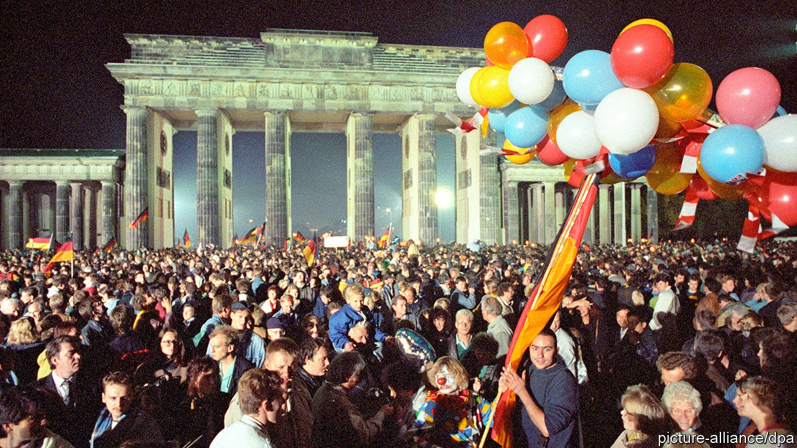
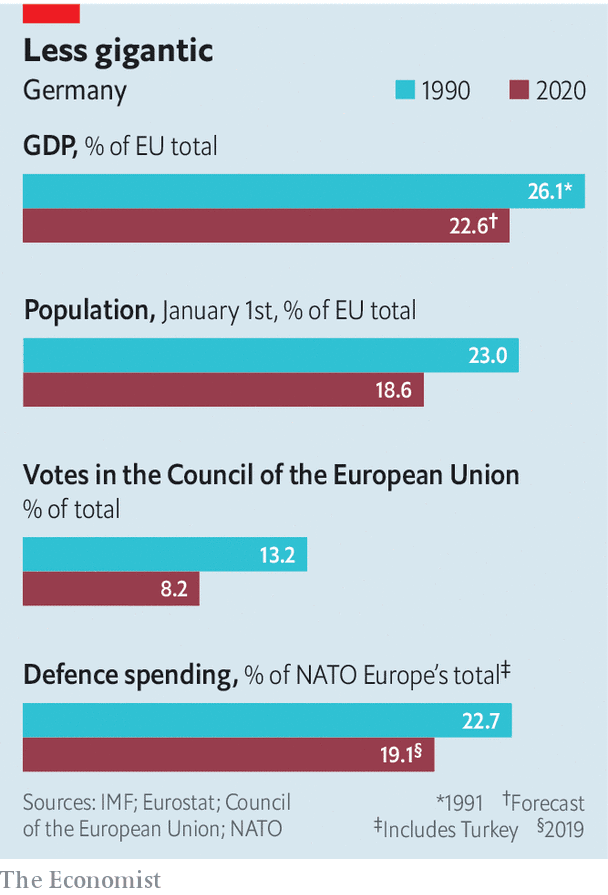

## The reluctant hegemon

# Germany is being forced to take a leadership role it never wanted

> But thirty years after reunification, it is finding its stride

> Oct 3rd 2020

IN UNGUARDED MOMENTS, British and French diplomats 30 years ago might quietly admit that they could happily live with a divided Germany. Its partition, however unjust, contained the problem of a country that, in Henry Kissinger’s words, was “too big for Europe, too small for the world”. After the Berlin Wall fell in 1989, Margaret Thatcher sought to recruit François Mitterrand, France’s president, in a fruitless plot to block, or at least delay, reunification, fearing an enlarged Germany would upset Europe’s balance or even threaten its security. Among European leaders only Felipe González, Spain’s then prime minister, unequivocally backed a united Germany.

Thirty years on—unified Germany marks its birthday on October 3rd—the darker fears of Germany’s European partners have not come to pass. Indeed, as the European Union has battled to hold itself together through a cascade of crises, they have been more often troubled by German inaction than by German assertiveness.

In an essay last year, Thomas Bagger, a German government official, argued that post-reunification Germany adopted a naive reading of Francis Fukuyama’s “end of history” thesis. The end of the cold war seemed to vindicate the country’s commitment to a world in which national interests were a hangover from a brutish past and foreign policy would be subsumed into multilateral institutions. German ministers took to suggesting that German and European interests were the same.

These views committed Germany to the cause of EU integration, not only expansion to the east but working with France to deepen links among existing members. The goal of a “united Europe” was even inserted into the constitution. A Bundeswehr general said he hoped to see German troops swear oaths of loyalty to a European flag. It was from conviction, not to please the French, that Chancellor Helmut Kohl agreed to ditch his country’s cherished Deutschmark for the euro. The currency, however, was built on Teutonic foundations: strict fiscal rules and a (Frankfurt-based) central bank with a single mandate of price stability. The cost of absorbing the clapped-out former communist East Germany, and Germany’s sclerotic labour market and high taxes, left the economy gasping for air by the end of the 1990s. But it perked up in the 2000s thanks to labour reforms and growing export markets. When the global credit crunch spawned the euro crisis in 2010, Germany’s economic might condemned it to lead Europe’s response.

Its answer seemed to be that the currency was being undermined by fiscally incontinent governments. (Critics countered that it had in fact been Germany’s huge surpluses and suppressed domestic demand that had stoked the crisis.) Germans started to wonder about the wisdom of the enterprise: a poll in 2010 found that 44% of them wanted the Deutschmark back. Angela Merkel, temperamentally ill-suited to big leaps forward, had little room for manoeuvre. The bail-outs she pushed through the Bundestag were hugely controversial, yet by forcing austerity on debtor countries they compounded the misery, merely delaying a reckoning. The resentment in those southern countries was huge. The single currency, designed to bind Germany to Europe, seemed to be doing the reverse.

Germany’s reluctance to act assertively in the face of a grave challenge triggered an arcane debate over what sort of “hegemon” it was, or might hope to become. But it was not a discussion the Germans sought themselves. “I was one of the first to use that term,” says Dominik Geppert, a historian at the University of Potsdam, “and other Germans told me, ‘Don’t say it, it will cost us money!’” In 2011, with the euro crisis raging, Radek Sikorski, Poland’s foreign minister, said he feared German inactivity more than its power. This extraordinary statement got him into hot water at home but barely rippled in Germany.

In the end the euro-zone fire was quelled not by Germany but the European Central Bank’s vow to do “whatever it takes” to hold the currency together: a pledge heralding an activist monetary policy that riled Germans further. Then came other crises, each with Germany at their heart. After Russia’s assault on Ukraine in 2014 Mrs Merkel corralled other EU members into backing sanctions and worked with America and France to counter Vladimir Putin. Yet in the migrant crisis of 2015-16 Germany twice irritated its European partners: first by keeping its borders open, and then by unilaterally striking a deal with Turkey to keep them out. If this was leadership, it looked worryingly erratic.

Events chipped away further. Brexit, which was and remains a mystery to most Germans, left the country with more weight inside the EU but, oddly, less influence, as the club’s centre of gravity shifted southwards. Some “new” central European states took an authoritarian turn. Most important was the unconcealed disdain of Donald Trump’s administration for the EU and the implied threat of the withdrawal of its security guarantee, one of the historical conditions for European reconciliation.

France under President Emmanuel Macron adjusted to this more quickly than Germany. Yet German attitudes may be shifting. Mr Macron’s notion of “European sovereignty” would once have inspired smirks in Berlin, says an official, but today it is rapidly finding adherents, as Germany grapples with American unpredictability, a troubled European neighbourhood and a growing Chinese threat. Mrs Merkel has surprised many by agreeing that the EU should issue €750bn ($880bn) in common debt and distribute the proceeds, partly through grants, to covid-stricken countries. The contrast with the reluctance of 2010-12 is striking.

Yet European sovereignty without America is a chimera, reckons Timothy Garton Ash, a historian at Oxford University, who fears Germans have lost interest in the transatlantic idea. For optimists, a Joe Biden victory in November could presage a new deal in which Europe repositions itself as a partner to America, especially over China and security, in exchange for a renewed American commitment to multilateral arrangements—such as the Paris climate deal and the Iran nuclear accord—so cherished by Germany. (If Mr Trump wins re-election, all bets are off.)

This will not be easy. “We need the Germans to stop sitting on the fence, but they have a hard time because the world is not as they would like it to be,” says Jim Townsend, a former top official on Europe at the Pentagon. Germany’s defence spending is growing quickly but remains far from the NATO target of 2% of GDP, and parts of its armed forces are not fit for purpose. Mr Sikorski, now a member of the European Parliament, says his former criticism now applies to foreign and defence policy, where “Germany always does too little too late”.

Perhaps the hardest illusion for Germany to shed is that trade and economics can be insulated from geopolitics. As many of its allies argue, gas pipelines from Russia and Chinese-built 5G networks are political projects, too. “The rest of Europe won’t become more sovereign if Germany always takes the national way” on such matters, says Franziska Brantner, a Green MP. This will be an uncomfortable debate. But the sands are shifting, and next year’s election, at which Mrs Merkel will stand down, offers a chance to bring it to life. ■

## URL

https://www.economist.com/europe/2020/10/03/germany-is-being-forced-to-take-a-leadership-role-it-never-wanted
