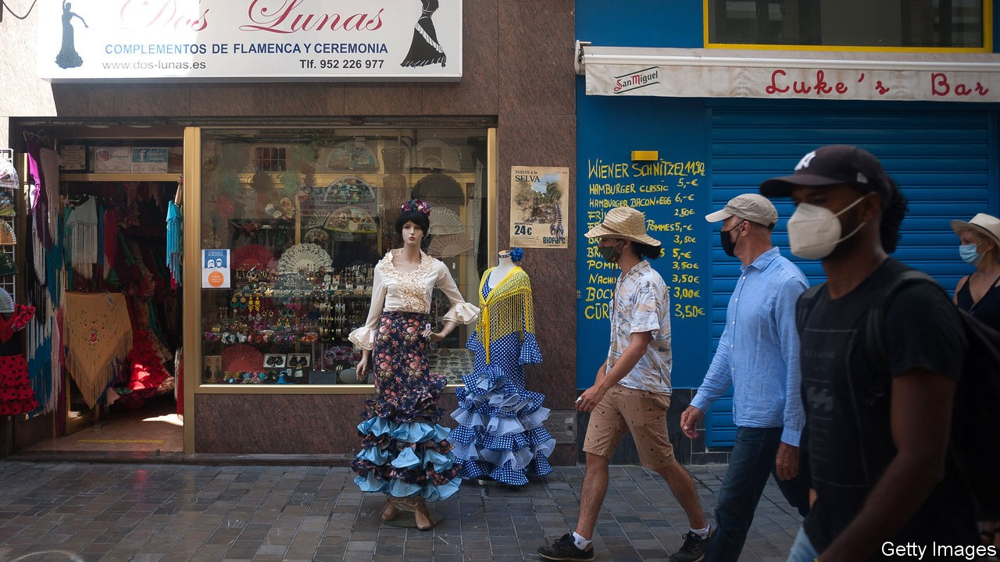
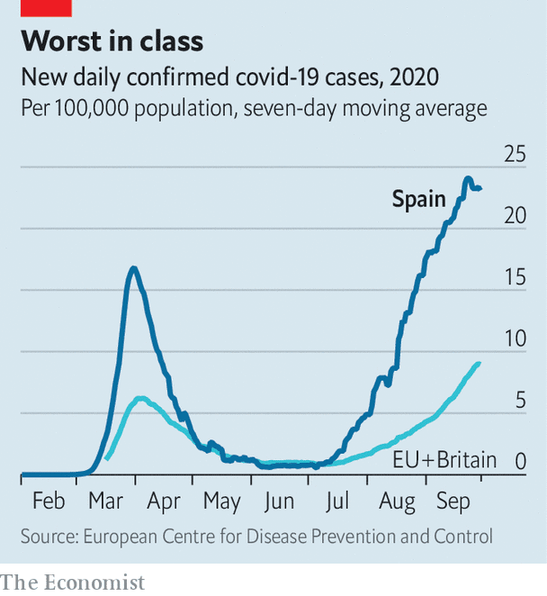

## Dancing with death

# Spain’s poisonous politics have worsened the pandemic and the economy

> Its record is Europe’s worst on both counts

> Oct 3rd 2020MADRID

THE INFANTA LEONOR hospital, wedged between a motorway and a suburban railway, serves the dense working-class districts of south-eastern Madrid. Last month 402 of its 480 doctors signed a letter to the regional government warning that the hospital was in a state of “pre-collapse”, with 54% of its 361 beds and all 27 intensive-care spaces occupied by covid-19 patients. With 784 cases per 100,000 people in the past fortnight, Madrid is currently the worst-hit region in Europe.

This is part of a broader national failure. On July 5th Spain’s prime minister, Pedro Sánchez, proclaimed that “we have defeated the virus and controlled the pandemic.” Yet the country is once again Europe’s coronavirus black spot (see chart).

What went wrong? Health experts point the finger at a failure of government for which both Mr Sánchez’s left-wing minority coalition and the conservative opposition People’s Party (PP), which runs Madrid, carry the blame.

After Europe’s strictest lockdown, Spain rushed its release. The PP joined Catalan and Basque nationalists in refusing to support the renewal of the state of emergency under which the government could restrict activity. Rebuffed, Mr Sánchez handed control of the pandemic to the regions and went on holiday. Several of the regions, especially Madrid, failed to strengthen primary health care and contact-tracing. The government failed to require them to do so, nor did it fix clear rules for handling outbreaks of the virus. The summer did the rest: heeding Mr Sánchez’s triumphalism, Spaniards returned to their normal happy mingling in bars, nightclubs and at family gatherings.

Isabel Díaz Ayuso, Madrid’s regional president, opposes stricter measures that would hurt the economy. This week the government thought it had secured her agreement to extend to the whole of the capital restrictions on non-essential movement and gatherings she has placed on its southern areas. New rules would require all cities of more than 100,000 people to follow suit when new cases rise above 500 per 100,000, and other criteria are met. But three other PP-governed regions opposed them, and as The Economist went to press, the deal seemed to have fallen apart.

The failure to keep the pandemic under control has nipped the economic recovery in the bud. Forecasters now reckon the economy will contract this year by up to 13%, the worst figure in Europe. A hoped-for restart of tourism was curbed by the renewed outbreaks. Raymond Torres of Funcas, a think-tank, notes that the Spanish economy is particularly vulnerable because, all told, tourism and hospitality account for 26% of GDP—five points more than the European average.

Some 60,000 of Spain’s 315,000 bars and restaurants have shut down; another 40,000 are likely to do so by the end of the year, according to the sector’s lobby. The government this week extended until January 31st a furlough scheme which currently helps some 800,000 workers (down from a peak of 3.2m). It has granted €85bn ($100bn) in credit to businesses. More tools may be needed to prevent what Mr Torres fears may be a “cascade of bankruptcies”.

Spain is trusting in EU aid, but most of that will not arrive until 2022. It may be tied to reforms of the labour market, pensions, education and training. These require political consensus, which is in short supply. Mr Sánchez has repeatedly called for national unity, only for ministers to stick the knife into the opposition. His relations with Pablo Casado, the PP’s leader, are marked by mutual mistrust.

The coalition of Mr Sánchez’s Socialists and Podemos, a far-left party, was voted into office in January with the help of Basque and Catalan separatists. Officials complain that the right denies its legitimacy. The opposition accuses Mr Sánchez of endangering the constitution with his liaisons: Pablo Iglesias, Podemos’s leader, snipes at the monarchy and the judiciary.

With some delay, Mr Sánchez is likely to get a budget approved. That should allow the government to survive for the rest of the parliamentary term until 2023. But at a cost. The private sector is rattled by Spain’s political warfare and Podemos’s presence in government, although it has little influence over economic policy. “There’s a bull market in pessimism,” says a normally upbeat former minister with business ties. “I’ve never been so worried about the political situation.” The moderation of the Spanish middle class and the constraints imposed by the EU are his only solace. ■

Editor’s note: Some of our covid-19 coverage is free for readers of The Economist Today, our daily [newsletter](https://www.economist.com/https://my.economist.com/user#newsletter). For more stories and our pandemic tracker, see our [hub](https://www.economist.com//news/2020/03/11/the-economists-coverage-of-the-coronavirus)

## URL

https://www.economist.com/europe/2020/10/03/spains-poisonous-politics-have-worsened-the-pandemic-and-the-economy
