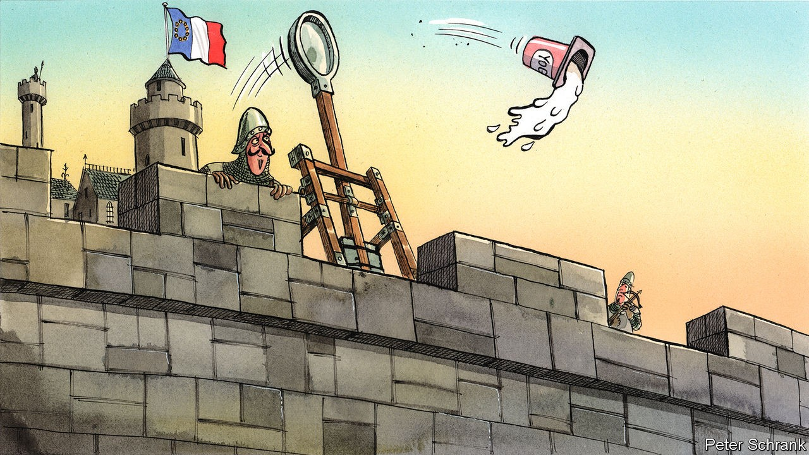

## Charlemagne

# The revenge of strategic yogurt

> How the EU started speaking French when it comes to the economy

> Oct 3rd 2020

DANONE IS PROUD of its yogurts. The French company boasts that 4bn patented bacteria go into every pot, with each batch fermented for eight hours, or roughly a quarter of the French working week. France, understandably, is proud of Danone. When rumours emerged in 2005 that Pepsi was considering a bid for the company, the French political establishment howled. Dominique de Villepin, the then prime minister, pledged to defend the “interests of France”. Jacques Chirac, the president at the time, promised to be “vigilant and mobilised” against any potential predator of French business. Anglo-Saxon capitalists guffawed. In Brussels, European Commission officials rolled their eyes and delivered lectures on the merits of red-blooded competition. “Strategic yogurt” became a byword for the excesses of French protectionism.

After a decade of such jokes, French ideas are now the bedrock of the EU’s economic policy. In Brussels, industrial strategies for everything from hydrogen to car batteries have been developed. (Incidentally, Thierry Breton, the French finance minister during the Danone row, is now the commissioner responsible.) A carbon border tax—first seriously floated by Chirac—is on the cards, which would involve duties on products entering the single market from polluting countries. New rules are in the works to make it easier to block foreign takeovers—whether of yogurt manufacturers or not—if the buyer has benefited from unfair subsidies. Some of the buzzwords have changed. Whereas Mr de Villepin and Co spoke of “economic patriotism”, today’s economic Francophiles in the EU speak of “strategic autonomy” and “sovereignty”, which now litter the conclusions of European Council meetings. But the content is the same. How did the French worldview take over?

One reason is that the bloc’s usual band of free traders are in retreat, cowed by a backlash against trade deals. This has taken place in some unlikely spots. The year 2016 is remembered as when voters opted for Donald Trump and Brexit. But it was also the year that the Dutch in a referendum voted against a trade agreement with Ukraine and a band of Walloons threatened to bring down a similar one with Canada. Now politicians line up to criticise such deals. In June Dutch MPs backed a motion against the ratification of a deal between the EU and Mercosur, the South American trade bloc, as have their usually liberal Irish counterparts. The Dutch even issued a joint paper with the French, calling for strict enforcement of labour and environmental standards in such deals.

Britain’s departure has deprived the economic liberals of clout. Even if Britain had stayed, the EU’s Frenchification might still have happened. Outside the bloc, Britain has spurned the idea of Singapore-on-Thames and is pursuing London-sur-Seine. Surprisingly, the British government’s right to pump businesses with taxpayers’ money without any EU constraint—historically a French dream—has emerged as an obstacle in trade talks. Brussels is determined not to allow Britain the chance to undercut the bloc with subsidies and is testing its newfound willingness to cut anyone who fails to abide by its wishes out of the single market. Charles Michel, the European Council president, turned to a French playwright to explain the EU’s hitherto unappreciated strength: “Just as Molière’s Monsieur Jourdain speaks in prose without realising it, Europeans have become a world power without realising it.”

Naivety, long a favourite term of French trade negotiators, has become a watchword for how the EU has mishandled its economic relationship with trading partners. When it comes to China, even diplomats from the most forthright liberal countries admit as much. If a conservative is a liberal who has been mugged by reality, a neo-protectionist is a trade negotiator who has had to deal with China. It speaks to a wider shift in the EU’s outlook on the rest of the world. Before, the world was an opportunity, with blockbuster trade deals the order of the day. These days it is seen as a threat, with an assertive China and an erratic America causing trouble from which the EU must protect itself.

A brutal mix of economics and geopolitics leaves the EU with little choice but to take a more protectionist line, argues Hosuk Lee-Makiyama, a director at the European Centre for International Political Economy, a free-trade think-tank. Export-led growth is off the table, if countries such as China and India remain closed. America will still be a tricky partner even if Donald Trump leaves the White House. This leaves import substitution as the only option, even if EU leaders do not dare to admit it.

After all, protectionism is still a dirty word in Brussels. Even the French do not use it. And they have good reason to be coy. For starters, the EU likes to see itself as the last guardian of the multilateral order. But its newfound enthusiasm for unilateral methods—such as stopping foreign buyers of European companies on subsidy grounds—puts this reputation under strain. It is possible that merely developing the tools will ensure the EU never has to use them, argues Sam Lowe from the Centre for European Reform, a think-tank. But if the EU does end up using these tools as a stick, it may turn out to be a boomerang that comes hurtling back at them.

All this means that there are limits to the EU’s economic Francophilia. France’s quixotic quest to bring home the production of things like surgical masks is politely ignored by its new allies. At the moment, the EU imports cheap things, like PVC gloves, and sells expensive things, like hospital scanners. Jeopardising this settlement would be unwise, particularly as the main problem at the start of the pandemic in the EU was de facto state-sanctioned piracy, with governments snatching medical goods that passed through their territory. French ideas may be in vogue in the EU. But many are just strategic yogurt. ■

Correction (October 5th 2020): A previous version of this piece said that EU exports accounted for “about half its GDP”. This is true only if trade between EU countries is included. EU exports of goods to countries outside the bloc were worth €2.1tn in 2019, or about a seventh of GDP. Sorry

## URL

https://www.economist.com/europe/2020/10/03/the-revenge-of-strategic-yogurt
