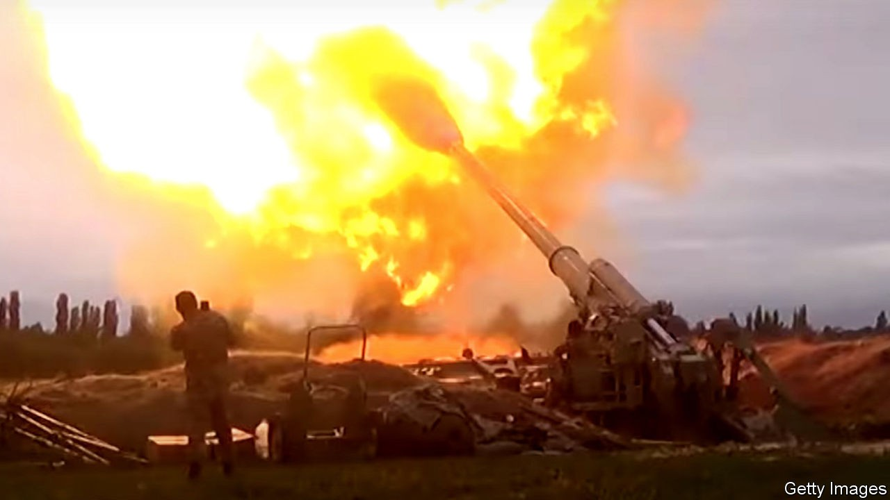
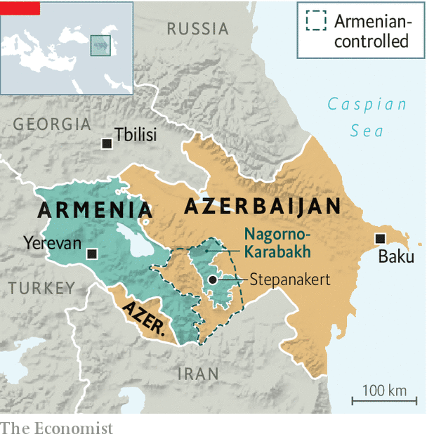

## Bad blood in the Caucasus

# War returns to Nagorno-Karabakh

> Armenia and Azerbaijan are at blows

> Oct 3rd 2020ISTANBUL

IN ONE VIDEO, an Azerbaijani tank stands in flames. In another, an Armenian one is pulverised by a drone. A hail of gunfire cuts into troops scaling a hillside. One of the world’s most intractable conflicts, over the disputed region of Nagorno-Karabakh, has blown up again, threatening to plunge Armenia and Azerbaijan into full-scale war. By the time The Economist went to press on October 1st, more than 100 people had been killed in five days of fighting.

Both sides blame the other for the violence, though it seems Azerbaijan had been preparing an offensive to recover at least part of Nagorno-Karabakh for some time. The fighting has awakened memories of a war that devastated the region in the 1990s. Missiles have rained down on Armenian positions across the separatist enclave, including Stepanakert, its main city. Azerbaijan said it had taken several villages. Both countries declared martial law and mobilised troops. Armenia accused Turkey, Azerbaijan’s main ally, of shooting down one of its warplanes; Turkish officials denied it.

Nagorno-Karabakh was part of Azerbaijan under the Soviet Union. As the empire crumbled, clashes broke out between its Armenian majority, which sought union with Armenia or independence, and its Azerbaijani minority. This descended into a war that saw atrocities on both sides. Some 30,000 people were killed and about 1m displaced before a ceasefire in 1994. The region has since been controlled by Armenian forces, though it is still internationally recognised as part of Azerbaijan. The Armenians also occupy surrounding areas, connecting the enclave to Armenia.

International mediation has failed to bring about a breakthrough. Nikol Pashinyan, Armenia’s prime minister since 2018, seemed open to talks when he came to office but has since reverted to a tougher position. In a speech last year he called for Nagorno-Karabakh to be unified with Armenia. Azerbaijan’s strongman president, Ilham Aliyev, has since ruled out negotiations. Skirmishes in the area occur regularly. At least 16 people, including an Azerbaijani general, were killed in clashes north of the enclave in July.

The fear is that Azerbaijan is now bent on taking back the entire enclave. “This is a more serious escalation, much better prepared, with more troops, and happening simultaneously on all parts of the front line,” says Olesya Vartanyan, a Caucasus analyst at the International Crisis Group, a Brussels-based think-tank. “In addition to heavy weaponry, we see infantry, we see many more helicopters, and masses of drones,” she says. The clashes threaten to spill over into civilian areas. Outright war could put key pipelines at risk. The region sits close to ones that bring oil and gas from Azerbaijan to Turkey through Georgia.

One new factor is Turkey’s greater involvement. Turkey has always backed Azerbaijan politically (Azeris are ethnically close to Turks) but now seems keener than ever to back it militarily, says Thomas de Waal of Carnegie Europe, a think-tank. Unlike other outside powers, including the EU, America and Russia, which have called for an end to the fighting, Turkey has urged Azerbaijan to fight on. Its president, Recep Tayyip Erdogan, said on September 28th that peace would come to the region only once Armenia withdrew from Nagorno-Karabakh. His spokesperson added a day later that Turkey was “fully ready” to help Azerbaijan recover the enclave. Turkey already supplies its ally with armed drones, which have been used in the fighting. Some reports say Mr Erdogan’s government has sent Syrian mercenaries to help.

Azerbaijan may settle for only partial gains. But escalation or deeper Turkish involvement could spark a confrontation with Russia, which also sells arms to Azerbaijan but has a mutual-defence pact with Armenia. In theory, since Nagorno-Karabakh is not formally part of Armenia, Azerbaijan can do “whatever it wants there” without provoking a Russian response, says Andrei Kortunov, head of the Russian International Affairs Council. “But that does not mean Russia will sit on its hands.”

So far Russia has only asked Turkey to back a ceasefire. “The Russians don’t want to be involved and prefer to play a balancing act and be a mediator,” says Mr de Waal. “But if Armenian territory is under attack, they have no option but to defend Armenia.” Turkey and Russia are already tangled up in two proxy wars, in Libya and Syria. They run the danger of fighting a third one in the Caucasus. ■

## URL

https://www.economist.com/europe/2020/10/03/war-returns-to-nagorno-karabakh
