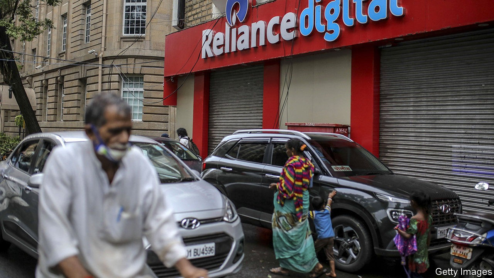

## Sticking plaster

# Foreign capital helps ease India’s credit drought

> As risk capital dries up at home, foreign institutional investors are proving influential

> Oct 3rd 2020

WITH THE economy battered by coronavirus, risk capital has dried up in India. In the past six months assets in credit-focused mutual funds, which play a crucial role as buyers forAA- to A-rated bonds, have declined from $13bn to $4bn. Lending by commercial banks, burdened by dud loans even before the pandemic, has withered. Thankfully, for some companies this domestic dry spell is being offset by a stream of foreign capital.

Reliance, a telecoms and energy giant, is a glitzy example of overseas equity investment made on the premise of growth. But a quieter wave of capital is seeking out different sorts of assets, serving to stabilise local companies while offering foreign investors high returns. As a result, many of the world’s largest insurers, private-equity (PE) firms and pension and sovereign-wealth funds have become influential.

Such inflows have been a boon for India’s financial institutions. Edelweiss, a big lender and asset manager, had already been suffering after the collapse of one non-bank, IL&FS, tightened domestic credit for the others. Covid-19 only made matters worse. But over the summer Edelweiss has struck a series of deals, selling, for instance, its corporate loans to Singaporean and American asset managers, and a majority stake in its wealth-management division to a Hong Kong-based PE firm. Its share price has doubled since May.

Banks have followed a roughly similar path. Several large private-sector lenders, including Axis, Kotak Mahindra and ICICI, along with HDFC, a non-bank mortgage lender, have raised capital from foreign investors. Sources of cash include: the Canada Pension Plan Investment Board; two Singaporean funds, Temasek and GIC; and funds associated with banks such as Morgan Stanley and Société Générale.

Foreign interest has also been piqued by operating assets that generate predictable annual dividends, rendering them similar to fixed-income investments. In July a 49% stake in GMR Airports, which controls airports in Delhi and Hyderabad, was sold to a French operator. In August Brookfield, a Canadian PE firm, along with GIC, agreed on a $3.4bn purchase of 135,000 mobile-phone towers from Reliance—India’s largest-ever PE deal. Along with Ontario’s municipal-pension fund and Actis, a PE firm, Brookfield is bidding for SoftBank’s 80% stake in a large solar-power company.

The list goes on, and more transactions are being negotiated. At a time when interest income has all but disappeared in the rich world, India’s credit squeeze lets foreign investors buy assets that could produce annual returns nearing double digits. For Indian firms the money provides desperately needed breathing room. It will not solve the systemic problems of Indian finance. Nor will it fuel investment-led growth; that would require foreigners to plough cash into new, productive projects instead of existing ones. But it does provide a welcome stop-gap at a difficult time. ■

## URL

https://www.economist.com/finance-and-economics/2020/10/03/foreign-capital-helps-ease-indias-credit-drought
