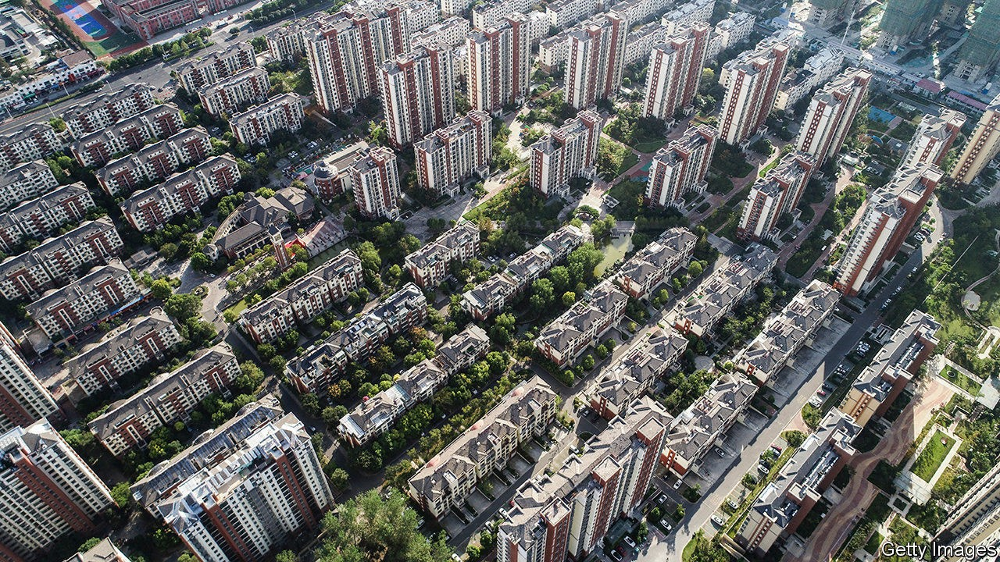

## Not forever grand

# Is China’s biggest property developer truly too big to fail?

> Regulators want Evergrande to save itself by raising cash and cutting its debts

> Oct 3rd 2020SHANGHAI

EARLY IN SEPTEMBER Evergrande, China’s biggest home-builder, announced the kind of sale more commonly seen in clothing stores: “30% off all properties, one month only!” Some debated whether it was a gimmick or a genuine discount. But its motivation was clear. Deep in debt, Evergrande needed cash—and quickly. Events since then have highlighted the urgency, and also raised the question of whether its struggles threaten the wider economy.

Evergrande, after all, has more debt—nearly $120bn—than any other non-financial listed company in China. Having built as many as 600,000 homes annually, it has amassed a debt load 56 times bigger than a decade ago. And it has strayed far from its core business, founding a colossal football academy, a bottled-water brand (which it later sold) and an electric-car company.

On September 24th a letter spread online suggesting that its giant edifice was shaky. Written on Evergrande stationery, it warned of a cash crunch and appealed to the government of Guangdong, its home province, to push through approval of a backdoor-listing plan. According to a previous agreement, Evergrande would owe investors 130bn yuan ($19bn) if its subsidiary failed to list on the Shenzhen stock exchange, where it would obtain a higher valuation than it currently has in Hong Kong, before the end of January. Evergrande has said that the letter, seen by reporters for Bloomberg and Reuters, is a fabrication.

The part of the letter that attracted most attention was its prediction that Evergrande’s failure would lead to “systemic financial risks”. Has it truly achieved too-big-to-fail status? The letter, whether authentic or not, made a straightforward case. First, if Evergrande were to collapse, the impact on the economy would be severe. The letter estimated that the developer, with projects in 229 cities, generates more than 3m jobs. Second, the financial fallout would be far-reaching. Evergrande reportedly owes money to 171 domestic banks and 121 other financial firms, on top of all of its bondholders. The letter seemed calculated to elicit a helping hand from a government that prizes stability, both social and financial.

The Chinese government regularly rescues ailing firms, especially its state-owned enterprises. But for a private-sector company, any bail-out is likely to involve at least partial nationalisation. Evergrande may have thought it had one factor in its favour: it was not asking for money, just approval for a stock listing.

Yet a listing is not simple—as Evergrande knows, having sought approval for its Shenzhen share sale since 2016. And it has only become tougher in recent weeks. The central bank and the housing ministry introduced a new policy to restrict funding for developers, measuring them against three “red lines” for indebtedness, such as too heavy a reliance on short-term funding. Evergrande is one of a handful of developers that cross all three.

The government is, in other words, trying to limit, not facilitate, the growth of indebted companies. Authorities have reason to think that Evergrande’s woes will have less systemic fallout than those of a big overleveraged bank. Evergrande is huge, but its debt nonetheless amounts to just 0.5% of total Chinese bank loans. And it is developing land worth about $170bn, 50% more than its debts, according to S&P Capital IQ, a data provider. It could, in theory, be wound down.

In practice, though, it would still be messy. Far better to rein it in before it fails. That, for the moment, seems to be the focus. Evergrande has reached an agreement with most of its investors who expected the Shenzhen listing, securing itself more time. It is likely to raise money by spinning off its property-management arm. And most crucially, the September sale has brought an influx of homebuyers to its showrooms. For a change, China’s biggest builder has to build down, not up. ■

## URL

https://www.economist.com/finance-and-economics/2020/10/03/is-chinas-biggest-property-developer-truly-too-big-to-fail
