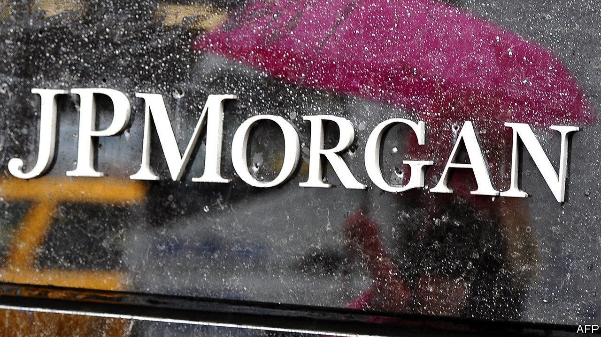

## Spoof proof

# JPMorgan Chase faces a fine of $920m for market manipulation

> Traders are alleged to have used “spoofing” to rig markets

> Oct 3rd 2020NEW YORK

MANY OF THE big market-manipulation scandals over the past decade have much in common: huge fines for the investment banks, criminal charges for the traders and an embarrassing paper trail revealing precisely what bank employees got up to. Interest-rate traders who manipulated the London Interbank Offered Rate (LIBOR) messaged each other with pleas to put their fixes in low. Foreign-exchange traders infamously called a chat room in which they discussed rigging exchange rates “the cartel”.

The case against JPMorgan Chase for manipulating precious-metals and Treasury markets has many of the usual features. On September 29th it admitted to wrongdoing in relation to the actions of employees who, authorities claim, fraudulently rigged markets tens of thousands of times in 2008-16. The bank agreed to pay $920m to settle various probes by regulators and law enforcement; this includes a $436.4m fine, $311.7m in restitution to parties harmed by the practices and $172m in disgorgement (ie, paying back unlawfully earned profits). Some of the traders involved face criminal charges. If convicted, they are likely to spend time in jail.

The traders are alleged to have used “spoofing”, a ruse where a marketmaker seeking to buy or sell an asset, like gold or a bond, places a series of phoney orders on the opposite side of the market in order to confuse other market participants and move the price in his favour. A trader trying to sell gold, for instance, might place a series of buy orders, creating the illusion of demand. This dupes others into pushing prices higher, permitting the trader to sell at an elevated price. Once accomplished, the trader cancels his fake orders.

The practice was explicitly outlawed in America in 2010, but the rise of algorithmic traders—which rapidly analyse order books to work out where prices might move next—has made it more tempting for human traders to spoof them. According to prosecutors one JPMorgan trader described the tactic as “a little razzle-dazzle to juke the algos”. In the past two years Deutsche Bank, HSBC, Merrill Lynch and UBS have all paid penalties on spoofing charges.

Though JPMorgan’s case shares similarities with past infringements, regulators and prosecutors have also become tougher. The penalty meted out to the bank is the largest ever for spoofing. The Department of Justice (DoJ) said that when it considered the appropriate punishment it took into account the fact that JPMorgan had pleaded guilty to manipulating foreign-exchange markets in 2015, suggesting that repeated offences would be punished more severely.

The penalties for the traders alleged to have run spoofing schemes are also likely to be harsher than usual. Four—including Michael Nowak, the bank’s former head of precious-metals trading, and Gregg Smith, a senior gold trader alleged to have introduced the practice at JPMorgan—have been indicted under the Racketeer Influenced and Corrupt Organisations (RICO) Act. (Mr Nowak and Mr Smith have pleaded not guilty to all charges.)

The RICO statute was formulated to target organised crime, the core business practices of which are illegal. But in 2019 Brian Benczkowski, then the head of the DoJ’s criminal division, said that the law had been used against JPMorgan because spoofing was so “widespread” at its metals-trading desk. That is a charge no one will want repeated. ■

## URL

https://www.economist.com/finance-and-economics/2020/10/03/jpmorgan-chase-faces-a-fine-of-920m-for-market-manipulation
