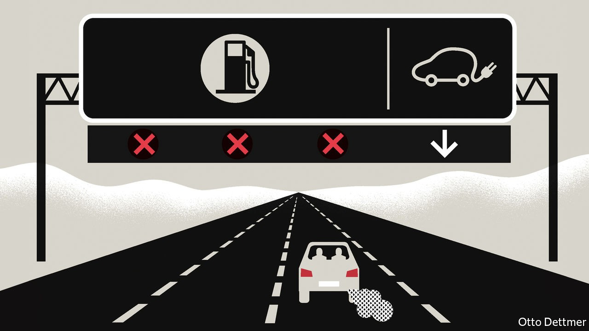

## Free exchange

# Outright bans can sometimes be a good way to fight climate change

> Studies show prospective bans on petrol-powered cars may be less inefficient than you think

> Oct 3rd 2020

WHEN SET against the grave threat posed by climate change, the green policies favoured by economists can seem convoluted. Carbon prices, beloved of wonks, require governments to estimate the social cost of carbon emissions, a nebulous concept. Green subsidies put politicians in the position of picking promising innovators and praying that bets with taxpayers’ money pay off. Faced with these fiddly alternatives, you might ask, would simply banning the offending technologies be so bad? In fact a growing number of governments are bowing to this logic. More than a dozen countries say they will prohibit sales of petrol-fuelled cars by a certain date. On September 23rd Gavin Newsom, California’s governor, pledged to end sales of non-electric cars by 2035. Such bans may look like window-dressing, and that could yet in some instances prove to be the case. But in the right circumstances, they can be both effective and efficient at cutting carbon.

It is easy to see why politicians are attracted to prospective bans. They sound tough and neither impose immediate hardship on consumers, as a carbon price would, nor drain the treasury, as subsidies do. It is just as easy to see why economists might disapprove. Carbon prices and green subsidies aim to redress markets’ failure to take account of the global costs of climate change while preserving choice for consumers. Bans are a far blunter instrument and—in the absence of good substitutes for the banned technology—can lead to economic losses, potentially offsetting the benefits of reduced emissions. But a ban could also accomplish too little, if a government’s commitment does not seem credible. Manufacturers who suspect that future politicians may renege on a pledge will not bother to make the investments needed to comply. A mandate introduced by Californian regulators in 1990, specifying that zero-emission vehicles should account for 2% of annual sales by 1998, rising to 10% by 2003, was revised substantially in 1996 when it became clear that the cost and performance of batteries were not improving fast enough to meet the targets.

Technology has advanced impressively since then. Fully electric vehicles are not yet a perfect substitute for petrol-consuming alternatives. They are often more expensive, depreciate faster, and have a lower range of travel and more limited supporting infrastructure, like charging stations or properly equipped mechanics. But the number of available electric models is growing, and performance gaps are closing. A recent analysis by Stephen Holland of the University of North Carolina at Greensboro, Erin Mansur of Dartmouth College and Andrew Yates of the University of North Carolina at Chapel Hill concludes that in such conditions—when electric vehicles are good but not perfect substitutes for petrol-guzzlers—a ban on the production of petrol-fuelled cars is a much less inefficient way to reduce emissions than you might think.

If electric vehicles were in every way as satisfactory as alternatives, it would take little or no policy incentive to flip the market from petrol-powered cars to electric ones. If, on the other hand, electric cars were not a good substitute at all, the cost of pushing consumers towards battery-powered vehicles would not be worth the savings from reduced emissions. Somewhere in between those extremes, both electric and petrol-powered cars may continue to be produced in the absence of any emissions-reducing policy even though it would be preferable, given the costs of climate change, for the market to flip entirely from the old technology to the new. Ideally, the authors reckon, this inefficiency would be rectified by a carbon tax, which would induce a complete transition to electric vehicles. If a tax were politically impossible to implement, though, a production ban would achieve the same end only slightly less efficiently—at a loss of about 3% of the annual social cost of petrol-vehicle emissions, or about $19bn over 70 years.

In practice, the degree to which electric vehicles are good substitutes for petrol-fuelled ones changes over time, and depends on more than just the capabilities of the cars themselves. This too may be a point in favour of sensibly structured bans on dirty technologies. Drivers of petrol-powered cars know that when the low-fuel warning light comes on, a filling station is probably nearby. The lack of a widespread network of charging points may put some potential buyers off electric cars (although in practice they would probably mostly charge their cars at home or at work). But charging stations are subject to a chicken-and-egg problem: when there are few electric cars on the road there is little incentive to build new stations, which in turn depresses demand for the vehicles.

Without policy guidance, the market might grope its way towards balance. Shanjun Li and Lang Tong of Cornell University, Jianwei Xing, now of Peking University, and Yiyi Zhou of Stony Brook University estimate that a 10% rise in the availability of charging stations boosts sales of electric vehicles by 8%, and a 10% increase in the number of electric cars on the roads raises the construction of new charging points by 6%. A promise to ban sales of petrol-powered cars at a certain date stands to accelerate this process and reduce its cost by co-ordinating the expectations of firms and consumers. Both firms and households would be less likely to waste money on capital goods the lifespan of which may be unexpectedly shortened by the disappearance of complementary technologies. Other scale economies might be realised: carmakers may feel more comfortable shifting the bulk of their R&D spending towards electric vehicles, for instance, and mechanics might start preparing to service electric cars. Meanwhile, the investment in services linked to petrol-powered vehicles would shrink rapidly.

Conditions in markets vary, and politicians should think carefully before applying the lessons from cars more widely. An announced ban on fossil-fuel-powered aeroplanes, for example, would most likely backfire in the absence of alternative technologies. In some cases, though, a shove may work as well as a nudge. ■

## URL

https://www.economist.com/finance-and-economics/2020/10/03/outright-bans-can-sometimes-be-a-good-way-to-fight-climate-change
