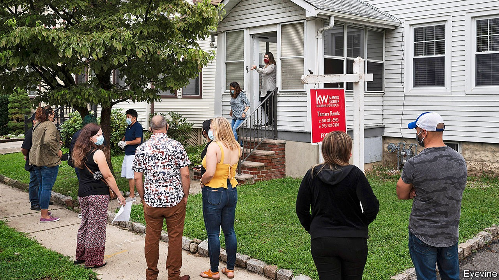
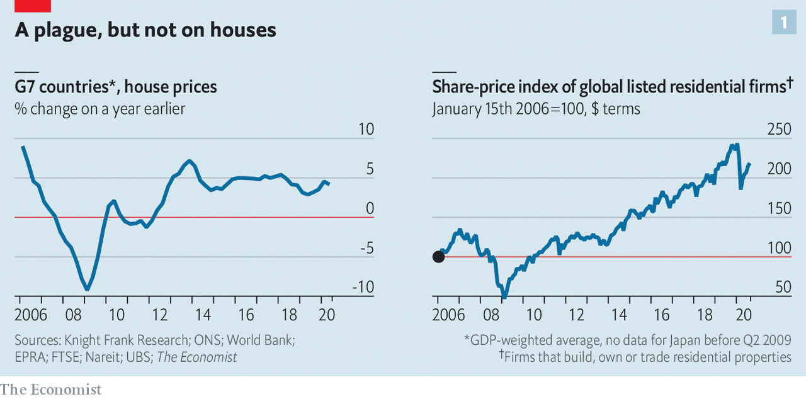
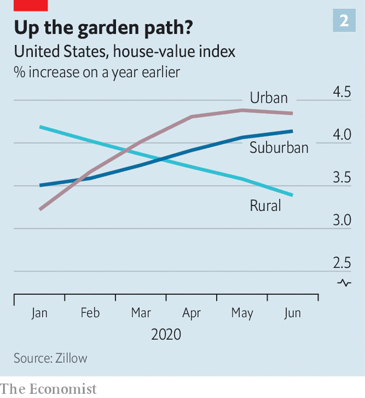

## The three pillars

# Why, despite the coronavirus pandemic, house prices continue to rise

> Monetary policy, fiscal measures and buyers’ preferences explain the unlikely boom

> Sep 30th 2020

DURING THE global recession a decade ago, real house prices fell by an average of 10%, wiping trillions of dollars off the world’s largest asset class. Though the housing market has not been the trigger of economic woes this time, investors and homeowners still braced for the worst as it became clear that covid-19 would push the world economy into its deepest downturn since the Depression of the 1930s.

That pessimism now looks misplaced. House prices picked up in most middle- and high-income countries in the second quarter. In the rich world they rose at an annual rate of 5% (see chart 1). Share prices of developers and property-traders fell by a quarter in the early phase of the pandemic, but have recovered much of the fall.

Some markets are fizzing. In August house prices in Germany were 11% higher than the year before; rapid growth in South Korea and parts of China has prompted the authorities to tighten restrictions on buyers. In America growth in the median price per square foot accelerated more quickly in the second quarter of 2020 than in any three-month period in the lead-up to the financial crisis of 2007-09. Three factors explain this strength: monetary policy, fiscal policy and buyers’ changing preferences.

Consider monetary policy first. Central bankers around the world have cut policy rates by two percentage points on average this year, reducing the cost of mortgage borrowing. Americans can take out a 30-year fixed-rate mortgage at an annual interest rate of just 2.9%, down from 3.7% at the beginning of the year. Studies suggest a strong link between falling real interest rates and higher house prices. Some borrowers can afford to take out bigger mortgages; others find it easier to manage their existing loans. Landlords are willing to pay more for property, because yields on other assets have dropped. In both America and Britain, mortgage lending is running at post-financial-crisis highs.

That is not to say that it has become easier for everyone to borrow. In fact, obtaining a mortgage has become harder for many. Brokers, fearful of the long-term economic impact of covid-19, have pulled back on riskier lending. British banks, for instance, are offering fewer high-loan-to-income mortgages. In America few loan officers at banks said they were tightening lending standards before the pandemic; now 60% do. In contrast with previous periods of strong house-price growth, there is little evidence of lax lending standards.

Fiscal policy, the second factor, may therefore be more important in explaining buoyant prices. In a normal recession, as people lose jobs and their incomes fall, foreclosures drag house prices down—not only by adding to the supply of houses on the market, but also by leaving ex-homeowners with a blemish on their credit history, making it harder for them to borrow again. But this time governments in rich countries have preserved households’ incomes. Handouts through wage subsidies, furlough schemes and expanded welfare benefits amount to 5% of GDP. In the second quarter of the year households’ disposable incomes in the G7 group of large economies were about $100bn higher than they were before the pandemic, even as jobs disappeared by the millions.

Other measures directly support the housing market. Spain, for instance, has allowed borrowers to suspend their mortgage repayments. Japan’s regulators have asked banks to defer principal repayments on mortgages, and the Netherlands temporarily banned foreclosures. In the second quarter the number of owner-occupied mortgaged properties that were repossessed in Britain was 93% lower than in the same period in 2019, the result of policies that dissuade repossessions. In America foreclosures, as a share of all mortgages, are at their lowest level since 1984.

The third factor behind the unlikely global housing boom relates to changing consumer preferences. In 2019 households in the median OECD country devoted 19% of spending to housing costs. With a fifth of office workers continuing to work from home, many potential buyers may want to spend more on a nicer place to live. Already there is evidence that people are upgrading their household appliances.

People also seem to be looking for more space—which, all else being equal, raises house prices. Though the New York and San Francisco housing markets look weak, there is little wider evidence to support the idea that people are fleeing cities for the suburbs, at least in America. Data from Zillow, a housing marketplace, suggest urban and suburban property prices are rising at roughly the same pace; price growth in the truly get-away-from-it-all areas is actually slowing (see chart 2). It seems more likely that people are looking for bigger houses near where they already live. In Britain prices of detached houses are rising at an annual rate of 4%, compared with 0.9% for flats, and the market for homes with gardens is livelier than for those without.

Can house prices continue their upward march? Governments are slowly winding down their economic-rescue plans, and no one knows what will happen once support ends. But lower demand for housing may run up against lower supply. High levels of economic uncertainty deter investment: in America housebuilding has fallen by 17% since covid-19 struck. The experience of the last recession suggests that even when the economy recovers, construction lags behind. It may take more than the deepest downturn since the Depression to shake the housing market’s foundations. ■

Editor’s note: Some of our covid-19 coverage is free for readers of The Economist Today, our daily [newsletter](https://www.economist.com/https://my.economist.com/user#newsletter). For more stories and our pandemic tracker, see our [hub](https://www.economist.com//news/2020/03/11/the-economists-coverage-of-the-coronavirus)

## URL

https://www.economist.com/finance-and-economics/2020/09/30/why-despite-the-coronavirus-pandemic-house-prices-continue-to-rise
