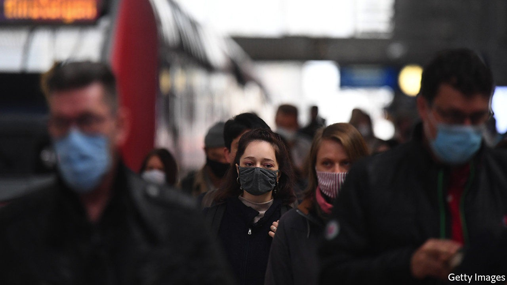
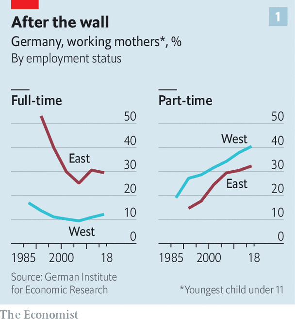
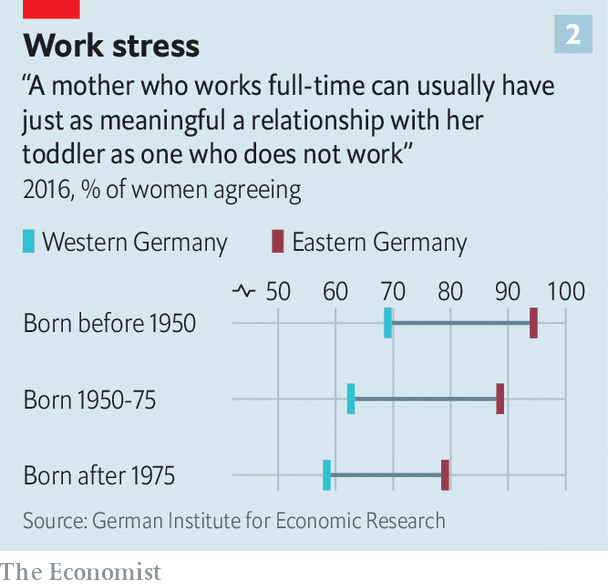

## Nature v nurture

# Why east and west German women still work vastly different hours

> Thirty years after reunification, eastern women are still more likely to work full-time

> Oct 3rd 2020

SCHOLARS ARE often greatly excited by “natural experiments”, events that end up separating two groups of people, allowing wonks to compare their subsequent behaviour. Much like the study of twins adopted into different households, the postwar division and eventual reunification of Germany could be seen as such an experiment. A report by the German Institute for Economic Research on working mothers, published ahead of the 30th anniversary of reunification on October 3rd, reveals the interplay between policy and attitudes that influences the decision to work.

When the German Democratic Republic (GDR) in the east united with the Federal Republic of Germany (FRG) in 1990, the mothers of young children led very different lives. Life expectancy and incomes were much lower in the east, but communism did at least seem to lead to greater gender equality in labour-market outcomes. Encouraged by state policies and party ideology, mothers were almost as likely to work as fathers, and most worked full-time. In the west, where state and church encouraged mums to stay at home, less than half were in paid employment, and most of those worked part-time.

Three decades on, how has the picture changed? Two things stand out. First, behaviour has changed drastically since unification: the share of eastern women with young children working full-time fell from over half in 1990 to just under a third in 2018 (see chart 1). More women across Germany are working part-time. Second, east-west differences still exist. The share of eastern mums in full-time work is more than double that in the west. As a result, whereas women in the east earn 7% less than men, the gap in the west is 22%. The report argues that policy and attitudes together explain these trends.

Policy seems to play a powerful role in explaining the collapse in full-time employment in the east. Despite some recent changes, the policies of unified Germany, like those of the FRG, still assume that women are wives and mothers first. Joint taxation of married couples, free co-insurance for spouses and tax breaks for “mini jobs”, or low-hours contracts, probably did little to encourage women in the west to up their hours, and put those in the east off full-time work.

Attitudes, meanwhile, may help explain part of the lasting hours gap between east and west: 30 years after unification, eastern women are still more likely to approve of full-time working mums (see chart 2). This chimes with earlier findings that east Germans are more likely to have an egalitarian view of the roles of the sexes.

Attitudes have also changed over time, though. Strikingly, women born after 1975 in both the east and west are more likely to disapprove of mothers in full-time work than older ones, putting paid to the idea that younger women are keener on work. Perhaps women’s views are shaped by the policies they face. Katharina Wrohlich, one of the report’s authors, also suspects that the shift marks a rejection by younger women of both the dual-earner model of the GDR and the single-earner model of the FRG. “Instead the younger generation seems to be aspiring to the one-and-a-half jobs model,” she says—a preference that policy may need to respond to in turn.

The unification “experiment” hardly took place in laboratory conditions. Many women migrated from east to west. The regions differ in many other respects—incomes per head are lower in the east, for instance—that also affect the number of hours women work. But the episode still says something about the power of policy and the endurance of attitudes, long after walls are torn down. ■

## URL

https://www.economist.com/finance-and-economics/2020/10/03/why-east-and-west-german-women-still-work-vastly-different-hours
