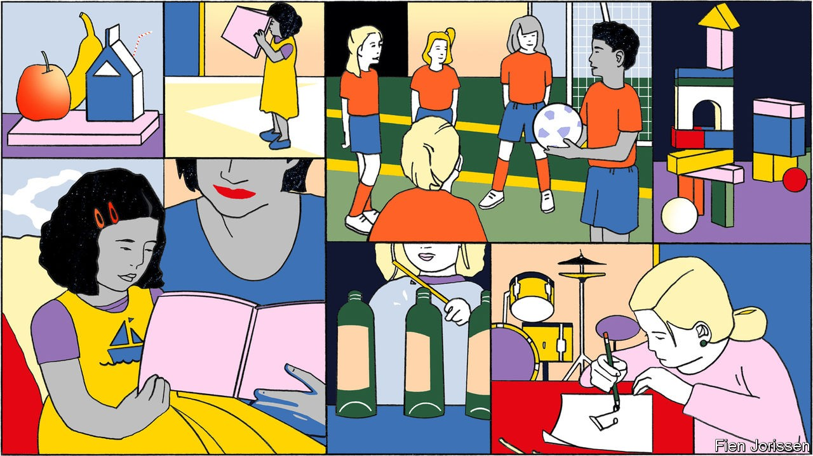
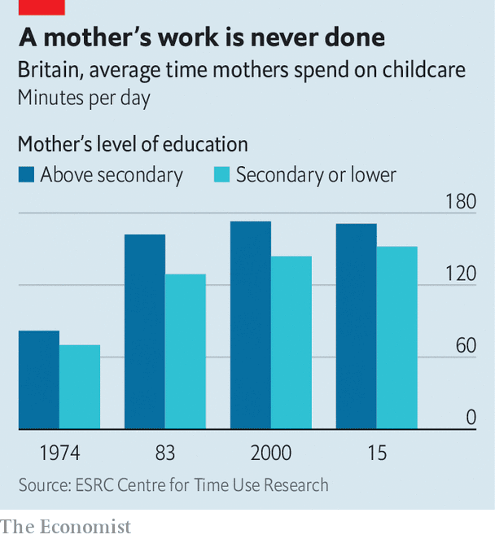
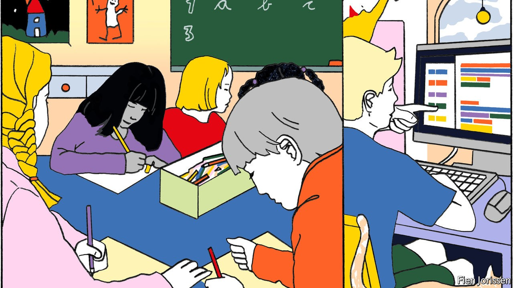

## The rugrat race

# Working-class parents are becoming more like middle-class ones

> They have adopted their child-rearing habits

> Oct 3rd 2020NEW YORK

LIKE MANY children around the age of two, Madison has decided not to do what her mother wants. She will not speak above a whisper. She does not want to read “Big Red Barn”. She will not identify her colours or her shapes, even though she knows them. So, for half an hour, her mother patiently cajoles, persuades, distracts and redirects. “You want me to read to you? What kind of sound does the cow make? Are you going to sing? What’s this?”

It would be a familiar scene in a pushy, upper-middle-class home. But this is a working-class black family in a poor district of Long Island, east of New York City. The careful cultivation of Madison reflects a change in her household. Her mother, Joy, says that she did little to prepare her two older children for school, assuming that they would be taught everything they needed to know. She is determined not to make the same mistake again.

Across the rich world, working-class parents have reached the same conclusion. They expect more of their children than in the past, and treat them differently. Gradually, they have adopted child-raising habits normally associated with middle-class parents. That largely unheralded change has probably mitigated the harm done to poorer children by covid-19 and the school closures it prompted. Unfortunately, some damage has been done anyway.

In 2003 Annette Lareau, a sociologist at the University of Pennsylvania, published an astonishing book about child-raising. “Unequal Childhoods” showed that working-class parents—whether they were white or black, poor and welfare-dependent or with steady jobs—thought and behaved differently from middle-class ones. Most assumed that their children would develop naturally, and that their job was to keep them happy and safe. Middle-class parents, by contrast, engaged in what Ms Lareau called “concerted cultivation”, stimulating, stretching and scheduling their progeny to within an inch of their lives.

Middle-class child-raising habits such as endlessly pointing out new things and answering children’s questions with other questions are easily mocked. They are also highly effective. Jill Gilkerson is the chief researcher at LENA, an organisation that measures children’s and adult’s speech using small digital recorders. By controlling for social class, she finds that 14% of the variance in adolescents’ IQ scores can be explained by the frequency of “conversational turns” in their speech at 18-24 months—a measure of their interactions with adults. The effect of toddler talk on adolescents’ verbal comprehension was stronger: it explained 27% of the variance.

Fortunately, the ideal of concerted cultivation seems to have spread. In 2018 Patrick Ishizuka of Cornell University presented American parents with domestic vignettes and asked what they thought of them. In one vignette, a girl who complains about being bored after school is told to go outside and play with her friends; in another, the bored girl is pushed into music lessons and sport. Mr Ishizuka found that highly educated and thinly educated parents differed hardly at all in their responses to these scenarios. Almost all thought the pushy parent was better.

Poorer parents are putting in more time, too. Sociologists Giulia Maria Dotti Sani and Judith Treas have data for 11 Western countries. In all but one (France) mothers without university educations are spending more time caring for their children than in the past. The Centre for Time Use Research has found a concertina pattern in Britain. In the mid-1970s highly educated and thinly educated mothers alike spent little time interacting with their children. Over the following decade the highly educated changed their behaviour, opening a large lead over everyone else. The less-educated then closed the gap (see chart).

Tomás Cano, a sociologist at the University of Frankfurt, suggests that child-raising norms are trickling down the social scale, much as liberal attitudes to divorce did in the second half of the 20th century. He has found that working-class Spanish parents are putting in more time on “developmental” child-care activities (such as reading and playing). Fathers in particular began to do more following the financial crisis, which hit Spain especially hard. They may have had more time for playing because so many had lost their jobs.

All this attention may be helping children at school. Two scholars, Sean Reardon and Ximena Portilla, have shown that in America the gap between the test scores of the most privileged and least privileged children upon entry to nursery closed slightly between 1998 and 2010. In Britain all children in year one of school—aged five or six—are doing better in phonics tests than they were a decade ago. Those who are entitled to free school meals because of their parents’ poverty have advanced more.

Working-class parents might have changed their behaviour in response to market forces. In America the wage premium for completing a college degree has risen from 29% to 45% since 1979. Not surprisingly, poorer parents have become more ambitious for their children. The proportion of parents in the poorest quintile of America’s population who expect their children to get no further than high school fell from 24% in 1998-99 to just 11% in 2010-11.

Another possibility is that training has changed attitudes and behaviour. Joy is being assisted by an organisation called ParentChild+, which has been sending books and toys to poor families, and guiding parents to play in more stimulating ways, since the 1960s. It now caters to 8,500 households in America each year and is expanding elsewhere. Evaluations of ParentChild+ and similar programmes have mostly shown that they work. They are too small to have much of an impact nationally. But they may have helped change norms by spreading the idea that reading and playing with children are important.

Day care, which usually happens outside children’s homes, is common enough to make a difference. It is becoming more so as governments promote it. In the OECD the proportion of three-year-olds enrolled in pre-primary education rose from 62% in 2005 to 70% in 2014. As well as affecting children directly, these programmes could be changing their parents’ behaviour. A large evaluation of Head Start, America’s programme for poor children, found that enrolling three-year-olds raised the proportion who were read to at home.

Another possible explanation for the change is that the working class is different. Sarah Walzer, the chief executive of ParentChild+, says that her outfit encounters many more immigrant families than it used to. Immigrant parents are often ambitious for their offspring, enduring hardship and loneliness to give them better lives. Dina, the mother of a three-year-old boy, moved to America from El Salvador. She does not have a job, and her husband works in a pizza parlour, making the family squarely working class. But Dina, who went to college in El Salvador, has the aspirations of a middle-class parent.

Just as working-class children were catching up, covid-19 hit. School-age children were sent home to households where parents were already juggling pre-school children and their own work. This has been hardest on the poor. Academics at Harvard University discovered that American children did less work on a popular maths website in March and April, with the biggest decline in poor areas. The National Foundation for Educational Research surveyed British teachers in May, two months after the lockdown began. More than half reported that poor children were less engaged with their homework than others.

But if the teachers were right about poorer children doing less work during lockdown (and they might not have been—few kept close tabs on their charges), it was probably not because parents lacked dedication or ambition. A British survey of almost 3,700 people, known as Understanding Society, found that 30% of parents with no more than GCSE qualifications spent at least two hours a day helping with home schooling during the lockdown. That proportion is a little higher than the 28% of parents with degrees who said the same. The parents might be exaggerating. But another survey, of children, found the same pattern. As in Spain after the financial crisis, they may have had more time because so many were furloughed or laid off.

A likelier explanation for the widening gap is that schools asked less of poorer children. Another study of Britain by two sociologists, Sait Bayrakdar and Ayse Guveli, confirmed that the children of less-educated parents did less work during lockdown. Bangladeshi and Pakistani children (who are mostly working class) did especially little. But the researchers found that the single biggest influence on how much work children did was not how educated their parents were but how much work their schools assigned.

Working-class parents have learned to bring up their children in a more stimulating way. The next thing they need to learn from the middle classes is how to nag their children’s teachers. ■

## URL

https://www.economist.com/international/2020/10/03/working-class-parents-are-becoming-more-like-middle-class-ones
