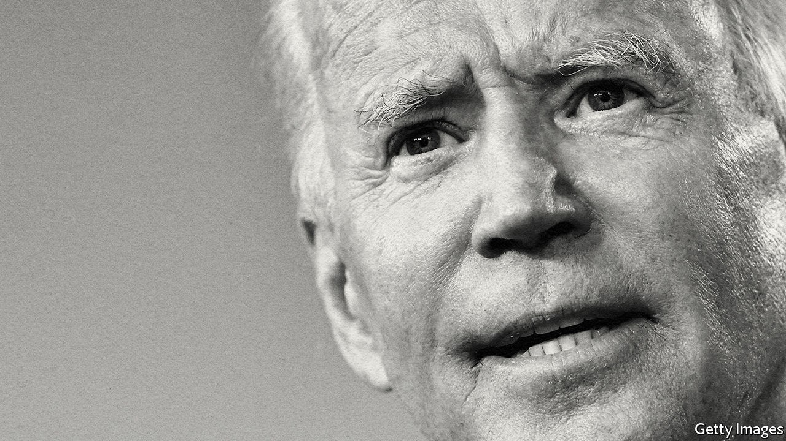

## America’s election

# Bidenomics: the good the bad and the unknown

> Joe Biden should be more decisive and ambitious about America’s economy

> Oct 3rd 2020

THE TWO presidential contenders squared up this week in the first debate before America votes on November 3rd. President Donald Trump set out to make it a brawl, even throwing a punch at the validity of the electoral process itself (see [article](https://www.economist.com//united-states/2020/10/03/would-the-supreme-court-hand-donald-trump-a-second-term)). Joe Biden spent the evening jabbing at Mr Trump for bringing the country to its knees. And the president went for what he hoped would be a knockout blow, accusing his opponent of being a weak man who would succumb to the left’s plans to dramatically expand government and cripple business.

Fear of just such a leftward lurch under Mr Biden is circulating among some American business leaders. However, as we explain (see [article](https://www.economist.com//briefing/2020/10/03/joe-biden-would-not-remake-americas-economy)), the charge is wide of the mark. Mr Biden has rejected the Utopian ideas of the left. His tax and spending proposals are reasonable. They imply only a modestly bigger state and attempt to deal with genuine problems facing America, including shoddy infrastructure, climate change and the travails of small business. In fact, the flaw in Mr Biden’s plans is that in some areas they are not far-reaching enough.

When Mr Trump took power in 2017 he hoped to unleash the animal spirits of business by offering bosses a hotline to the Oval Office and slashing red tape and taxes. Before covid-19, bits of this plan were working, helped by loose policy at the Federal Reserve. Small-business confidence was near a 30-year high; stocks were on a tear and the wages of the poorest quartile of workers were growing by 4.7% a year, the fastest since 2008. Voters rank the economy as a priority and, were it not for the virus that record may have been enough to re-elect him.

Yet, partly owing to the pandemic, Mr Trump’s shortcomings have also become clear. Long-term problems have festered, including crumbling infrastructure and a patchy social safety-net. The underlying dynamism of business remains weak. Investment is muted and fewer firms have been created even as big ones gain clout. Mr Trump’s chaotic style, involving the public shaming of firms and attacks on the rule of law, is a tax on growth. Deregulation has turned into a careless bonfire of rules. The confrontation with China has yielded few concessions, while destabilising the global trading system.

As the 46th president, Mr Biden would alleviate some of these problems simply by being a competent administrator who believes in institutions, heeds advice and cares about outcomes. Those qualities will be needed in 2021, as perhaps 5m face long-term unemployment and many small firms confront bankruptcy. Mr Biden’s economic priority would be to pass a huge “recovery” bill, worth perhaps $2trn-3trn, depending on whether a stimulus plan passes Congress before the election. This would include short-term money, boosting unemployment insurance and help for state and local governments, which face a budget hole. Mr Biden would also extend grants or loans to small businesses which have not received as much aid as big firms. He would ease tensions with China, soothing the markets. And if a vaccine arrives, his co-operative rather than transactional approach to foreign relations would make its global distribution easier and allow borders to reopen and trade to recover faster.

The recovery bill would also aim to “build back better” by focusing on some long-term problems for America that have also been Biden priorities for many years. He is keen on a giant, climate-friendly infrastructure boom to correct decades of underinvestment: the average American bridge is 43 years old. Government research and development (R&D) has dropped from over 1.5% of GDP in 1960 to 0.7% today, just as China is mounting a serious challenge to American science. Mr Biden would reverse that, too, with more R&D in tech and renewable energy. He would scrap Mr Trump’s harsh restrictions on immigration, which are a threat to American competitiveness. And he wants to raise middle-class living standards and social mobility. That means more spending on education, health care and housing and a $15 minimum wage, helping 17m workers who earn less than that today.

This is hardly the agenda of a socialist. Mr Biden has ignored the Panglossian fantasies of the left, including Medicare For All, a ban on nuclear energy and guaranteed jobs. His plans are moderate in size as well as scope, adding up to an annual increase in public spending of 3% of GDP, assuming they could all pass the Senate. That compares with 16-23% for those of Elizabeth Warren and Bernie Sanders. He would raise taxes to pay for about half of the spending that is approved, with higher levies on firms and the rich. Even if all of his tax plan were enacted, which is highly unlikely, studies suggest corporate profits after tax might drop by up to 12% and the income of the top 1% of earners by up to 14%. If you are rich that would be an irritant, but not a catastrophe.

The real risk of Bidenomics is that his pragmatism will lead him to be insufficiently bold. Sometimes he fails to resolve competing objectives. For example, he rightly supports ladders for social mobility as well as a better safety-net for workers who lose their jobs; his plans range from more affordable housing to free public universities. But equipped with these safety buffers, he should be willing to welcome more creative destruction so as to raise long-run living standards. Instead Mr Biden’s instinct is to protect firms, and he has too little to say on boosting competition, including prising open tech monopolies. Incumbent firms and insiders often exploit complex regulations as a barrier to entry. His plans are wrapped in red tape.

Mr Biden’s climate policy represents real progress. Building green-power grids and charging networks makes sense because the private sector may hold back. But, again, its effect will be blunted by the rule that 40% of spending must favour disadvantaged communities and by perks for domestic suppliers: a recipe for inefficiency. His plan to cut emissions involves targets, but shies away from a carbon tax which would harness the power of capital markets to reallocate resources. That is a missed opportunity. Just last month the Business Roundtable, representing corporate America, said it supported carbon pricing.

This lack of boldness also reflects the lack of a fully developed strategy. Mr Biden has a record as a free trader, but he will not remove tariffs quickly and his plan indulges in petty protectionism by, say, insisting that goods are shipped on American vessels. That would complicate the daunting task ahead of him: to create a new framework to govern the economic relationship with China, which involves persuading America’s allies to sign up even as they flirt with protectionism, too (see [article](https://www.economist.com//europe/2020/10/03/the-revenge-of-strategic-yogurt)).

It is the same with fiscal policy. To his credit, Mr Biden wants to pay for some of his spending—a novelty these days. Nonetheless, by 2050 public debt is on track to hit almost 200% of GDP. There is little reason to fret now, when interest rates are near zero and the Fed is buying up government debt. But America would benefit if the next president faced up to this long-term challenge. That would mean beginning to build a harder-nosed consensus on entitlement spending and a sustainable tax base.

Mr Biden still has to win in November, so his ambiguity is understandable. But there is a risk he assumes that victory and a return to growth and competence will be sufficient to set America on the right track. If he wants to renew America’s economy and ensure it leads the rich world for decades to come, he will have to be bolder than that. On the threshold of power, he must be more ruthless about his priorities and far-reaching in his vision.■

Dig deeper:Read the [best of our 2020 campaign coverage](https://www.economist.com//us-election-2020) and explore our [election forecasts](https://www.economist.com/https://projects.economist.com/us-2020-forecast/president), then sign up for Checks and Balance, our [weekly newsletter](https://www.economist.com//checksandbalance/) and [podcast](https://www.economist.com/https://play.acast.com/podcasts/2020/01/24/checks-and-balance-our-new-weekly-podcast-on-american-politics) on American politics.

## URL

https://www.economist.com/leaders/2020/10/03/bidenomics-the-good-the-bad-and-the-unknown
