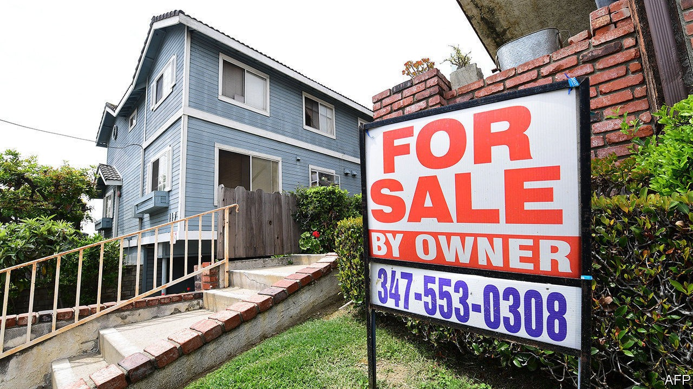
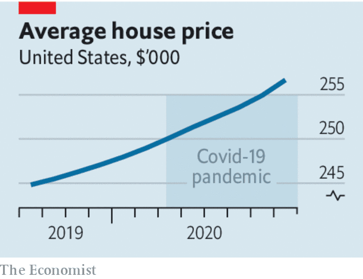

## The house party returns

# Booming house prices spell more trouble for the social contract

> Low interest rates and changing preferences explain housing’s strength during the pandemic

> Oct 3rd 2020

STOCKMARKETS HAVE not had a good September, but their strength for the year as a whole remains a source of wonderment. Less noticed has been the equally remarkable buoyancy of another asset class: housing. Many rich countries are seeing house prices surge even as their rate of infections is rising for a second time. In the second quarter, although economies were under lockdown, house prices rose in eight out of ten high- and middle-income countries. According to unofficial series—which are timelier though less accurate than government data—America’s house prices are up 5% on a year ago. Germany’s are 11% higher. Britain’s hit an all-time high, in nominal terms, in August. The boom shares some causes with the strength of stockmarkets, but reveals more about the pandemic’s effect on economies. It is also more consequential.

Like stocks, house prices are being supported by loose monetary policy. In the past year the rate at which Americans can obtain 30-year fixed-rate mortgages has fallen by roughly a quarter, to about 2.9%. As well as making monthly mortgage payments more affordable, low rates make houses more attractive, because they depress the returns on alternative safe investments. Other economic policies are also helping. Mass government support for household incomes, as well as mortgage-repayment holidays, have saved jobless workers from having to sell their homes, as they otherwise might. Britain has temporarily suspended stamp duty, a tax on buying houses.

The house-price boom is not just a result of policy, however. Structural forces are at work, too (see [article](https://www.economist.com//finance-and-economics/2020/09/30/why-despite-the-coronavirus-pandemic-house-prices-continue-to-rise)). Job losses this year have been concentrated among low-paid service-sector workers, who are more likely to rent than buy. Professionals who have carried on working from home but cut back on their spending have accumulated cash to splash—and, with time spent at home rising, what better moment to buy a bigger pad? The unequal effects of the pandemic have allowed prices to surge even as banks have curtailed their riskiest loans. In America the share of lending going to the most creditworthy borrowers has been growing. In Britain the boom seems to be being driven by a bidding war among existing homeowners, rather than by first-time buyers who, because they are younger, are more exposed to the economic downturn.

Housing is a bigger asset class than equities and its ownership is more dispersed. Booming stockmarkets lead to grumbles about the growing riches of billionaires. Pricey houses make life tangibly harder for swathes of would-be homebuyers who struggle to raise the minimum down-payment necessary to get a mortgage and join the club that can benefit from low rates. The problem is most acute in countries that see home ownership as a rite of passage. In such places high prices drive young people towards leftist populists and threaten the social contract. It is reasonable to hope that the trend towards working from home will help ease the housing shortages around the most vibrant cities, which have been most economically damaging. Yet so far this is not apparent in prices.

Perhaps the boom will cool as government support for the economy falls. However, the effect of the pandemic on long-term interest rates is unlikely to change; nor is the desire for roomier homes. Higher house prices could turn out to be an enduring legacy of covid-19. If so, in the 2020s they will deepen the intergenerational tensions that were already emerging in the 2010s. The fact that the economic costs of fighting the disease are mostly being borne by the young mostly to protect the lives of the elderly makes the problem knottier still.

In the 2010s politicians failed to get to grips with high house prices. They often responded to them by further subsidising home-buying. They should indeed cut stamp duty, which distorts the market, as much as possible. But it is futile to fight long-term price rises caused by low rates and shifts in households’ preferences. Rather, governments should cease to indulge national obsessions with owning property.

That means creating a well-regulated rental sector which offers security of tenancy, removing subsidies for owner-occupation and easing planning restrictions to the point where housing no longer looks like a magic money tree accessible only to those fortunate enough to start out with pots of cash. Taxes on property values—and ideally on land values—should also rise. Such levies are an efficient way of plugging budget shortfalls. They would also recoup some of the windfall gains that lucky homeowners have enjoyed.

To the extent that robust house-price growth represents confidence in the prospects for an economic recovery, it is welcome. But in no other context would the contrast between asset prices and the present condition of labour markets cause as much discomfort for those who are missing the party. ■

## URL

https://www.economist.com/leaders/2020/10/03/booming-house-prices-spell-more-trouble-for-the-social-contract
