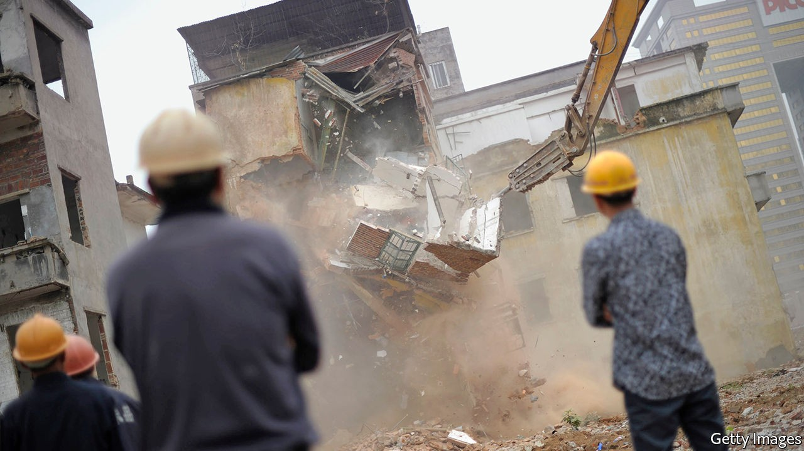

## Mass destruction

# China is demolishing villages and forcing people into bigger ones

> The suffering of millions far outweighs any benefits

> Oct 3rd 2020

IN THE PAST 30 years tens of millions of Chinese farmers have moved to cities to work. While these have boomed, villages have hollowed out. Often the elderly share them with the children left in their care. Houses lie empty. With too few pupils, many rural schools have closed, forcing children to trek long distances daily or attend often grim state-run boarding schools.

Many provinces have devised a remedy for this malaise. It involves knocking down villages and building new, bigger ones, to accommodate the residents of several scattered hamlets. The land where demolished houses stood can then be ploughed up and sown with crops—a boon for a country that has one-fifth of the world’s population but less than one-tenth of its arable land.

Many elderly villagers remember the famine in 1959-61 after Mao Zedong forced them onto collective farms in his disastrous Great Leap Forward. The merging of villages is causing another man-made calamity. It is rarely lethal, but still causes vast suffering (see [article](https://www.economist.com//node/21792391)).

Experiments with “village consolidation”, conducted in many parts of China over the past two decades, have shown that the scheme is flawed. The officials who order it are often motivated by greed and a desire to impress their superiors. Local governments have a financial incentive to destroy rural housing. By creating more arable land, they can sell greenfield sites near cities to developers without reducing their province’s stock of farmland—an amount ordained by the central government. Urban expansion promotes economic growth, which helps officials’ careers. And when developers and officials are in cahoots, corruption breeds.

Powerless villagers become victims. Millions of them have been turfed out of their homes, or are due to be. They sometimes have to move before new accommodation is ready. Even when it is, new communities are far from the fields or main urban centres. The new housing is often cramped—no more the spacious courtyards that even some poor villagers used to enjoy. What if they refuse to move? Along come officials and their thugs. In 2015 the fate of a villager who was burned to death when goons threw petrol bombs into his home (officials say he lit the fire himself) caused a national outcry. But horrors persist. Reports of beatings are common, as are accounts of people left with nowhere to live but tents or shacks—which is especially hard on the elderly.

Last year the eastern province of Shandong launched a village-flattening programme that led to protests by residents and outrage in the state-controlled press. China’s leader, Xi Jinping, has long insisted that the “rural revival” must not involve “mass demolition and mass building”, but local officials have reason to push on.

Mr Xi could do more to stop the brutality by giving people a genuine say in the running of their villages. His Communist Party claims it has done much to build village-level democracy. Yet most people in the country, as in the cities, are at the mercy of party bosses. If an official decides they must move out, they have no choice. Mr Xi has made matters worse by demanding that the party must take the lead. That gives officials all the authority they need.

Another problem is that rural residents, unlike their urban counterparts, have only a vague assurance of rights to the property they live in. They can rarely sell it to people outside the village or mortgage it. The party calls their land “collectively owned”. Many officials take that to mean they can seize it when they like. Farmers should be given clear rights to their homes and be allowed to sell them freely, as city dwellers have been allowed to since the 1990s. Governments could buy them if they wish, at a price agreed on with the owners. The law should protect the weak from big men with bulldozers, not vice versa. ■

## URL

https://www.economist.com/leaders/2020/10/03/china-is-demolishing-villages-and-forcing-people-into-bigger-ones
