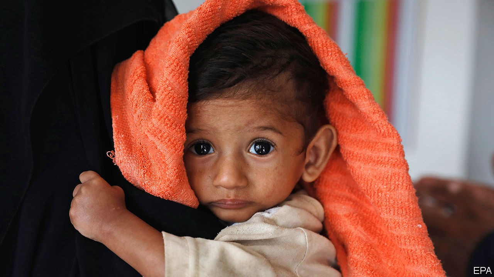

## An avoidable tragedy

# Famine in Yemen need not happen

> Millions of people are on the brink of starvation. Yemen’s warring parties can save them

> Oct 3rd 2020

THE WAR in Yemen seems to play on an endless loop. Atrocity follows atrocity. The government is backed by a Saudi-led coalition that bombs civilians; the Houthi rebels are backed by Iran, and recruit children and fire shells indiscriminately into cities. Efforts to make peace go nowhere. A swap of 1,081 prisoners, agreed on at the end of September, raised only faint hopes. A similar exchange, involving 15,000 detainees, was arranged in 2018 but never fully implemented. The loop is unbroken.

In the past six years the conflict has killed tens of thousands of people and gravely harmed millions more. Now it is escalating again. Civilians died in August in greater numbers than in any other month this year. The economy is collapsing, covid-19 is spreading unchecked and a rusting tanker off the western coast, laden with roughly 1.1m barrels of oil, risks causing an ecological catastrophe (see [article](https://www.economist.com//node/21792385)).

Amid this litany of suffering, Yemen’s most pressing problem is famine. About two-thirds of its 30m people need food aid. Many millions, the UN says, are on the brink of starvation. It should be possible to feed them. International bodies have sounded the alarm; relief groups know what to do. The question is whether Yemen’s rich neighbours, who have sustained the fighting with arms and money, will have the decency also to sustain the country’s people with food and medicine—and whether the war’s stubborn and self-interested combatants will allow the aid to get through.

Two years ago the UN requested billions of dollars for the relief effort. It was a good time to ask. The Saudis were eager to repair their image, tarnished by the war and the killing of Jamal Khashoggi, a dissident journalist. The United Arab Emirates (UAE), which led the coalition’s ground war in Yemen until last year, was also on a publicity drive. Along with Kuwait, they both gave generously. As a result, countless lives were saved.

Lately the Saudis, Emiratis and Kuwaitis have had other priorities. Saudi Arabia hosted an international pledging conference in June, after it vowed to give $500m this year (down from $750m last year). The kingdom has since lowered its commitment to $300m—better than the UAE, which so far this year has pledged nothing. “It is particularly reprehensible to promise money, which gives people hope that help may be on the way, and then to dash those hopes by simply failing to fulfil the promise,” says Mark Lowcock, the UN’s emergency-relief co-ordinator.

The resulting decline in Yemenis receiving food aid is being aggravated by the coalition, which has cut off fuel supplies to Houthi-controlled areas. Its blockade has pushed up prices and shut down vital services for lack of fuel. Saudi Arabia deposited $2bn in Yemen’s central bank in 2018. Now it is nearly all gone and the currency is collapsing, making food, most of which is imported, even less affordable. Neither do Saudi Arabia’s alleged air strikes on farms help Yemen’s harvest.

Saudi Arabia, desperate for a face-saving way out of the war, may be turning the screws on the Houthis. Starving the north is unlikely to work. But the Houthis will not like the loss of revenue—they themselves divert aid and sell it for profit. They even tried to impose a 2% levy on aid shipments. To ensure food reaches the right people, the UN wants to introduce a biometric ID system. The Houthis, though, are loth to cede control.

Neither the government nor the Houthis seem to care about the people they hope to rule any more than their backers do. To prevent famine would not take much—more money from the Gulf states, a lifting of the blockade and co-operation from the Houthis. Alas, if the belligerents were at all moved by the suffering of Yemenis, the war would have ended long ago. ■

## URL

https://www.economist.com/leaders/2020/10/03/famine-in-yemen-need-not-happen
