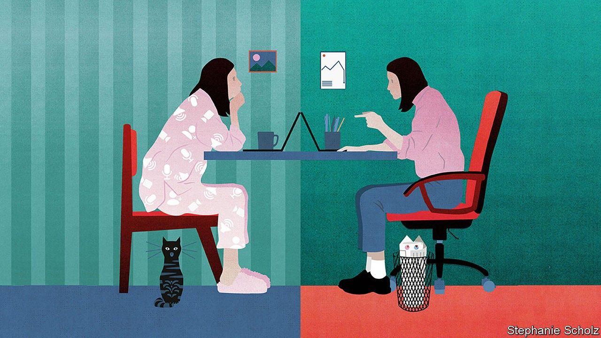
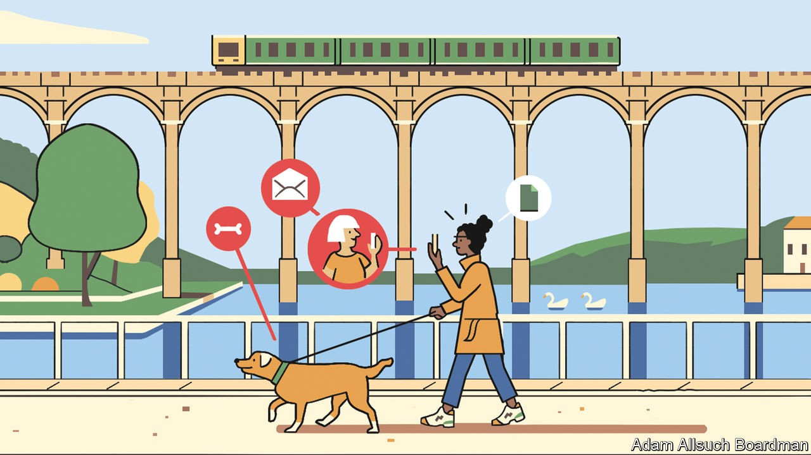

## On working from home, land reform, scientific management

# Letters to the editor

> A selection of correspondence

> Oct 3rd 2020

[letters@economist.com](https://www.economist.com/mailto:letters@economist.com)

The office

I enjoyed your briefing on the future of the office (“[What a way to make a living](https://www.economist.com//briefing/2020/09/12/covid-19-has-forced-a-radical-shift-in-working-habits)”, September 12th). Running the world’s largest provider of flexible workspace, I have seen many of the radical shifts in working behaviour that you explored. The debate should focus less on working from home versus the office, and more on the shift to hybrid working, which was already taking place before the pandemic struck.

People have enjoyed working from home and the relative luxury of not having to commute. At the same time, companies still need offices that employees can drop in to for social interaction, meetings and business reviews.

It is also fair to say that very few people have the discipline to work from home all of the time. And we have seen the rise of “Zoom fatigue”. Video-conferencing can be more draining than in-person interactions, as it requires a higher degree of energy to process non-verbal cues such as facial expressions, voice tone and pitch and body language.

What employees need is a hybrid workplace, where they can split their working time between home, a local office and their company’s headquarters. As a result, more companies will have distributed workforces.

The pandemic won’t lead to the demise of the city-centre office, as companies still need somewhere that characterises corporate identity and a place that allows people to congregate, but it will mean greater economic opportunities in smaller towns, where local businesses can grow supported by increasing numbers of home workers. The hybrid office rather than the “optional office” is the future.

MARK DIXONChief executiveIWGZug, Switzerland

The executive-search firm I work for recently carried out a survey across Asia Pacific. One, admittedly cheeky, question asked whether the respondents thought co-workers who worked from home were taking advantage and not fulfilling their responsibilities: 53% thought there was definitely some hookey being played. But commenting on themselves, 60% said they were working longer hours at home. Office politics indeed.

RICHARD LETCHERHong Kong

Communication, both informally across desks and in organised meetings, is far richer when conducted in person. Most ideas occur when you are not sitting at a computer screen. At home, the instant you walk away from your computer you are surrounded by your home life and your mind will be engaged with family and domesticity.

As a business owner, I am aiming for 100% efficiency and effectiveness. Do you really think I should accept less than this so my staff don’t have to travel to work? That is a dangerous concept for businesses to adopt and one I suspect you won’t find in places like China. I worry about our work ethic and its impact on our output.

However, we do need creative solutions to reduce the cost of commuting. In Britain, how about waiving stamp duty on homes less than 30 minutes travel from one’s place of work, encouraging people to live closer to the office.

LUKE DASHPERLondon

The most important question is this: is my corporate culture strong enough to adapt to this new way of working? A company with a clearly articulated and effectively deployed corporate culture can thrive in any configuration, be it remote, office-based, or a blend of the two. In fact, organisations that are longing for a return to the office are trying to mask a weak corporate culture.

Too often, business leaders mistake presence for performance, which is why the use of productivity-tracking software has surged during the pandemic. Strong organisations aren’t built through micromanagement or surveillance. They are built on a foundation of trust. The future of work is about results, not time spent at a desk, and this is true whether that desk is in an office or in someone’s home.

What began as an emergency has become an opportunity. There is no one correct answer to the balance of remote and in-office work. There are a wide range of choices that require creative reflection. If bosses approach it in this manner, and with a hard look at their work culture, their company and their employees will be the better for it.

TASO DU VALChief executiveToptalNew York

We should consider our social nature. In humans’ evolutionary history, our survival depended on being able to live together in groups. We needed to figure out how to keep track of who is friends with whom, what others are trying to achieve, and when those around us are angry or happy. We learned to pay attention to how others move, where they look, and how they react to what is going on around them.

This requires that we are physically near each other. I cannot know if you are happy or angry with me if I am not sure if your facial expression is triggered by what I said or by an unexpected tap on your leg. I cannot read your body language if all that I see is your facial expression on a screen. Because of this bio-social psychological inheritance, there is good reason to think that, as the threat of infection recedes, people will look to leave their home offices and return to their real offices.

ARMIN SCHULZProfessor of philosophyUniversity of KansasLawrence, Kansas

Many thanks for the issue on office politics. It makes a great mouse mat when working at the kitchen table.

CHRIS MIJNSSENBrisbane

Land reform is indeed difficult (“[Parcels, plots and power](https://www.economist.com//middle-east-and-africa/2020/09/12/the-quest-for-secure-property-rights-in-africa),” September 12th) but there are reasons to be encouraged about changes in Africa and there are practical policy recommendations that can address some of the continuing problems. For example, governments should ensure that women are aware of and able to register claims for land, both jointly and as sole owners. That would give them a sound foundation for farming, opening a business or providing a home and shelter. The digital gender divide makes it difficult for many women to access technologies and newer online land registries. We should also help women implement the land rights they do hold by using legal professionals.

There are signs of progress. In Liberia a land-reform bill in 2018 included provisions to strengthen marital property rights for women and to formalise customary land rights for millions. And in Tanzania paralegals are using a mobile app to dispense legal advice and help women settle disputes over land rights.

KAROL BOUDREAUXChief programme officerLandesaWashington, DC

With all due respect to the correspondent who credited Louis Brandeis with coining “scientific management” in 1910 ([Letters](https://www.economist.com//letters/2020/09/19/letters-to-the-editor), September 19th), Frederick Taylor used the term in his paper “Shop Management”, presented at the meeting of the American Society of Mechanical Engineers in June 1903. So Bagehot was correct.

ANDREW WYNERNorthern Virginia Community CollegeManassas, Virginia

## URL

https://www.economist.com/letters/2020/10/03/letters-to-the-editor
